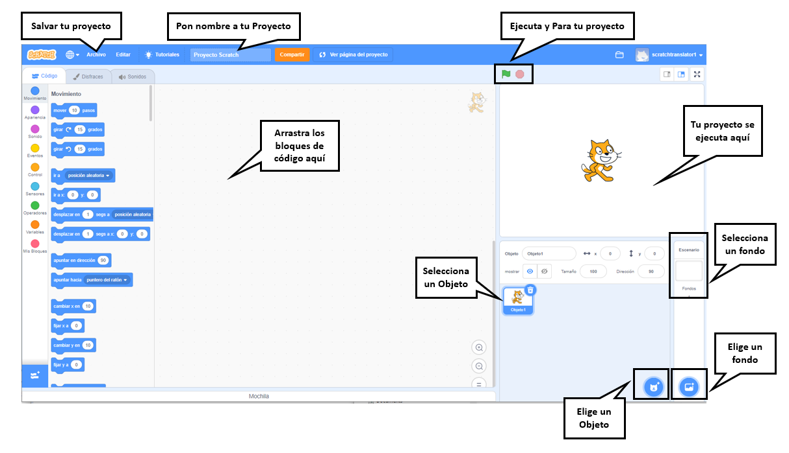
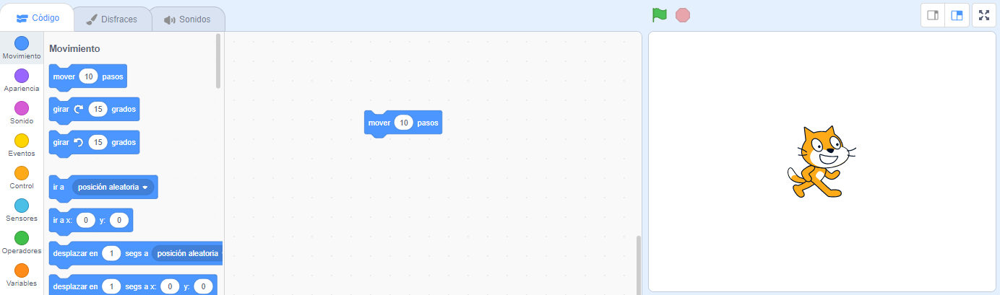
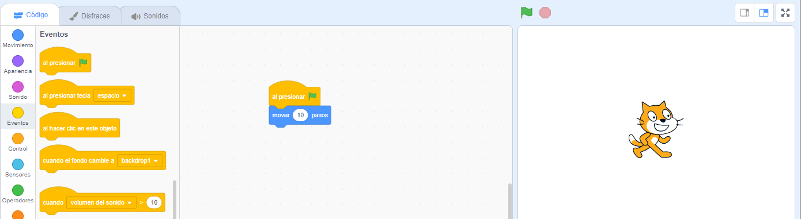
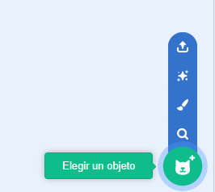
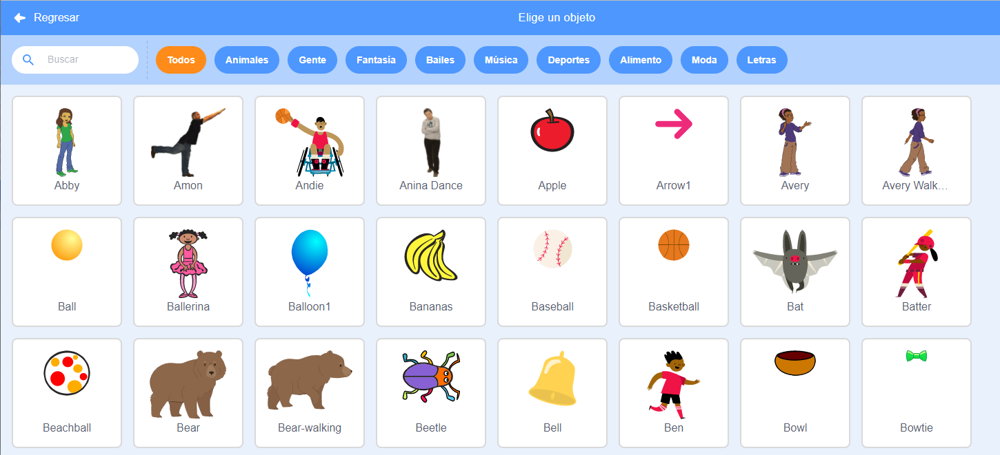
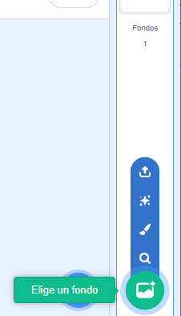
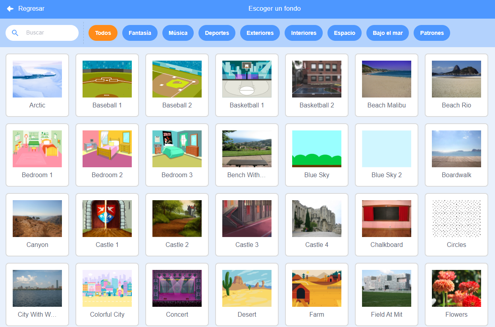
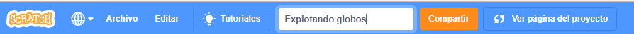

## Tu primer proyecto Scratch



--- task ---

Cuando creas un nuevo proyecto de Scratch, éste incluye un objeto **gato**.

Arrastra bloques del menú Bloques al área de Código para que el gato haga algo.

Para probar un ejemplo, arrastra un bloque `mover`{:class="block3motion"} del menú de bloques `Movimiento`{:class="block3motion"}. Los bloques están codificados por colores para ayudarte a encontrarlos.



Puedes hacer clic en los bloques en el área de Código para ejecutarlos. Haz clic en el bloque `mover`{:class="block3motion"} y el gato se moverá.

**Consejo:** Si estás utilizando Scratch en una tableta, puedes tocar un elemento para hacer clic en él.

**Bloques de Sombrero** ejecutan los bloques debajo de ellos cuando ocurre un evento en particular. El bloque `al presionar la bandera verde`{:class="block3events"} ejecuta código cuando se hace clic en la bandera verde encima del Escenario para ejecutar tu proyecto.

Arrastra un bloque `al presionar la bandera verde`{:class="block3events"} por encima del bloque `mover`{:class="block3motion"} para que encajen.



Tu código debería parecerse a esto:

```blocks3
when flag clicked
move (10) steps
```

**Consejo:** Los bloques Scratch están codificados por colores, por lo que encontrarás el bloque `al presionar la bandera verde`{:class="block3events"} en el menu de bloques `Eventos`{:class="block3events"}.

Ahora, haz clic en la bandera verde sobre el Escenario y el gato se moverá.

--- /task ---

Puedes agregar más objetos a tu proyecto y también puedes agregar un fondo.

--- task ---

--- collapse ---
---
title: Elegir un objeto
---

En la lista de Objetos, haz clic en **Elegir un Objeto** para ver la biblioteca de todos los objetos Scratch.



Puedes buscar un objeto o navegar por categoría o tema. Haz clic en un objeto para agregarlo a tu proyecto.



--- /collapse ---

--- /task ---

--- task ---

--- collapse ---
---
title: Elige un fondo
---

En la esquina inferior derecha del panel Escenario, haz clic en **Elige un fondo**.



Puedes buscar un fondo o navegar por categoría o tema. Haz clic en un fondo para agregarlo a tu proyecto.



--- /collapse ---

--- /task ---

--- task ---

--- collapse ---
---
title: Nombrar y guardar tu proyecto
---

Vaya a **Archivo** en el menú. Si tienes una cuenta Scratch, haz clic en **Guardar ahora**. Si no tienes una cuenta, haz clic en **Guardar en tu computador**.

Haz clic en el cuadro del nombre del proyecto y cambia el nombre para que coincida con tu proyecto.



Si compartes tu proyecto, otras personas también verán este nombre, así que asegúrate de que tenga sentido.

--- /collapse ---

--- /task ---

¡Has creado tu primer proyecto Scratch!

Ahora estás listo para aprender Scratch. Te recomendamos que comiences con nuestros tutoriales [Scratch: Módulo 1](https://projects.raspberrypi.org/en/raspberrypi/scratch-module-1){:target="_blank"} y/ó [Cuídate](https://projects.raspberrypi.org/en/raspberrypi/look-after-yourself){:target="_blank"}, que están diseñados para principiantes.

 Puedes volver a esta guía si necesitas ayuda para usar Scratch cuando estés trabajando en nuestros proyectos de ruta o en tus propios proyectos independientes. 


