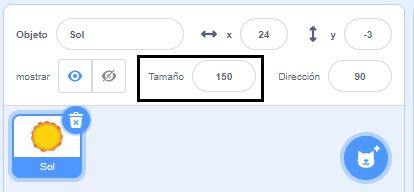

## Apariencia

Los bloques `Apariencia`{:class="block3looks"} controlan el aspecto de un objeto en el Escenario.

Sprites can communicate using `Looks`{:class="block3looks"}, through a `say`{:class="block3looks"} speech bubble, a `think`{:class="block3looks"} thought bubble, or through their `graphic effects`{:class="block3looks"}.

### Decir y pensar

```blocks3
say () for () seconds

say ()

think () for () seconds

think ()
```

--- collapse ---
---
title: Use a speech bubble to communicate
---

Sprites can `say`{:class="block3looks"} and `think`{:class="block3looks"} to communicate.

Los bloques `decir () durante () segundos`{:class="block3looks"} y `pensar () durante () segundos`{:class="block3looks"} se utilizan para decir o pensar algo durante un período de tiempo determinado.

```blocks3
when this sprite clicked
say [Hello!] for [2] seconds // hide speech after 2 seconds
```

El objeto mostrará un cuadro de diálogo durante dos segundos cuando se pulse.

**Space talk**: [See inside](https://scratch.mit.edu/projects/485673032/editor){:target="_blank"}

Click on the sprites to see them communicate with speech and thought.

<div class="scratch-preview">
  <iframe allowtransparency="true" width="485" height="402" src="https://scratch.mit.edu/projects/embed/485673032/?autostart=false" frameborder="0"></iframe>
</div>

Los bloques `decir ()`{:class="block3looks"} y `pensar ()`{:class="block3looks"} se usan para decir o pensar algo, hasta que otro mensaje o un bloque vacío `decir ()`{:class="block3looks"} o `pensar ()`{:class="block3looks"} lo reemplace.

--- /collapse ---

### Tamaño

Establece o cambia el `tamaño`{:class="block3looks"} de tus objetos.

```blocks3
change size by ()

set size to () %

(size)
```

--- collapse ---
---
title: Establece el tamaño de tu objeto
---

Cuando agregas un objeto a tu proyecto, su tamaño se establece en `100` por ciento. Esto puede ser demasiado grande o demasiado pequeño para tu proyecto.

Puedes usar código para establecer el tamaño de un objeto. Para hacer esto, usa un bloque `fijar tamaño a`{:class="block3looks"}:

```blocks3
set size to (50) %
```

Si fijas el tamaño de un objeto a `50` por ciento, será la mitad de alto y la mitad de ancho. Si fijas el tamaño de un objeto a `200` por ciento, será el doble de alto y el doble de ancho.

Para fijar el tamaño de un objeto cuando se inicia el proyecto, coloca un bloque `fijar tamaño a`{:class="block3looks"} debajo de un bloque `al presionar la bandera verde`{:class="block3events"}:

```blocks3
when green flag clicked
set size to (50) %
```

También puedes establecer rápidamente el tamaño de un objeto en la propiedad **tamaño** en el panel de Objetos debajo del escenario:

{:width="400px"}

--- /collapse ---

### Efectos gráficos

Fija o cambia una variedad de efectos visuales, como color, ojo de pez, remolino, pixelado, mosaico, brillo y desvanecer.

```blocks3
change [color v] effect by ()

set [color v] effect to ()

clear graphic effects
```

[[[scratch3-graphic-effects]]]

### Disfraces

Para crear un efecto de animación con tus objetos, puedes cambiar sus disfraces.

```blocks3
cambiar disfraz a (v)

siguiente disfraz

(disfraz [número v])
```

[[[scratch3-change-costumes-to-show-mood]]]

--- collapse ---
---
title: Cambiar la apariencia para crear un efecto de animación
---

**Beating heart**: [See inside](https://scratch.mit.edu/projects/435725413/editor){:target="_blank"}

<div class="scratch-preview">
  <iframe allowtransparency="true" width="485" height="402" src="https://scratch.mit.edu/projects/embed/435725413/?autostart=false" frameborder="0"></iframe>
</div>

Puedes usar los bloques `fijar tamaño a`{:class="block3looks"} o `cambiar tamaño en`{:class="block3looks"} para crear un efecto pulsante, como un latido de corazón.

**Nota:** El bloque `fijar tamaño a`{: class = "block3looks"} establece el tamaño en un valor específico, mientras que el bloque `cambiar tamaño en`{: class = "block3looks"} cambia el valor de lo que era antes, por ejemplo, `cambiar tamaño en`{: class = "block3looks"} `10` agrega 10 al valor del tamaño.

```blocks3
when green flag clicked
set size to (160) %
forever
change size by (40)
wait (0.2) seconds
change size by (20)
wait (0.2) seconds
change size by (-20)
wait (0.2) seconds
change size by (-40)
wait (0.2) seconds
end
```

Este código usa una serie de bloques `cambiar tamaño en`{:class="block3looks"} y `esperar`{:class="block3control"} para hacer que el corazón crezca y se encoja. Intenta crear tu propio objeto pulsante.

You could also use the `change graphic effect by`{:class="block3looks"} block to create a sprite that continues to change its appearance.

```blocks3
when green flag clicked
change [ghost v] effect by (75)
wait (1) seconds
change [ghost v] effect by (-75)
```

**Note:** If you use code that changes a graphic effect and then changes it back again, remember to use a `wait`{:class="block3control"} block in between the `change graphic effect by`{:class="block3looks"} blocks, otherwise, it will happen so fast that you won't see it!

You can use a `clear graphic effects`{:class="block3looks"} block at any time to reset the effects:

```blocks3
clear graphic effects
```

--- /collapse ---

--- collapse ---
---
title: Click to change and then change back
---

Puedes agregar acciones que realicen un cambio en un objeto y luego revertirlas, como crecer, esperar y luego reducir.

**Squash ball when clicked**: [See inside](https://scratch.mit.edu/projects/435723273/editor){:target="_blank"}

<div class="scratch-preview">
  <iframe src="https://scratch.mit.edu/projects/435723273/embed" allowtransparency="true" width="485" height="402" frameborder="0" scrolling="no" allowfullscreen></iframe>
</div>

Este código hará crecer un objeto, aplicará el efecto `ojo de pez`{:class="block3looks"} durante 0.5 segundos, y luego el objeto volverá a su apariencia inicial:

```blocks3
when this sprite clicked
set size to (110)
set [fisheye v] effect to (50)
wait (0.5) seconds
set [fisheye v] effect to (0)
set size to (100)
```

--- /collapse ---

[[[scratch3-animate-movement-costumes]]]

### Fondos

Puedes usar código también para cambiar el fondo.

```blocks3
switch backdrop to ( v)

next backdrop

(backdrop [number v])
```

[[[scratch3-changing-backdrops-pages-levels]]]

### Visibilidad

Los bloques `mostrar`{:class="block3looks"} y `esconder`{:class="block3looks"} controlan la visibilidad de un objeto.

```blocks3
show 

hide
```

[[[scratch3-show-hide-sprites-backdrops]]]

### Capas

Para cambiar como aparecen tus objetos entre ellos, puedes usar capas.

```blocks3
go to [front v] layer

go [forward v] () layers
```

[[[scratch3-positioning-with-layers]]]

--- collapse ---
---
title: Posicionar objetos en muchas capas
---

**Through the window with tree**: [See inside](https://scratch.mit.edu/projects/454188775/editor){:target="_blank"}

<div class="scratch-preview">
  <iframe allowtransparency="true" width="485" height="402" src="https://scratch.mit.edu/projects/embed/454188775/?autostart=false" frameborder="0"></iframe>
</div>

En el ejemplo, el objeto **Marco Ventana** aparece en la parte delantera y el objeto **Sol** aparece en la parte posterior. Los objetos **Avery Caminando** y **Árbol** están cada uno en sus propias capas entre el objeto **Marco Ventana** y el objeto **Sol**.

Usa el bloque `ir`{:class="block3looks"} `1` `capas hacia atrás`{:class="block3looks"} para colocar un objeto una capa por detrás del objeto en la parte delantera:

``` blocks3
when green flag clicked
go to [front v] layer
+go [backward v] (1) layers
```

Cambia el valor en el bloque `ir`{:class="block3looks"} `1` `capas hacia atrás`{:class="block3looks"} para cada objeto, dependiendo de dónde quieres que esté posicionado en relación con otros objetos:

``` blocks3
when green flag clicked
go to [front v] layer
+go [backward v] (2) layers
```

--- /collapse ---

