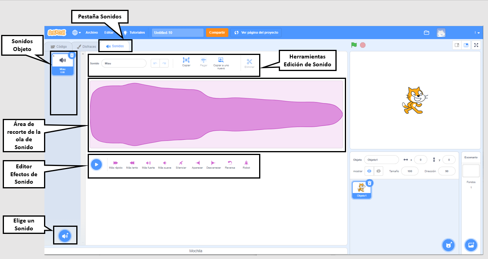

## Sonido

Para agregar sonido a tu proyecto, usa los bloques `Sonido`{:class="block3sound"}. Por ejemplo, puedes crear un sonido de fondo continuado o agregar sonidos que se reproducen a intervalos regulares.

{:width="600px"}

Primero, selecciona un sonido de la Biblioteca de sonidos o graba tu propio sonido.

[[[scratch3-add-sound]]]

[[[scratch3-record-sound]]]

Agregua código para ejecutar bloques `Sonido`{:class="block3sound"} donde desees sonido en tu proyecto.

--- collapse ---
---
title: Agregar un sonido largo para crear un sonido de fondo continuado
---

Haz clic en la bandera verde para escuchar los sonidos.

**Radio soundtrack**: [See inside](https://scratch.mit.edu/projects/444581851/editor){:target="_blank"}

<div class="scratch-preview">
 <iframe allowtransparency="true" width="485" height="402" src="https://scratch.mit.edu/projects/embed/444581851/?autostart=false" frameborder="0"></iframe>
</div>

You can use a `play sound until done`{:class="block3sound"} block inside a `forever`{:class="block3control"} loop. Once the sound has finished, the `forever`{:class="block3control"} loop makes the sound start again from the beginning.

Este código utiliza un único clip de sonido largo repetido como banda sonora:

```blocks3
when green flag clicked
forever
play sound (Dance Snare Beat v) until done
end
```

**Nota:** Cuando elijas un nuevo sonido, si seleccionas la categoria **Ciclos**, Scratch sólo te mostrará los sonidos que son adecuados para una banda sonora en bucle.


--- /collapse ---

--- collapse ---
---
title: Agregar una secuencia de sonidos cortos para crear un sonido de fondo continuado
---

Haz clic en la bandera verde para escuchar los sonidos.

**Champ performance**: [See inside](https://scratch.mit.edu/projects/444673165/editor){:target="_blank"}

<div class="scratch-preview">
 <iframe allowtransparency="true" width="485" height="402" src="https://scratch.mit.edu/projects/embed/444673165/?autostart=false" frameborder="0"></iframe>
</div>

 Use a `forever`{:class="block3control"} block to create a looped sound. Puedes:
+ Poner una serie de sonidos cortos en una secuencia, o
+ Usar diferentes notas de instrumentos y efectos

```blocks3
when flag clicked
forever
play sound (Low Boing v) until done
play sound (Low Boing v) until done
play sound (Drum Buzz v) until done
play sound (Pop v) until done
play sound (Bird v) until done
play sound (Bark v) until done
play sound (Glug v) until done
End
```

--- /collapse ---

--- collapse ---
---
title: Agregar sonidos que se reproducen a intervalos regulares
---

**Football sounds**: [See inside](https://scratch.mit.edu/projects/450870079/editor){:target="_blank"}

Haz clic en la bandera verde para escuchar los sonidos.

<div class="scratch-preview">
 <iframe allowtransparency="true" width="485" height="402" src="https://scratch.mit.edu/projects/embed/450870079/?autostart=false" frameborder="0"></iframe>
</div>

 En este proyecto, el **Escenario** contiene código para reproducir un sonido a intervalos regulares:

 ```blocks3
 when flag clicked
 forever
 wait (3) seconds
 play sound (Cheer v) until done
 end
 ```

The **Whistle** sprite also plays a sound at regular intervals:

 ```blocks3
 when this sprite clicked
 forever
 play sound (Referee Whistle v) until done
 wait (4) seconds
 end
 ```

--- /collapse ---

--- collapse ---
---
title: Agregar sonidos que comienzan a reproducirse al mismo tiempo
---

Hay dos bloques `Sonido`{:class="block3sound"} con una diferencia importante:

+ Cuando utilices `tocar sonido hasta que termine`{:class="block3sound"}, el sonido se reproducirá hasta el final. La siguiente línea de código en el script no se ejecutará hasta que el sonido termine de reproducirse.

+ Cuando utilices `iniciar sonido`{:class="block3sound"}, el sonido se reproducirá, pero el siguiente bloque se ejecutará inmediatamente y no esperará a que el sonido termine de reproducirse primero.

Esto significa que si tuvieras una serie de bloques `iniciar sonido`{:class="block3sound"}, los sonidos se reproducirían casi al mismo tiempo, superpuestos uno sobre el otro. El efecto puede ser interesante y algunas veces desordenado.

¡Juega con ello alguna vez!

```blocks3
when green flag clicked
start sound (Meow v)
start sound (Alien Creak2 v)
start sound (Boing v)
start sound (Boom Cloud v)
start sound (Baa v)
```

--- /collapse ---

Una vez hayas elegido tus sonidos, es posible que desees cambiar el `volumen`{:class="block3sound"}, `tono`{:class="block3sound"} o `paneo`{:class="block3sound"} ( para que escuche el sonido del altavoz izquierdo o derecho).

--- collapse ---
---
title: Volumen, tono y paneo
---

Haz clic en la bandera verde para escuchar los sonidos.

**Band practice**: [See inside](https://scratch.mit.edu/projects/451697380/editor){:target="_blank"}

<div class="scratch-preview">
 <iframe allowtransparency="true" width="485" height="402" src="https://scratch.mit.edu/projects/embed/451697380/?autostart=false" frameborder="0"></iframe>
</div>

The **Drums** sprite uses `set volume to`{:class="block3sound"}, `set pitch effect to`{:class="block3sound"}, and `set pan left/right effect to`{:class="block3sound"} blocks to change the sound:

```blocks3
set volume to (80) %
set [pitch v] effect to (50) :: sound
set [pan left/right v] effect to (-100) :: sound
play sound (Drum Funky v) until done
```

+ Puedes `fijar volumen a`{:class="block3sound"} con un valor desde `0` (silencioso) a `100` (volumen máximo). This is useful if you want some sounds to play louder than others, or if you want a sprite to appear further away.

+ El efecto `tono`{:class="block3sound"} controla qué tan alto o bajo es un sonido. Ajustar el tono a un valor más alto también hace que el sonido sea más rápido. Puedes `fijar efecto tono a`{:class="block3sound"} valores entre `-360` (muy bajo) y `360` (muy alto).

+ El efecto `paneo izquierda/derecha`{:class="block3sound"} te permite controlar si un sonido sale de un altavoz o auricular izquierdo o derecho, o de ambos. Puedes `fijar efecto paneo izquierda/derecha a`{:class="block3sound"} valores desde `-100` (todo el sonido de la izquierda) a `100` (todo el sonido de la derecha).

--- /collapse ---

También puedes utilizar la extensión `Texto a Voz`{:class="block3extensions"}:

[[[scratch3-text-to-speech]]]

