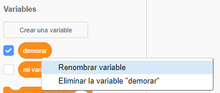
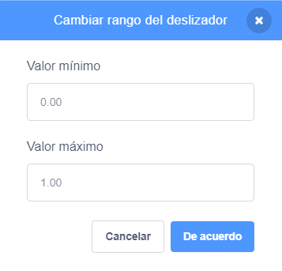

## Variables

Una `variable`{:class="block3variables"} es una forma de almacenar números y/o texto.

Puedes crear tus propias variables y elegir si se muestran en el Escenario:

[[[generic-scratch3-add-variable]]]

Deberías pensar si necesitas establecer un valor inicial cuando crees una variable:

[[[scratch3-create-set-variable]]]

Puedes cambiar el nombre de una variable si cambias de opinión:

--- collapse ---
---
title: Renombrar variable
---

A veces piensas en un nombre mejor para una variable.

Puedes darle un nombre nuevo a una variable: ve al menú de bloques `Variables`{:class="block3variables"}, haga clic con el botón derecho (o en una tableta, toca y mantén presionado) en la `variable`{:class="block3variables"} y elige **Renombrar variable**.



Esto cambiará el nombre de la variable en todos los bloques en los que la hayas usado.

--- /collapse ---

**Consejo:** Asegúrate de conocer la diferencia entre `fijar`{:class="block3variables"} y `cambiar en`{:class="block3variables"}. `fijar`{:class="block3variables"} reemplazará el valor almacenado en una variable. `cambiar en`{:class="block3variables"} cambiará el valor de una variable numérica por la cantidad que elijas, `cambiar en`{:class="block3variables"}`1` agregará uno a una variable. `cambiar en`{:class="block3variables"}`-1` quitará uno de una variable.


**Consejo:** Las variables del Escenario siempre aparecen en una capa superior a todos los objetos. Si tienes un objeto en movimiento, el objeto irá debajo de cualquier variable en el Escenario.

Puedes utilizar un deslizador para controlar el valor de una variable.

[[[scratch3-slider-variable]]]

Más ideas para usar variables:

[[[generic-scratch3-high-score]]]

[[[scratch3-join-text]]]

[[[scratch3-set-variable-with-button]]]

[[[scratch3-change-variable-in-loop]]]


--- collapse ---
---
title: Controlar los efectos gráficos con una variable deslizador
---

Aquí se muestran algunos ejemplos de cómo puedes utilizar tu variable deslizador:


Este ejemplo cambia el efecto gráfico `desvanecer`{:class="block3looks"} para que puedas ver a través del arco iris.

**Arco iris transparente**: [Ver dentro](https://scratch.mit.edu/projects/451544795/editor){:target="_blank"}

<div class="scratch-preview">
  <iframe allowtransparency="true" width="485" height="402" src="https://scratch.mit.edu/projects/embed/451544795/?autostart=false" frameborder="0"></iframe>
</div>

Puedes usar una variable `transparente`{:class="block3variables"} para controlar el efecto `desvanecer`{:class="block3looks"} en un objeto que está `frente`{:class="block3looks"}, y usarlo para mostrar u ocultar objetos en capas inferiores.

```blocks3
when flag clicked
go to [front v] layer
```

```blocks3
when flag clicked
forever
set [ghost v] effect to (transparente)
```

Intenta utilizar el mismo procedimiento con otros efectos gráficos como `brillo`{:class="block3looks"} o `color`{:class="block3looks"}.

--- /collapse ---

--- collapse ---
---
title: Controlar la velocidad de movimiento con una variable
---

**Mariquita en una pared**: [Ver dentro](https://scratch.mit.edu/projects/451545341/editor){:target="_blank"}

<div class="scratch-preview">
  <iframe allowtransparency="true" width="485" height="402" src="https://scratch.mit.edu/projects/embed/451545341/?autostart=false" frameborder="0"></iframe>
</div>

Utiliza la variable `velocidad`{:class="block3variables"} como entrada a un bloque `mover`{:class="block3motion"}:

```blocks3
when flag clicked
forever
move (velocidad) steps
if on edge, bounce
```
Fija los valores mínimos y máximos para el rango del deslizador para adaptarlos a tu proyecto.

--- /collapse ---

--- collapse ---
---
title: Controlar la velocidad de giro con una variable
---

**Perro espacial**: [Ver dentro](https://scratch.mit.edu/projects/451543041/editor){:target="_blank"}

<div class="scratch-preview">
  <iframe allowtransparency="true" width="485" height="402" src="https://scratch.mit.edu/projects/embed/451543041/?autostart=false" frameborder="0"></iframe>
</div>

Utiliza una variable `ángulo`{:class="block3variables"} como entrada para un bloque `girar a la derecha`{:class="block3motion"}:

```blocks3
when flag clicked
forever
turn right (ángulo) degrees
```

--- /collapse ---

--- collapse ---
---
title: Cambiar el retraso en un bloque de espera
---

**Baile esquelético**: [Ver dentro](https://scratch.mit.edu/projects/451536565/editor){:target="_blank"}

<div class="scratch-preview">
  <iframe allowtransparency="true" width="485" height="402" src="https://scratch.mit.edu/projects/embed/451536565/?autostart=false" frameborder="0"></iframe>
</div>

Utiliza una variable `retrasar`{:class="block3variables"} como entrada a un bloque `esperar`{:class="block3control"}:

```blocks3
when flag clicked
forever
wait (retraso) seconds
next costume
```

Un retraso de más de un segundo es bastante tiempo. Si incluyes un número decimal en el rango de un deslizador, puedes cambiar el valor en una centésima de segundo a la vez.

Un rango de `0,00` a `1,00` te permite elegir una demora entre `0` segundos (sin demora) y `1` segundo.



Cambia los números para obtener los valores mínimos y máximos que quieres que los usuarios puedan usar en tu proyecto.

--- /collapse ---

--- collapse ---
---
título: Cambiar efectos de sonido
---

**Tono de batería**: [Ver dentro](https://scratch.mit.edu/projects/451547017/editor){:target="_blank"}

<div class="scratch-preview">
  <iframe allowtransparency="true" width="485" height="402" src="https://scratch.mit.edu/projects/embed/451547017/?autostart=false" frameborder="0"></iframe>
</div>

Puedes usar una `variable`{:class="block3variables"} en un bloque `fijar efecto tono a`{:class="block3sound"}. Si aumentas el tono de un sonido, las notas se vuelven más altas y el sonido se acelera.

```blocks3
when flag clicked
forever
set [pitch v] effect to (ritmo) :: sound
```

Reproduce el sonido en un ciclo separado `por siempre`{:class="block3control"}, de modo que el tono cambie inmediatamente, en lugar de esperar hasta que el sonido haya terminado de reproducirse:

```blocks3
when flag clicked
forever
play sound [Dance Head Nod v] until done
```

También puedes utilizar una `variable`{:class="block3variables"} para cambiar el volumen y el efecto de paneo (ladeo).

--- /collapse ---


