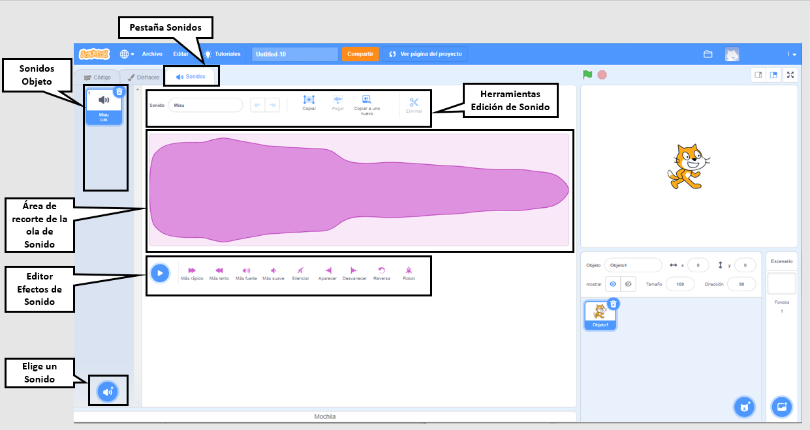

## Editor de sonido

Utiliza el editor de sonido para agregar y editar sonidos existentes y para grabar tus propios sonidos.

{:width="600px"}

### Crear sonidos

[[[scratch3-add-sound]]] [[[scratch3-record-sound]]]

### Editar sonidos

Edita sonidos completos o partes de sonidos.

[[[scratch3-reverse-sound]]] [[[scratch3-crop-sound]]] [[[scratch3-sound-effects]]]
