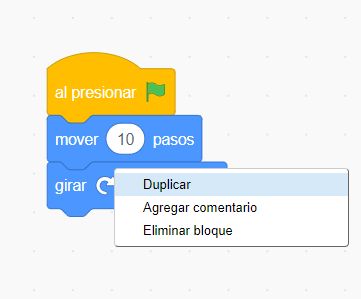
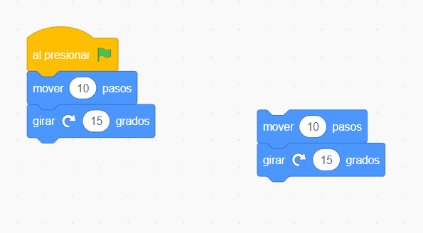
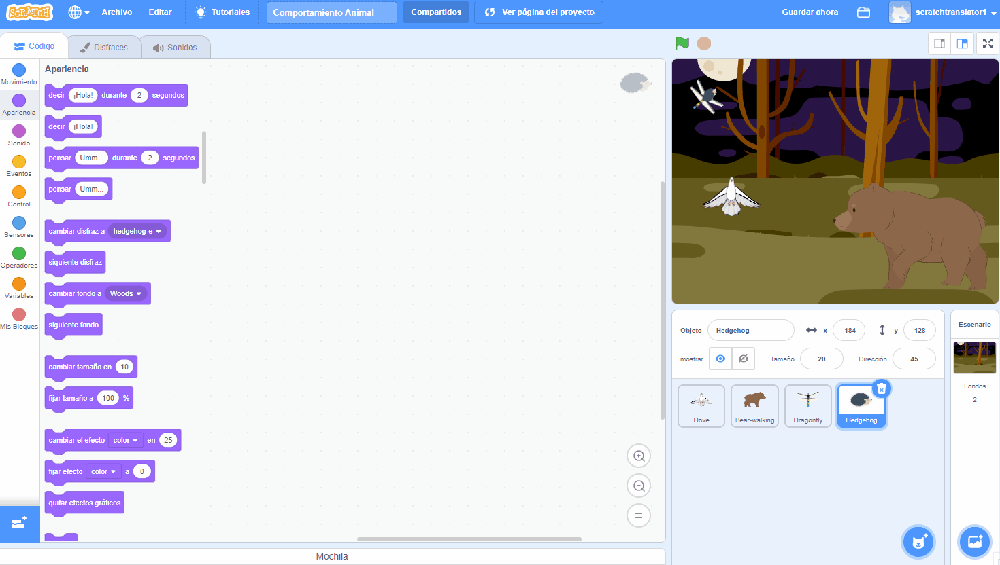

## Consejos de edición
Es útil aprender a copiar y eliminar bloques de código y duplicar objetos.

**Consejo:** Puedes usar <kbd>Ctrl-z</kbd> (mantén presionada la tecla Ctrl y toque 'z') para deshacer muchas acciones en Scratch. Si borras accidentalmente un Objeto u otro elemento, puedes usar **Restaurar** del menú **Editar** para recuperarlo.

Puedes eliminar bloques de código que ya no necesites:

[[[scratch-delete]]]

Duplicar o copiar código puede ahorrarte tiempo al realizar un proyecto.

--- collapse ---
---
title: Duplicar bloques
---

Duplica bloques o conjuntos de bloques para reutilizar en un programa de objetos:

* Ve a la pestaña **Código**.
* Haz clic con el botón derecho (o en una tableta, toca y mantén presionado) en el primer bloque que desees copiar. También seleccionará todos los bloques debajo de él.
* Selecciona **Duplicar** en el menú desplegable. {:width="300px"}
* Arrastra el código duplicado donde desees que vaya. {:width="300px"}
* Elimina los bloques que no necesites.

--- /collapse ---

[[[scratch3-duplicate-sprite]]]

Crea un nuevo objeto y copia todo o parte del código del primer objeto.

--- collapse ---
---
title: Copiar el código de un objeto
---

En la esquina inferior derecha de la lista de Objetos, haz clic en **Elegir un Objeto** y selecciona el objeto que deseas agregar.

Haz clic en el primer objeto y ve a su pestaña **Código**. Arrastra el código que está en el área de Código del primer objeto a la imagen del segundo objeto en la lista de Objetos, luego suelta el código para terminar de copiarlo al segundo objeto. Puedes tener un script que comienza con un bloque `al presionar la bandera verde`{:class="block3events"}, así como otro script que comienza con `al hacer clic en este objeto`{:class="block3events"}. Asegúrate de copiar **todos** los scripts de código que has creado.

{:width="300px"}

Tu segundo objeto ahora tendrá exactamente el mismo código que tu primer objeto. No ejecutes el programa hasta que hayas comenzado a cambiar el código del segundo objeto - es posible que no veas el segundo objeto porque podría estar ubicado debajo del primer objeto.

--- /collapse ---

Si deseas copiar disfraces, objetos, sonidos y scripts entre proyectos, arrástralos a la **Mochila**.

[[[scratch-backpack]]]

Siempre vale la pena dedicar algo de tiempo para asegurarse de haber seguido las mejores prácticas para que tu proyecto sea fácil de entender.

--- collapse ---
---
title: Mejores prácticas para proyectos Scratch
---

- Nombra todos los objetos, disfraces, sonidos, variables y mensajes con sentido. Es mucho más fácil entender los proyectos que utilizan nombres útiles.
- Completa la Página del Proyecto con un buen título, instrucciones y notas para que los usuarios sepan cómo usar tu proyecto y de dónde obtuviste las ideas.
- Agrega comentarios cortos que expliquen lo que está haciendo tu código.
- Asegúrate de que tus scripts estén ordenados en la pestaña **Código**. Puedes hacer clic con el botón derecho y elegir **Eliminar bloque** u ordenar los scripts de la forma que tenga sentido para ti. Intenta poner juntos los scripts similares.

--- /collapse ---
