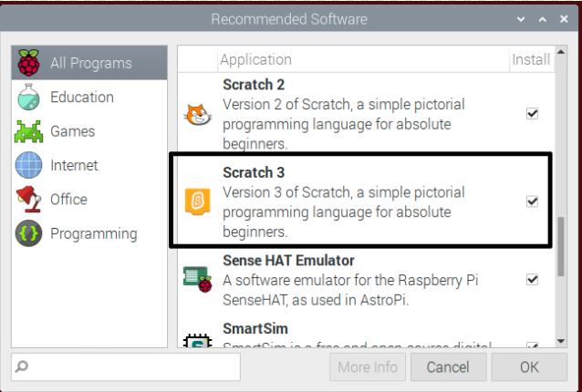
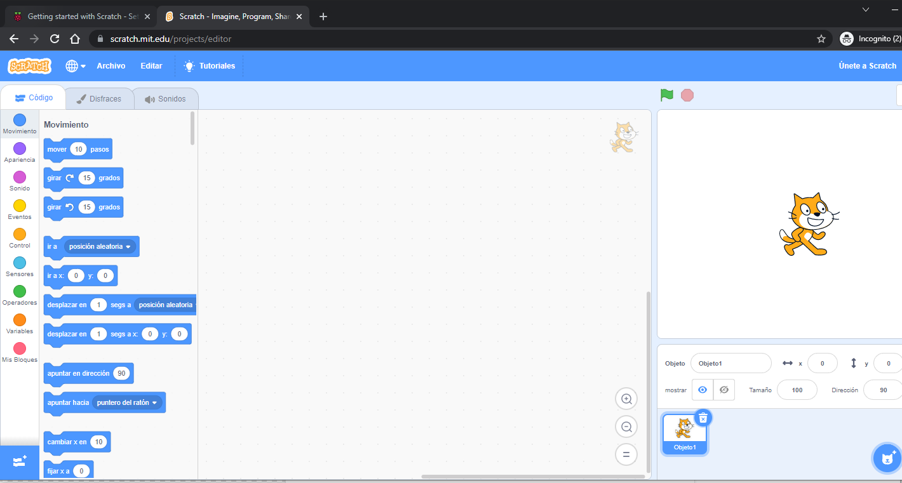
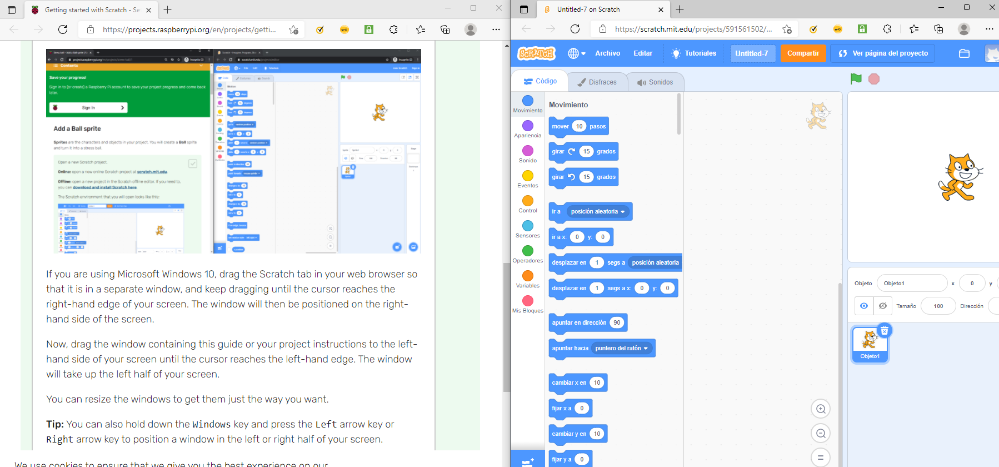
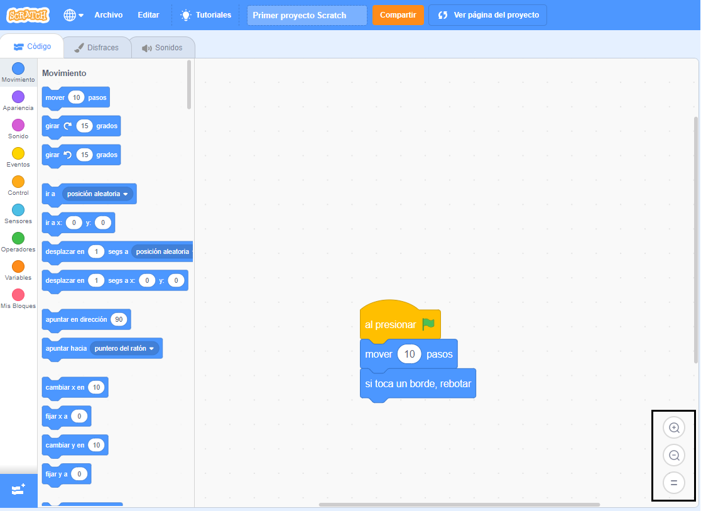

## Configurar Scratch
Puedes usar Scratch en una computadora portátil o de escritorio, o en una tableta. También puedes usar Scratch en una computadora Raspberry Pi.

--- task ---

Abre un navegador web en tu computadora o tableta y visita [rpf.io/scratch-new](https://rpf.io/scratch-new){:target="_blank"} para abrir un nuevo proyecto en el editor de Scratch. Scratch se abrirá en una nueva pestaña en tu navegador web.

**Consejo:** También puedes visitar [scratch.mit.edu](https://scratch.mit.edu/){:target="_blank"} y luego hacer clic en **Crear**.

--- collapse ---
---
title: Trabajar sin conexión a Internet
---

Si necesitas trabajar sin conexión (sin conexión a Internet), puedes [download Scratch](https://scratch.mit.edu/download){:target="_blank"} e instalarlo en una computadora.

No puedes trabajar sin conexión si estás usando una tableta.

--- /collapse ---

--- collapse ---
---
title: Scratch en Raspberry Pi
---

Si estás utilizando una computadora Raspberry Pi, es posible que Scratch ya esté instalado. Haz clic en el icono **Raspberry Pi** para abrir el menú, luego haz clic en **Programar**, luego selecciona **Scratch 3**.

Si necesitas instalar Scratch, sigue este proceso:
+ Haz clic en el icono de Raspberry Pi para abrir el menú
+ Haz clic en **Preferencias**
+ Haz clic en **Software Recomendado**
+ Selecciona **Scratch 3**
+ Haz clic en **OK**

Consulta [Escritorio Scratch 3 para Raspberry Pi](https://www.raspberrypi.org/blog/scratch-3-desktop-for-raspbian-on-raspberry-pi/) para obtener más información.

--- /collapse ---

--- /task ---

--- task ---

Cuando utilices Scratch con esta guía o uno de nuestros proyectos, deberás cambiar entre Scratch y las instrucciones del proyecto.

--- collapse ---
---
title: Cambiar entre las pestañas del navegador
---

Haz clic en (o en una tableta, toca) el título de una pestaña del navegador para cambiar entre el editor de Scratch y las instrucciones del proyecto.

--- /collapse ---

--- collapse ---
---
title: Instrucciones y Scratch juntos
---

Si tu pantalla es lo suficientemente grande, puedes ver Scratch junto a las instrucciones del proyecto.

Si estás utilizando Microsoft Windows 10, arrastra la pestaña Scratch en tu navegador web para que esté en una ventana separada, y sigue arrastrando hasta que el cursor llegue al borde derecho de tu pantalla. De esta manera la ventana se colocará en el lado derecho de la pantalla.

Ahora, arrastra la ventana que contiene esta guía o las instrucciones de tu proyecto hacia el lado izquierdo de tu pantalla hasta que el cursor llegue al borde izquierdo. La ventana ocupará la mitad izquierda de tu pantalla.

Puedes cambiar el tamaño de las ventanas para dejarlas de la manera que desees.

**Consejo:** También puedes mantener presionada la tecla <kbd>Windows</kbd> y presionar la tecla flecha <kbd>Izquierda</kbd> o la tecla flecha <kbd>Derecha</kbd> para colocar una ventana en la mitad izquierda o derecha de la pantalla.

--- /collapse ---

Pruébalo ahora para saber cómo prefieres trabajar.

--- /task ---

--- task ---

Cuando utilices Scratch en un navegador web, puedes acercar o alejar la imagen para ajustar el tamaño.

Por ejemplo, si estás utilizando Microsoft Windows y deseas utilizar el zoom en una página web en Google Chrome o Microsoft Edge, mantén pulsada la tecla <kbd>Ctrl</kbd> y presiona la tecla <kbd>+</kbd> ó tecla <kbd>-</kbd> para acercar o alejar.

--- collapse ---
---
title: Usar el zoom en el área de Código
---

También puedes usar los controles de zoom en el área de Código en Scratch para cambiar el tamaño de los bloques de código en el área de Código.

--- /collapse ---

--- /task ---

