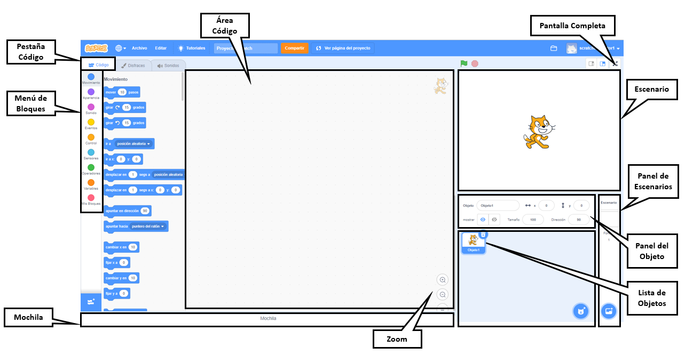

## El editor de Scratch

El **Escenario** es donde se lleva a cabo la acción en tu proyecto. El Escenario tiene una o más imágenes de fondo llamadas **fondos**.

**Objetos** son personajes y objetos que aparecen en el **Escenario**. Los Objetos reciben instrucciones usando bloques de código Scratch. A ésto se le llama **programar**.

Arrastra **bloques de código** desde el **Menú de Bloques** al **Área de código** para programar tus objetos y el Escenario. Los bloques de código pueden hacer que un objeto se mueva alrededor, cambie su apariencia, y reproduzca sonidos.

Los Objetos pueden tener varios **disfraces**. Puedes cambiar el disfraz para modificar la apariencia de un objeto. Esto se puede utilizar para efectos como dar la apariencia de caminar.

Un **script** es una serie de bloques que se unen para dar instrucciones al Escenario o a los objetos. El Escenario y los objetos pueden tener cada uno muchos scripts diferentes. 

