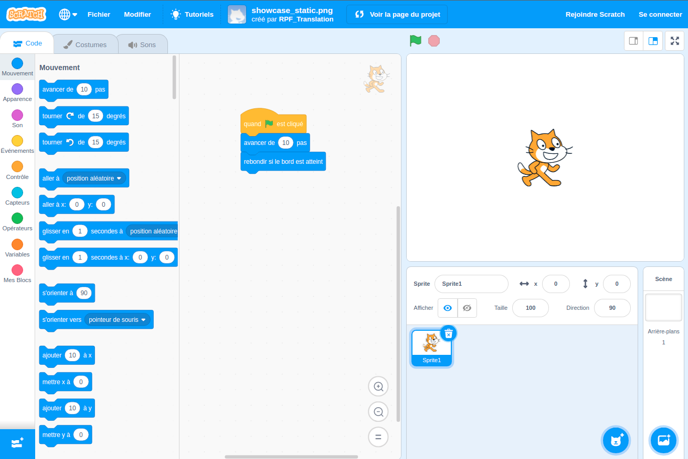

## Qu'est-ce que Scratch ?
Scratch est un langage de programmation graphique développé par le groupe Lifelong Kindergarten du MIT Media Lab. Avec Scratch, tu peux faire glisser et combiner des blocs de code pour créer une gamme de programmes, notamment des animations, des histoires, des instruments de musique et des jeux. C'est un peu comme programmer avec les blocs d'un jeu de construction !

Scratch est utilisé dans de nombreuses écoles dans le cadre de leur programme d'études. C'est gratuit et les jeunes peuvent l'utiliser à la maison comme dans les clubs.

Scratch permet aux jeunes d'apprendre des concepts de codage et de créer des projets interactifs sans avoir besoin d'apprendre un langage de programmation textuel. Tu n'auras pas besoin de taper rapidement ou de mémoriser du code complexe pour utiliser Scratch.

### Comment utiliser ce guide de référence
Si tu n'as jamais utilisé Scratch auparavant, ce guide t'aidera à configurer et à créer ton premier projet.

Tu peux revenir à ce guide et l'utiliser pour rechercher les informations dont tu as besoin lorsque tu crées tes propres projets Scratch.

À la fin du guide, tu trouveras des liens vers des chemins de projets Scratch, de débutant à avancé, où tu peux apprendre le codage en créant des applications, des jeux, des histoires, des animations, de l'art et de la musique amusants et intéressants.

--- collapse ---
---
title: Ce qu'il te faudra
---
### Matériel informatique

+ Un ordinateur ou une tablette capable d'exécuter Scratch 3

### Logiciel

+ Ce guide t'expliquera comment démarrer avec Scratch 3 (soit [en ligne](https://scratch.mit.edu/){:target="_blank"} ou [hors ligne](https://scratch.mit.edu/download){:target="_blank"})

--- /collapse ---
