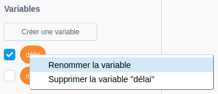
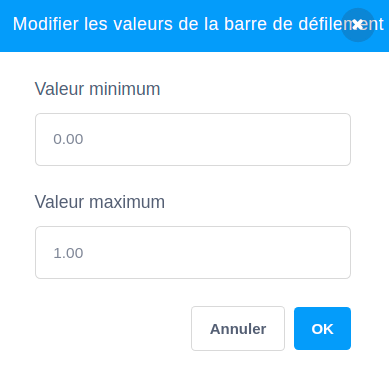

## Variables

Une `variable`{:class="block3variables"} est un moyen de stocker des nombres et/ou du texte.

Tu peux créer tes propres variables et choisir si elles s'affichent sur la Scène :

[[[generic-scratch3-add-variable]]]

Tu dois considérer si tu as besoin de définir une valeur de départ lorsque tu crées une variable :

[[[scratch3-create-set-variable]]]

Tu peux renommer une variable si tu changes d'avis :

--- collapse ---
---
title: Renommer une variable
---

Parfois, tu penses à un meilleur nom pour une variable.

Tu peux donner un nouveau nom à une variable : va dans la catégorie `Variables`{:class="block3variables"}, fais un clic droit (ou sur une tablette, appuie longuement) sur la `variable`{:class="block3variables"}, et choisis **Renommer la variable**.



Cela changera le nom de la variable dans tous les blocs dans lesquels tu l'as utilisée.

--- /collapse ---

**Astuce :** Assure-toi de connaître la différence entre `mettre à`{:class="block3variables"} et `ajouter à`{:class="block3variables"}. `mettre à`{:class="block3variables"} remplacera la valeur stockée dans une variable. `ajouter à`{:class="block3variables"} changera la valeur d'une variable numérique du montant que tu choisis, `ajouter`{:class="block3variables"}`1` ajoutera un à une variable. `ajouter`{:class="block3variables"}`-1` enlèvera un à une variable.


**Astuce :** Les variables sur la Scène apparaissent toujours dans une couche au-dessus de tous les sprites. Si tu as un sprite en mouvement, le sprite sera affiché en dessous des variables sur la Scène.

Tu peux utiliser un curseur pour contrôler la valeur d'une variable.

[[[scratch3-slider-variable]]]

Autres idées d'utilisation des variables :

[[[generic-scratch3-high-score]]]

[[[scratch3-join-text]]]

[[[scratch3-set-variable-with-button]]]

[[[scratch3-change-variable-in-loop]]]


--- collapse ---
---
title: Contrôler les effets graphiques avec un curseur variable
---

Voici quelques exemples d'utilisation de ton curseur variable :


Cet exemple modifie l'effet `fantôme`{:class="block3looks"} afin que tu puisses voir à travers l'arc-en-ciel.

**Arc-en-ciel transparent** : [Voir à l'intérieur](https://scratch.mit.edu/projects/451544795/editor){:target="_blank"}

<div class="scratch-preview">
  <iframe allowtransparency="true" width="485" height="402" src="https://scratch.mit.edu/projects/embed/451544795/?autostart=false" frameborder="0"></iframe>
</div>

Tu peux utiliser une variable `transparence`{:class="block3variables"} pour contrôler l'effet `fantôme`{:class="block3looks"} sur un sprite situé au `premier plan`{:class="block3looks"}, et utiliser pour révéler ou masquer les sprites situés sur les couches inférieures.

```blocks3
when flag clicked
go to [front v] layer
```

```blocks3
when flag clicked
forever
set [ghost v] effect to (transparence)
```

Essaye d'utiliser la même approche avec d'autres effets graphiques tels que `luminosité`{:class="block3looks"} ou `couleur`{:class="block3looks"}.

--- /collapse ---

--- collapse ---
---
title: Contrôler la vitesse de déplacement avec une variable
---

**Coccinelle sur un mur** : [Voir à l'intérieur](https://scratch.mit.edu/projects/451545341/editor){:target="_blank"}

<div class="scratch-preview">
  <iframe allowtransparency="true" width="485" height="402" src="https://scratch.mit.edu/projects/embed/451545341/?autostart=false" frameborder="0"></iframe>
</div>

Utiliser la variable `vitesse`{:class="block3variables"} comme entrée d'un bloc `avancer`{:class="block3motion"} :

```blocks3
when flag clicked
forever
move (vitesse) steps
if on edge, bounce
```
Définis les valeurs minimales et maximales pour la plage du curseur en fonction de ton projet.

--- /collapse ---

--- collapse ---
---
title: Contrôler la vitesse de rotation avec une variable
---

**Chien spationaute** : [Voir à l'intérieur](https://scratch.mit.edu/projects/451543041/editor){:target="_blank"}

<div class="scratch-preview">
  <iframe allowtransparency="true" width="485" height="402" src="https://scratch.mit.edu/projects/embed/451543041/?autostart=false" frameborder="0"></iframe>
</div>

Utiliser une variable `angle`{:class="block3variables"} comme l'entrée d'un bloc `touner vers la droite`{:class="block3motion"} :

```blocks3
when flag clicked
forever
turn right (angle) degrees
```

--- /collapse ---

--- collapse ---
---
title: Modifier le délai dans un bloc d'attente
---

**La danse du squelette** : [Voir à l'intérieur](https://scratch.mit.edu/projects/451536565/editor){:target="_blank"}

<div class="scratch-preview">
  <iframe allowtransparency="true" width="485" height="402" src="https://scratch.mit.edu/projects/embed/451536565/?autostart=false" frameborder="0"></iframe>
</div>

Utiliser une variable `délai`{:class="block3variables"} comme paramètre d'entrée d'un bloc `attendre`{:class="block3control"} :

```blocks3
when flag clicked
forever
wait (délai) seconds
next costume
```

Un délai de plus d'une seconde est assez long. Si tu inclus un nombre décimal dans la plage d'un curseur, tu peux modifier la valeur par tranche d'un 100ème de seconde à la fois.

Une plage de `0.00` à `1.00` te permet de choisir un délai entre `0` secondes (pas de délai) et `1` secondes.



Modifie les nombres pour obtenir les valeurs minimales et maximales que tu souhaites que les utilisateurs puissent utiliser dans ton projet.

--- /collapse ---

--- collapse ---
---
title: Changer les effets sonores
---

**Ton musical** : [Voir à l'intérieur](https://scratch.mit.edu/projects/451547017/editor){:target="_blank"}

<div class="scratch-preview">
  <iframe allowtransparency="true" width="485" height="402" src="https://scratch.mit.edu/projects/embed/451547017/?autostart=false" frameborder="0"></iframe>
</div>

Tu peux utiliser une `variable`{:class="block3variables"} dans un bloc `mettre l'effet hauteur à`{:class="block3sound"}. Si tu augmentes la hauteur d'un son, les notes deviennent plus hautes et le son s'accélère.

```blocks3
when flag clicked
forever
set [pitch v] effect to (rythme) :: sound
```

Joue le son dans une boucle `répéter indéfiniment`{:class="block3control"}, de sorte que la hauteur change immédiatement, plutôt que d'attendre la fin de la lecture du son :

```blocks3
when flag clicked
forever
play sound [Dance Head Nod v] until done
```

Tu peux également utiliser une `variable`{:class="block3variables"} pour modifier le volume et l'effet stéréo gauche-droite (panoramique ).

--- /collapse ---


