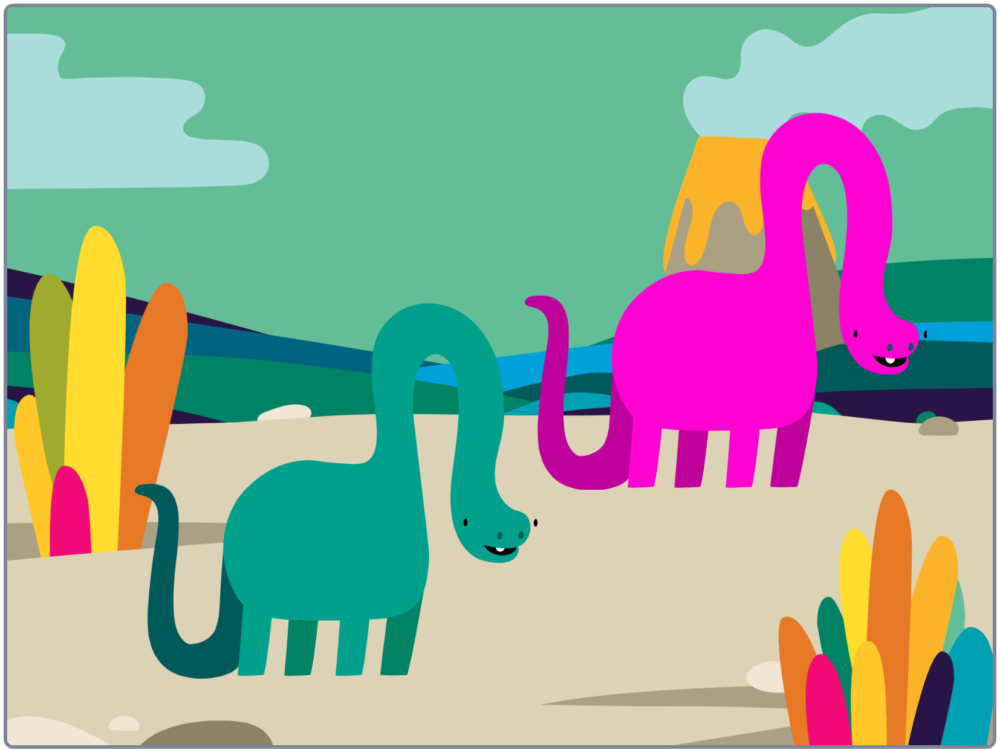

## Éditeur graphique

Utiliser l'éditeur graphique pour créer tes propres arrière-plans et costumes, et pour éditer des arrière-plans et des costumes existants.

{:width="600px"}

[[[scratch3-paint-a-new-backdrop-extended]]]

[[[scratch3-backdrops-and-sprites-using-shapes]]]

[[[scratch3-use-text-tool]]]

[[[scratch3-add-costumes-to-a-sprite]]]

[[[scratch-crosshair]]]

[[[scratch3-copy-parts-between-sprite-costumes]]]

--- collapse ---
---
title: Dupliquer et éditer un costume à utiliser dans une animation
---

Certains sprites Scratch n'ont qu'un seul costume, ou ont plusieurs costumes qui ne fonctionnent pas comme une animation. Si tu choisis un costume, puis le dupliques (en en faisant une copie) et apportes une petite modification, cela peut créer un effet d'animation.

**Animation robot** : [Voir à l'intérieur](https://scratch.mit.edu/projects/436260207/editor){:target="_blank"}

  <iframe allowtransparency="true" width="485" height="402" src="https://scratch.mit.edu/projects/embed/436260207/?autostart=false" frameborder="0"></iframe>

Bascule vers l'onglet **Costumes** de ton sprite.

Choisis le costume que tu souhaites utiliser, et supprimes les autres, car tu n'en auras pas besoin pour ton animation. Par exemple, le sprite **Robot** est livré avec des costumes pour trois robots différents, tu dois donc choisir l'un des costumes et supprimer les autres costumes.

Fais un clic droit (ou sur une tablette, appuie longuement) sur le costume, et choisis **dupliquer**.

Apporte de petites modifications à la copie du costume. Par exemple, tu peux déplacer, faire pivoter ou modifier tout ou partie du costume. Tu peux également ajouter des lignes de mouvement.

Si ton costume utilise des graphiques vectoriels, tu peux sélectionner des parties d'un costume et modifier chaque partie séparément.

Tu peux à nouveau dupliquer le costume et apporter d'autres modifications pour ajouter plus d'images à ton animation.

Tu peux maintenant utiliser tes costumes dans une simple animation de sprite.

--- /collapse ---

--- collapse ---
---
title: Utiliser l'outil Remplissage pour changer les couleurs d'un costume
---

Tu peux changer la couleur de ton sprite. Tout d'abord, sélectionne ton sprite dans la liste Sprite sous la Scène, puis clique sur l'onglet **Costumes**.

Utilise l'outil **Sélectionner** (Flèche) pour mettre en surbrillance la partie du costume dont tu souhaites changer la couleur.

{:width="200px"}

{:width="300px"}

Développe le sélecteur de couleurs **Remplissage** et sélectionne une couleur. Cela remplira automatiquement la forme que tu as sélectionnée.

{:width="300px"}

Répéte les étapes ci-dessus pour toute partie du costume que tu as manquée, ou pour toute autre partie du costume dont tu souhaites changer la couleur.

{:width="300px"}

{:width="300px"}

{:width="300px"}

--- /collapse ---

Utilisez les conseils ci-dessous pour vous aider à créer vos propres modèles de sprites dans l'éditeur graphique.

--- collapse ---
---
title: Créer des décors sous forme de sprites
---

**Une colline comme sprite** : [Voir à l'intérieur](https://scratch.mit.edu/projects/452582516/editor){:target="_blank"}

{:width="400px"}

Pour créer ta propre **Colline** , illustrée dans l'exemple ci-dessus, tu peux utiliser les outils **Cercle** et **Rectangle** dans l'éditeur graphique :

+ Va à **Choisir un Sprite** et sélectionne **Peindre** pour créer un nouveau costume de sprite.

{:width="400px"}

+ Choisis une couleur de **Remplissage**. Clique sur **Contour** et désélectionne-le (pour cela, clique sur la case avec la ligne diagonale rouge en bas à gauche du menu). Maintenant, utilise l'outil **Cercle** pour dessiner un ovale. Ensuite, sélectionne l'outil **Rectangle** et dessine un rectangle sous l'ovale.

+ Si tu utilises des couleurs différentes pour les formes, tu devras peut-être utiliser les outils **Avancer** et **Reculer** dans l'éditeur graphique pour déplacer tes formes vers l'avant ou vers l'arrière afin qu'elles soient correctement positionnées dans ton arrière-plan.

+ Tu peux sélectionner toutes les formes et les **Grouper** ensemble afin de pouvoir les ajuster ou les déplacer comme une seule forme.

{:width="400px"}

Maintenant, crée d'autres sprites pour ton décor, si cela correspond à ton idée de projet.

N'oublie pas de nommer ton ou tes sprite(s).

--- /collapse ---

--- collapse ---
---
title: Utiliser l'outil Ligne pour créer un triangle
---

Tu peux créer des polygones, comme un triangle, et utiliser ces formes pour créer des toits ou des montagnes.

Va à **Choisir un Sprite** et sélectionne **Peindre** pour créer un nouveau costume de sprite. Dans cet exemple, tu vas faire des maisons.

**Maison** : [Voir à l'intérieur](https://scratch.mit.edu/projects/453595663/editor){:target="_blank"}

{:width="400px"}

Si tu suis les instructions ci-dessous, tu peux utiliser l'outil **Ligne** pour créer n'importe quelle forme :
+ Choisis une couleur de **Remplissage**. Pour choisir la couleur noire, diminue la **Luminosité** à zéro (`0`).

{:width="150px"}

+ Sélectionne **Pas de contour**.

{:width="200x"}

+ Utilise l'outil **Rectangle** pour dessiner un rectangle.
+ Utilise l'outil **Ligne** pour dessiner un triangle. Assure-toi de compléter le triangle, sinon il ne se remplira pas de couleur.
+ Déplace les deux formes pour les connecter ensemble.
+ Sélectionne l'outil **Remplissage** (Seau) et remplis le triangle de couleur.
+ Utilise l'outil **Rectangle** pour dessiner un autre rectangle pour la cheminée.
+ Tu peux utiliser les outils **Avancer** et **Reculer** dans l'éditeur graphique pour déplacer tes formes vers l'avant ou vers l'arrière afin qu'elles soient correctement positionnées. Dans cet exemple, tu n'auras pas besoin de le faire, car les formes sont noires afin de former une silhouette.
+ Sélectionne toutes les formes et clique sur **Grouper** afin que tu puisses les ajuster ou les déplacer comme une seule forme.

Pour créer des formes en double de ta maison (par exemple, pour créer une ligne d'horizon), suis les conseils sous **Dupliquer des formes pour créer un costume de décor** ci-dessous.

--- /collapse ---

--- collapse ---
---
title: Dupliquer des formes pour créer un costume de décor
---

Tu voudras peut-être dupliquer des formes dans un costume afin que ton paysage semble plus occupé ou plus peuplé.

**Nuages multiples** : [Voir à l'intérieur](https://scratch.mit.edu/projects/447278432/editor){:target="_blank"}

{:width="400px"}

L'effet de multiplication des formes est utilisé par les animateurs professionnels pour créer l'impression de conditions météorologiques, telles que la pluie ou les nuages ; un groupe d'objets, tels que des bâtiments ou un bois ; ou une foule de personnes dans une scène.

--- no-print ---

--- /no-print ---

Pour multiplier tout type de forme :
+ Va à **Choisir un Sprite** et sélectionne, dans cet exemple, le Sprite ** Cloud**
+ Dans l'onglet **Costumes** , utilise l'outil **Sélectionner** pour surligner l'ensemble de la forme
+ Utilise les outils **Copier** et **Coller** pour créer des doublons de la forme
+ Utilise l'outil **Sélectionner** pour déplacer la forme dans l'éditeur graphique
+ Tu peux varier la taille des formes pour aider à créer un plus grand sens d'effet 3D, par exemple
+ Tu peux sélectionner toutes les formes et les **Grouper** ensemble, afin de pouvoir les ajuster ou les déplacer comme une seule forme

--- /collapse ---

--- collapse ---
---
title: Utiliser la saturation et la luminosité pour créer de la profondeur
---

Dans le monde réel, les objets plus éloignés apparaissent de couleur plus claire. Pour obtenir des scènes 3D plus réalistes, tu peux **diminuer** la couleur **Saturation** et/ou **Luminosité** de chaque sprite afin qu'ils apparaissent de plus en plus loin.

{:width="400px"}

--- /collapse ---

--- collapse ---
---
title: Créer un sprite avec des espaces laissant voir à travers
---

Tu peux créer un sprite qui a des espaces te laissant voir à travers. S'il est positionné à l'avant-plan et a la taille de la Scène, il peut apparaître comme une vue à travers les barreaux d'une cage ou d'une fenêtre.

--- no-print ---

**Lion en cage** : [Voir à l'intérieur](https://scratch.mit.edu/projects/445680159/editor){:target="_blank"}

--- /no-print ---

Pour créer un type de sprite de masquage :
+ Va à **Choisir un Sprite** et sélectionne **Peindre**
+ Choisis une couleur de **Remplissage** sans **Contour** et dessine un rectangle vertical
+ Utilise les outils **Copier** et **Coller** pour répéter cette forme
+ Utilise l'outil **Sélectionner** pour déplacer les formes
+ Lorsque tu places tes formes, assure-toi qu'elles touchent le bord de la Scène pour s'adapter à ton idée de projet

--- /collapse ---

**Astuce :** Si tu as du mal à gérer les sprites sur ta scène, par exemple si tu as un grand sprite qui en recouvre un beaucoup plus petit, tu peux cliquer sur **Cacher** pour ne pas voir un ou plusieurs sprites. Ensuite, lorsque tu as terminé, clique à nouveau sur **Montrer**.

{:width="300px"}
