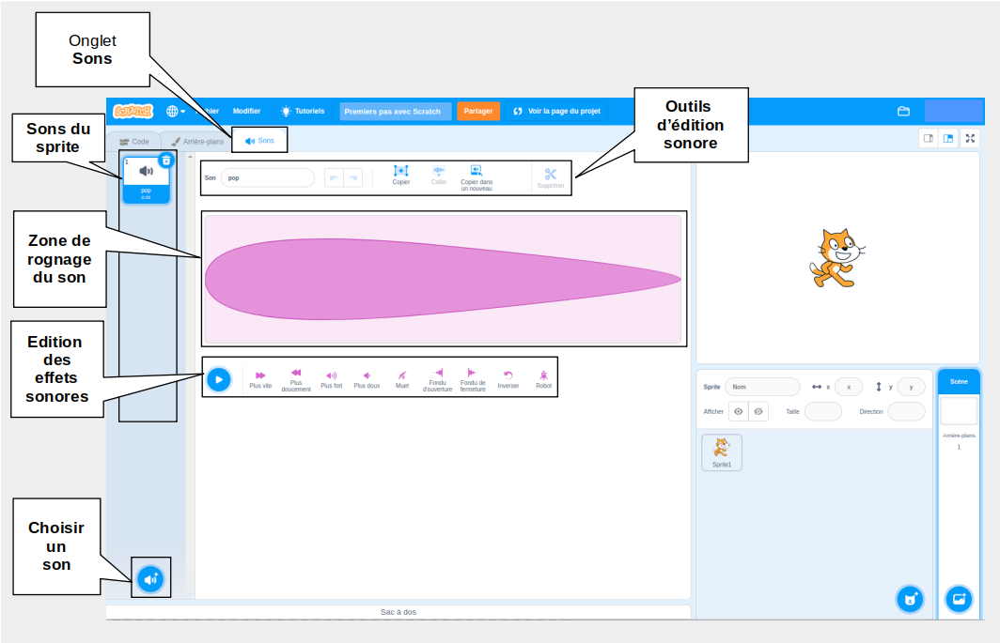

## Éditeur de son

Utiliser l'éditeur de sons pour ajouter et modifier des sons existants et pour enregistrer tes propres sons.

{:width="600px"}

### Créer des sons

[[[scratch3-add-sound]]] 
[[[scratch3-record-sound]]]

### Édition des sons

Modifie des sons entiers ou des parties de sons.

[[[scratch3-reverse-sound]]] 
[[[scratch3-crop-sound]]] 
[[[scratch3-sound-effects]]]
