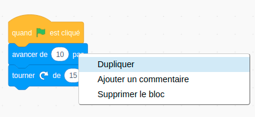
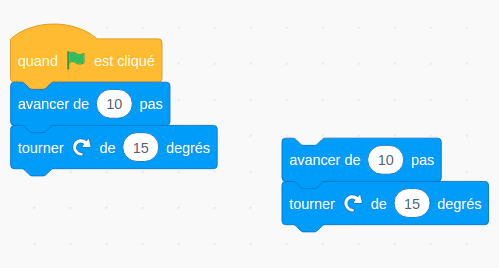
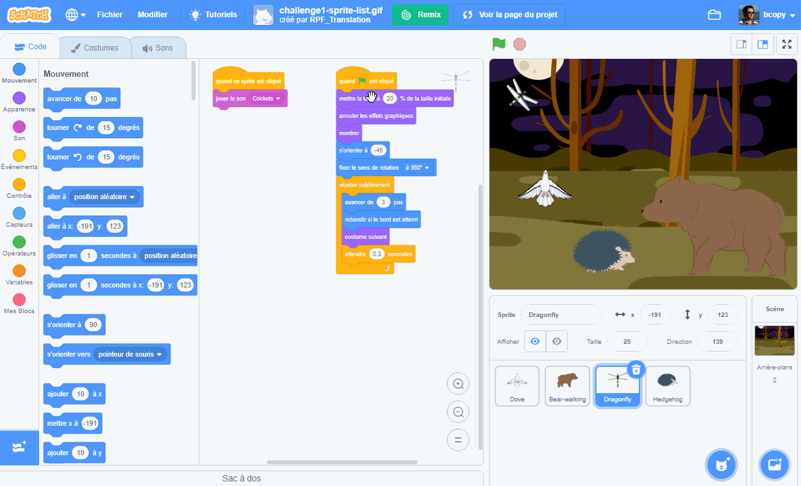

## Conseils d'édition
Il est utile d'apprendre à copier et supprimer des blocs de code et à dupliquer des sprites.

**Astuce :** Tu peux utiliser <kbd>Ctrl-z</kbd> (maintiens la touche Ctrl enfoncée et appuie sur « z ») pour annuler de nombreuses actions dans Scratch. Si tu supprimes accidentellement un Sprite ou un autre élément, tu peux utiliser **Restaurer** dans le menu principal **Modifier** pour le récupérer.

Tu peux supprimer les blocs de code dont tu n'as plus besoin :

[[[scratch-delete]]]

Dupliquer ou copier du code peut te faire gagner du temps lors de la création d'un projet.

--- collapse ---
---
title: Dupliquer des blocs
---

Dupliquer des blocs ou ensembles de blocs pour les réutiliser dans le programme d'un sprite :

* Va dans l'onglet **Code**.
* Fais un clic droit (ou sur une tablette, appuie longuement) sur le premier bloc que tu souhaites copier. Il sélectionnera également tous les blocs en dessous.
* Sélectionne **Dupliquer** dans le menu déroulant. {:width="300px"}
* Fais glisser le code dupliqué où tu veux qu'il aille. {:width="300px"}
* Supprime tous les blocs dont tu n'as pas besoin.

--- /collapse ---

[[[scratch3-duplicate-sprite]]]

Crée un nouveau sprite et copie tout ou partie du code du premier sprite.

--- collapse ---
---
title: Copier le code d'un sprite
---

Dans le coin inférieur droit de la liste des Sprites, clique sur **Choisir un Sprite** et sélectionne le sprite que tu souhaites ajouter.

Clique sur le premier sprite et accéde à son onglet **Code**. Fais glisser le code qui se trouve dans la zone Code du premier sprite vers l'image du deuxième sprite dans la liste Sprite, puis relâche le code pour terminer de le copier dans le deuxième sprite. Tu peux avoir un script qui commence par un bloc `quand le drapeau vert est cliqué`{:class="block3events"}, ainsi qu'un autre script qui commence par `quand ce sprite est cliqué`{:class="block3events"}. Assure-toi de copier **tous**les scripts de code que tu as créés.

{:width="300px"}

Ton deuxième sprite aura maintenant exactement le même code que ton premier sprite. N'exécute pas le programme avant d'avoir commencé à modifier le code du deuxième sprite — tu pourrais ne pas voir le deuxième sprite car il pourrait être placé sous le premier sprite.

--- /collapse ---

Si tu souhaites copier des costumes, des sprites, des sons et des scripts entre les projets, fais-les glisser dans le **Sac à dos**.

[[[scratch-backpack]]]

Cela vaut toujours la peine de passer du temps à s'assurer que tu as suivi les meilleures pratiques afin que ton projet soit facile à comprendre.

--- collapse ---
---
title: Meilleures pratiques pour les projets Scratch
---

- Nomme judicieusement tous les sprites, costumes, sons, variables et messages. Il est beaucoup plus facile de comprendre les projets qui utilisent des noms faciles.
- Remplis la page du projet avec un bon titre, des instructions et des notes afin que les utilisateurs sachent comment utiliser ton projet et d'où tu as obtenu des idées.
- Ajoute de courts commentaires qui expliquent ce que fait ton code.
- Assure-toi que tes scripts sont bien rangés dans l'onglet **Code**. Tu peux cliquer avec le bouton droit de la souris et choisir **Nettoyer les blocs** ou organiser les scripts d'une manière qui te convient. Essaye de rassembler des scripts similaires.

--- /collapse ---
