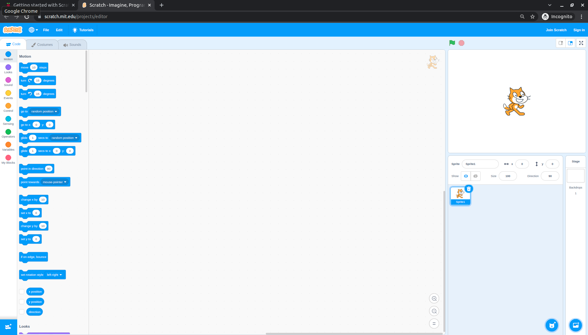
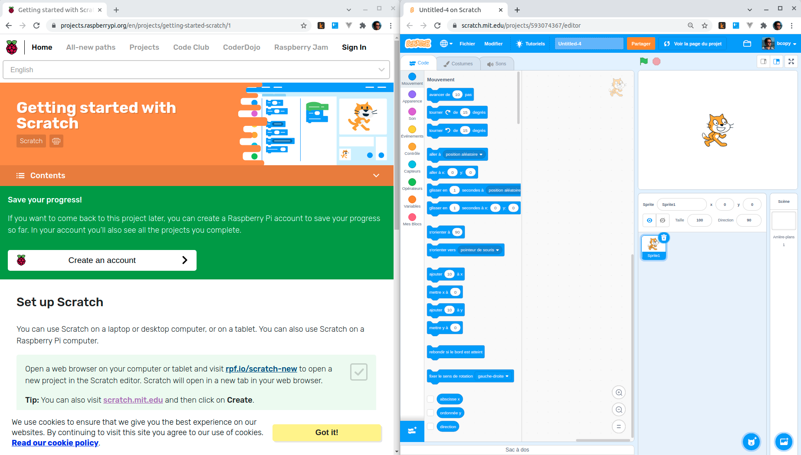
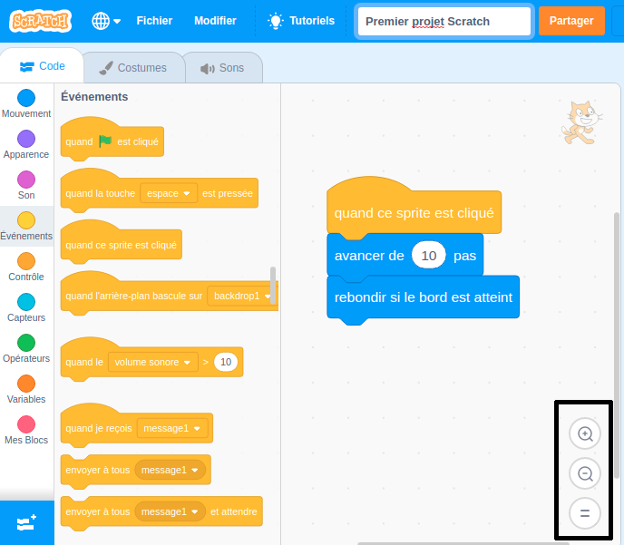

## Installer Scratch
Tu peux utiliser Scratch sur un ordinateur portable ou de bureau ou encore sur une tablette. Tu peux également utiliser Scratch sur un ordinateur Raspberry Pi.

--- task ---

Ouvre un navigateur Web sur ton ordinateur ou ta tablette et visite [rpf.io/scratch-new](https://rpf.io/scratch-new){:target="_blank"} pour ouvrir un nouveau projet dans l'éditeur Scratch. Scratch s'ouvrira dans un nouvel onglet de ton navigateur Web.

**Astuce :** Tu peux également visiter [scratch.mit.edu](https://scratch.mit.edu/){:target="_blank"} puis cliquer sur **Créer**.

--- collapse ---
---
title: Travailler hors ligne sans connexion Internet
---

Si tu dois travailler hors ligne (sans connexion Internet), tu peux [télécharger Scratch](https://scratch.mit.edu/download){:target="_blank"} et l'installer sur un ordinateur.

Tu ne peux pas travailler hors ligne si tu utilises une tablette.

--- /collapse ---

--- collapse ---
---
title : Scratch sur Raspberry Pi
---

Si tu utilises un ordinateur Raspberry Pi, Scratch est peut-être déjà installé . Clique sur l'icône **Raspberry Pi** pour ouvrir le menu, puis clique sur **Programmation**, puis sélectionne **Scratch 3**.

Si tu dois installer Scratch, suis ce processus :
+ Clique sur l'icône Raspberry Pi pour ouvrir le menu
+ Clique sur **Préférences**
+ Clique sur **Logiciels recommandés**
+ Sélectionne **Scratch 3**
+ Clique sur **OK**

Voir [Scratch 3 Desktop pour Raspberry Pi](https://www.raspberrypi.org/blog/scratch-3-desktop-for-raspbian-on-raspberry-pi/) pour plus d'informations.

--- /collapse ---

--- /task ---

--- task ---

Lorsque tu utilises Scratch avec ce guide ou l'un de nos projets, tu devras basculer entre Scratch et les instructions du projet.

--- collapse ---
---
title: Basculer entre les onglets du navigateur
---

Clique sur (ou sur une tablette, appuie sur) le titre d'un onglet du navigateur pour basculer entre l'éditeur Scratch et les instructions du projet.

--- /collapse ---

--- collapse ---
---
title: Instructions et Scratch côte à côte
---

Si ton écran est assez grand, tu peux avoir Scratch côte à côte avec les instructions du projet.

Si tu utilises Microsoft Windows 10, fais glisser l'onglet Scratch dans ton navigateur Web afin qu'il se trouve dans une fenêtre séparée, et continue à faire glisser jusqu'à ce que le curseur atteigne le bord droit de ton écran. La fenêtre sera alors positionnée sur le côté droit de l'écran.

Maintenant, fais glisser la fenêtre contenant ce guide ou les instructions de ton projet sur le côté gauche de ton écran jusqu'à ce que le curseur atteigne le bord gauche. La fenêtre occupera la moitié gauche de votre écran.

Tu peux redimensionner les fenêtres pour les afficher exactement comme tu le souhaites.

**Astuce :** Tu peux également maintenir la <kbd>Windows</kbd> enfoncée et appuyer sur la touche <kbd>Flèche Gauche</kbd> ou <kbd>Flèche Droite</kbd> pour positionner une fenêtre dans la moitié gauche ou droite de ton écran.

--- /collapse ---

Essaye cela maintenant et vois comment tu préfères travailler.

--- /task ---

--- task ---

Lorsque tu utilises Scratch dans un navigateur Web, tu peux effectuer un zoom avant ou arrière pour ajuster la taille.

Par exemple, si tu utilises Microsoft Windows et que tu souhaites utiliser le zoom sur une page Web dans Google Chrome ou Microsoft Edge, maintiens la touche <kbd>Ctrl</kbd> enfoncée et appuie sur la touche <kbd>+</kbd> ou <kbd>-</kbd> pour effectuer un zoom avant ou arrière.

--- collapse ---
---
title: Zoomer dans la zone Code
---

Tu peux également utiliser les commandes de zoom dans la zone Code dans Scratch pour modifier la taille des blocs de code dans la zone Code.

--- /collapse ---

--- /task ---

