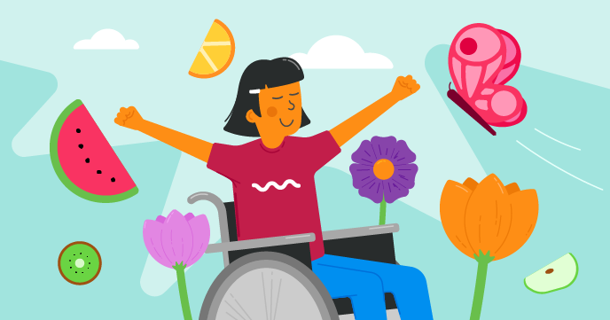

## Nos projets Scratch

Nos parcours Scratch comportent chacun six projets, pour t'aider à acquérir différentes compétences dans Scratch, afin de créer tes propres projets de manière indépendante.

Tu peux revenir à ce guide de référence, Premiers pas avec Scratch, chaque fois que tu as besoin de te rappeler les compétences que tu as acquises.

Ces projets peuvent être réalisés sur n'importe quel ordinateur ou tablette exécutant Scratch 3.

### Projets Scratch pour débutants

Si tu débutes avec Scratch, commence par nos parcours pour débutants :

[Introduction à Scratch : sprites, scripts et boucles](https://projects.raspberrypi.org/en/pathways/scratch-intro){:target="_blank "} 
Dans cette introduction pour débutants, tu apprendras à ajouter du code, des costumes et des sons aux sprites lorsque tu crées des animations, un jeu, des applications et une histoire.

[Prenez soin de vous](https://projects.raspberrypi.org/en/pathways/look-after-yourself){:target="_blank"} 
Apprendre comment prendre soin de toi et des autres avec les projets Scratch pour te faire rire, te détendre, contrôler, créer, faire de l'exercice et te concentrer.

[Scratch module 1](https://projects.raspberrypi.org/en/pathways/scratch-module-1){:target="_blank"}

 

### Projets Scratch pour utilisateurs confirmés

Si tu connais déjà les sprites, les costumes, les décors et les boucles, essaye ces projets :

[Plus de Scratch : envoyer à tous, décisions et variables](https://projects.raspberrypi.org/en/pathways/more-scratch){:target="_blank" } 
Plus de Scratch va au-delà des bases introduites dans Introduction à Scratch. Vous créerez des applications, des jeux et des simulations en utilisant les blocs Envoyer à tous, des décisions si..alors et si..alors..sinon, ainsi que des variables.

[Module Scratch 2](https://projects.raspberrypi.org/en/pathways/scratch-module-2){:target="_blank"} 

 

### Projets Scratch avancés

Si tu souhaites en savoir plus sur les listes, les clones et la création de tes propres blocs, essaye ces projets :

[Plus loin avec Scratch : clones, mes blocs et logique booléenne](https://projects.raspberrypi.org/en/pathways/further-scratch){:target=" _blank"} 
Plus loin avec Scratch va au-delà des compétences introduites dans Introduction à Scratch et Plus de Scratch. Tu créeras des applications, des jeux, de l'art généré par ordinateur et des simulations à l'aide de la logique booléenne, des fonctions, des clones, etc.

[Protégez notre planète](https://projects.raspberrypi.org/en/pathways/protect-our-planet){:target="_blank"} 
Utilise Scratch pour Découvrir notre planète et comment protéger l'environnement pour les générations futures.

[Scratch pour l'entreprise sociale](https://projects.raspberrypi.org/en/coderdojo/scratch-for-social-enterprise){:target="_blank"} 

[Module Scratch 3](https://projects.raspberrypi.org/en/pathways/scratch-module-3){:target="_blank"} 

 

### Projets matériels Scratch GPIO pour le Raspberry Pi

Si tu as un ordinateur Raspberry Pi, tu peux également essayer ces projets. Tu auras besoin de composants électroniques supplémentaires.

 

[Physical computing with Scratch path](https://projects.raspberrypi.org/en/pathways/physical-computing-with-scratch-and-the-raspberry-pi){:target="_blank"}

 

[Physical computing with Scratch additional projects](https://projects.raspberrypi.org/en/projects?software%5B%5D=scratch&hardware%5B%5D=raspberry-pi){:target="_blank"}

 

Tu as apprécié le guide Scratch ? As-tu repéré un problème ? S'il te plaît clique sur le bouton **Envoyer des commentaires** ci-dessous et fais-le nous savoir !
