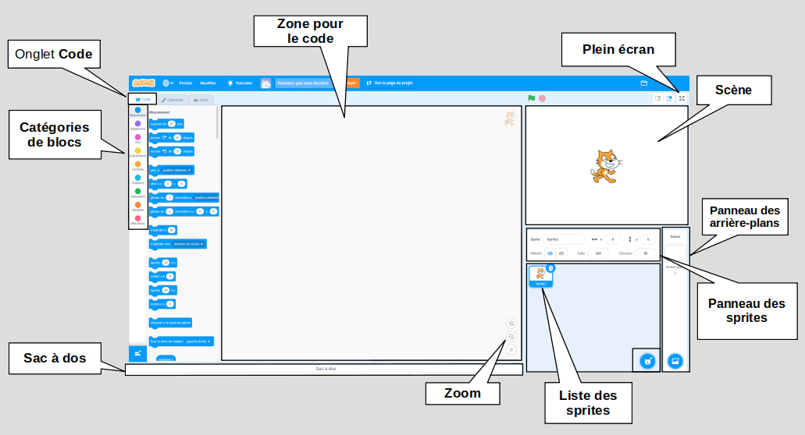

## L'éditeur Scratch

La **Scène** est l'endroit où se déroule l'action de ton projet. La scène a une ou plusieurs images de fond appelées **arrière-plans**.

Les **sprites** sont des personnages et des objets qui apparaissent sur la **Scène**. Les sprites reçoivent des instructions à l'aide de blocs de code Scratch. C'est ce qu'on appelle la **programmation**.

Fais glisser les **blocs de code** du **menu Blocs** vers la **zone de codage** pour programmer tes sprites et la Scène. Les blocs de code peuvent faire bouger un sprite, changer son apparence et jouer des sons.

Les sprites peuvent avoir plusieurs **costumes**. Tu peux changer le costume pour changer l'apparence d'un sprite. Cela peut être utilisé pour des effets tels que donner l'impression de marcher.

Un **script** est une série de blocs qui sont réunis pour donner des instructions à la Scène ou aux sprites. La Scène et les sprites peuvent avoir chacun de nombreux scripts différents. 

