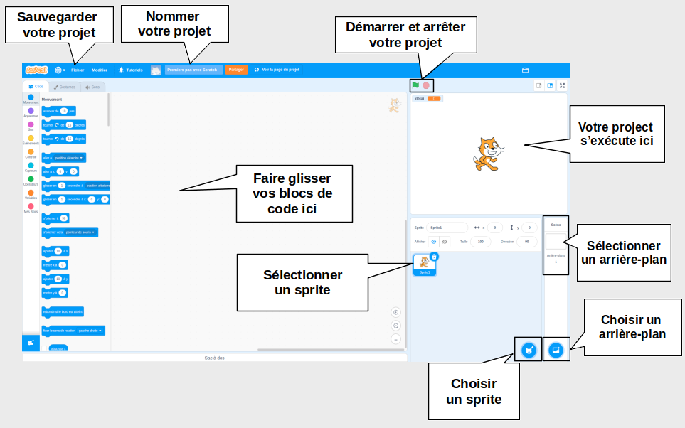

## Ton premier projet Scratch



--- task ---

Lorsque tu crées un nouveau projet Scratch, il inclut un sprite **chat**.

Fais glisser des blocs du menu Blocs vers la zone Code pour faire faire quelque chose au chat.

Pour essayer un exemple, fais glisser un bloc `avancer`{:class="block3motion"} de la catégorie `Mouvement`{:class="block3motion"}. Les blocs sont catégorisés par couleur pour t'aider à les trouver.


Tu peux cliquer sur les blocs dans la zone Code pour les exécuter. Clique sur le bloc `avancer`{:class="block3motion"} et le chat se déplacera.

**Astuce :** Si tu utilises Scratch sur une tablette, tu peux appuyer sur un élément pour cliquer dessus.

Les **blocs en forme de chapeau** exécutent les blocs situés au dessous d'eux lorsqu'un événement particulier se produit. Le bloc `quand le drapeau vert est cliqué`{:class="block3events"} exécute le code lorsque tu cliques sur le drapeau vert au-dessus de la scène pour exécuter ton projet.

Fais glisser un bloc `quand le drapeau vert est cliqué` de la catégorie `Événements`{:class="block3events"} vers la zone Code, afin qu'ils s'emboîtent ensemble.


Ton code devrait ressembler à ceci :

```blocks3
when flag clicked
move (10) steps
```

**Astuce :** les blocs Scratch sont catégorisés par couleur, tu trouveras donc le `quand le drapeau vert est cliqué`{:class="block3events"} dans le menu blocs `Evénements`{:class="block3events"}.

Maintenant, clique sur le drapeau vert au-dessus de la scène et le chat se déplacera.

--- /task ---

Tu peux ajouter plus de sprites à ton projet, et tu peux également ajouter un arrière-plan.

--- task ---

--- collapse ---
---
title: Choisir un sprite
---

Dans la liste des Sprites, clique sur **Choisir un Sprite** pour consulter la bibliothèque de tous les sprites Scratch.


Tu peux rechercher un sprite ou les parcourir par catégorie ou par thème. Clique sur un sprite pour l'ajouter à ton projet.


--- /collapse --- 

--- /task ---

--- task ---

--- collapse ---
---
title: Choisir un arrière-plan
---

Dans le coin inférieur droit du volet Scène, clique sur **Choisir un arrière-plan**.


Tu peux rechercher un arrière-plan ou les parcourir par catégorie ou par thème. Clique sur un arrière-plan pour l'ajouter à ton projet.


--- /collapse --- 

--- /task ---

--- task ---

--- collapse ---
---
title: Nommer et enregistrer ton projet
---

Va dans le menu **Fichier**. Si tu as un compte Scratch, clique sur **Enregistrer maintenant**. Si tu n'as pas de compte, clique sur **Sauvegarder sur votre ordinateur**.

Clique dans le champ du nom du projet et modifiez le nom pour qu'il corresponde à ton projet.


Si tu partages ton projet, d'autres personnes verront également ce nom, alors assure-toi qu'il corresponde à son contenu.

--- /collapse --- 

--- /task ---

Tu viens de créer ton premier projet Scratch !

Tu es maintenant prêt à apprendre Scratch. Nous te recommandons de commencer par nos parcours [Scratch : Module 1](https://projects.raspberrypi.org/fr-FR/raspberrypi/scratch-module-1){:target="_blank"} et/ou [Prenez soin de vous](https://projects.raspberrypi.org/fr-FR/raspberrypi/look-after-yourself){:target="_blank"}, qui sont conçus pour les débutants.

 Tu peux revenir à ce guide si tu as besoin d'aide pour utiliser Scratch lorsque tu travailles sur nos projets parcours ou sur tes propres projets indépendants. 


