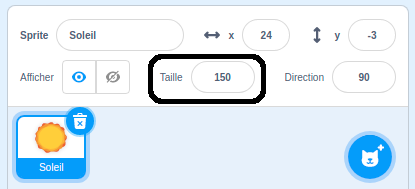

## Apparence

Les blocs `Apparence`{:class="block3looks"} contrôlent l'apparence d'un Sprite sur la Scène.

Les sprites peuvent communiquer en utilisant leur `Apparence`{:class="block3looks"}, par une bulle `dire`{:class="block3looks"}, une bulle `penser`{:class="block3looks"}, ou par leur `effets graphiques`{:class="block3looks"}.

### Dire et penser

```blocks3
say () for () seconds

say ()

think () for () seconds

think ()
```

--- collapse ---
---
title: Utiliser une bulle de dialogue pour communiquer
---

Les sprites peuvent `dire`{:class="block3looks"} et `penser`{:class="block3looks"} pour communiquer.

Les blocs `dire () pendant () secondes`{:class="block3looks"} et `penser () pendant () secondes`{:class="block3looks"} sont utilisés pour dire ou penser quelque chose pendant un laps de temps défini.

```blocks3
when this sprite clicked
say [Hello!] for [2] seconds // hide speech after 2 seconds
```

Le sprite affichera une bulle de dialogue pendant deux secondes lorsque tu cliques dessus.

**Conversation spatiale** : [Voir à l'intérieur](https://scratch.mit.edu/projects/485673032/editor){:target="_blank"}

Clique sur les sprites pour les voir communiquer par la parole et par la pensée.

<div class="scratch-preview">
  <iframe allowtransparency="true" width="485" height="402" src="https://scratch.mit.edu/projects/embed/485673032/?autostart=false" frameborder="0"></iframe>
</div>

Les blocs `dire ()`{:class="block3looks"} et `penser ()`{:class="block3looks"} sont utilisés pour dire ou penser quelque chose, jusqu'à ce qu'un autre message ou un bloc `dire ()`{: class="block3looks"} ou `penser ()`{:class="block3looks"} le remplace.

--- /collapse ---

### Taille

Définis ou modifie la `taille `{:class="block3looks"} de tes sprites.

```blocks3
change size by ()

set size to () %

(size)
```

--- collapse ---
---
title: Définir la taille de ton sprite
---

Lorsque tu ajoutes un sprite à ton projet, sa taille est définie à `100` pour cent. Cela peut être trop grand ou trop petit pour ton projet.

Tu peux utiliser du code pour définir la taille d'un sprite. Pour ce faire, utilise un bloc `mettre la taille à`{:class="block3looks"} :

```blocks3
set size to (50) %
```

Si tu définis la taille d'un sprite à `50` pour cent, il sera moitié moins haut et moitié moins large. Si tu définis la taille d'un sprite à `200` pour cent, il sera deux fois plus haut et deux fois plus large.

Pour définir la taille d'un sprite au démarrage du projet, place un bloc `mettre la taille à `{:class="block3looks"} sous un bloc `quand le drapeau vert est cliqué`{:class="block3events"}:

```blocks3
when green flag clicked
set size to (50) %
```

Tu peux également définir rapidement la taille d'un sprite dans le champ **Taille** du volet Sprite sous la Scène :

{:width="400px"}

--- /collapse ---

### Effets graphiques

Définis ou modifie une gamme d'effets visuels, tels que couleur, fisheye, tourbillon, pixelliser, mosaïque, luminosité et fantôme.

```blocks3
change [color v] effect by ()

set [color v] effect to ()

clear graphic effects
```

[[[scratch3-graphic-effects]]]

### Costumes

Pour créer un effet d'animation avec tes sprites, tu peux changer leurs costumes.

```blocks3
basculer sur le costume ( v)

costume suivant

(costume [number v])
```

[[[scratch3-change-costumes-to-show-mood]]]

--- collapse ---
---
title: Changer d'apparence pour créer un effet d'animation
---

**Cœur battant** : [Voir à l'intérieur](https://scratch.mit.edu/projects/435725413/editor){:target="_blank"}

<div class="scratch-preview">
  <iframe allowtransparency="true" width="485" height="402" src="https://scratch.mit.edu/projects/embed/435725413/?autostart=false" frameborder="0"></iframe>
</div>

Tu peux utiliser les blocs `mettre la taille à`{:class="block3looks"} ou `ajouter à la taille`{:class="block3looks"} pour créer un effet de pulsation, comme un cœur qui bat.

**Remarque :** Le bloc `mettre la taille à`{:class="block3looks"} met la taille à une valeur spécifique, tandis que le bloc `ajouter à la taille`{:class="block3looks"} modifie la valeur par rapport à ce qu'elle était avant, par exemple `ajouter à la taille`{:class="block3looks"} `10` ajoute 10 à la valeur de la taille.

```blocks3
when green flag clicked
set size to (160) %
forever
change size by (40)
wait (0.2) seconds
change size by (20)
wait (0.2) seconds
change size by (-20)
wait (0.2) seconds
change size by (-40)
wait (0.2) seconds
end
```

Ce code utilise une série de blocs `ajouter à la taille`{:class="block3looks"} et `attendre`{:class="block3control"} pour faire grandir et rétrécir le cœur. Essaye de créer ton propre sprite palpitant.

Tu peux également utiliser le bloc `mettre l'effet à`{:class="block3looks"} pour créer un sprite qui continue de changer d'apparence.

```blocks3
when green flag clicked
change [ghost v] effect by (75)
wait (1) seconds
change [ghost v] effect by (-75)
```

**Remarque :** Si tu utilises du code qui modifie un effet graphique puis le modifie à nouveau, n'oublie pas d'utiliser un bloc `attendre`{:class="block3control"} entre les blocs `mettre l'effet à`{:class=" block3looks"} , sinon, cela arrivera si vite que tu ne le verras pas !

Tu peux utiliser un bloc `annuler les effets graphiques`{:class="block3looks"} à tout moment pour réinitialiser les effets :

```blocks3
clear graphic effects
```

--- /collapse ---

--- collapse ---
---
title : Cliquer pour modifier puis revenir en arrière
---

Tu peux ajouter des actions qui modifient un sprite, puis les inverser, telles qu'agrandir, attendre, puis réduire.

**Ecraser la balle quand on clique** : [Voir à l'intérieur](https://scratch.mit.edu/projects/435723273/editor){:target="_blank"}

<div class="scratch-preview">
  <iframe src="https://scratch.mit.edu/projects/435723273/embed" allowtransparency="true" width="485" height="402" frameborder="0" scrolling="no" allowfullscreen></iframe>
</div>

Ce code agrandira un sprite, appliquera l'effet `fisheye`{:class="block3looks"} pendant 0,5 secondes, puis ramènera le sprite à son apparence d'origine :

```blocks3
when this sprite clicked
set size to (110)
set [fisheye v] effect to (50)
wait (0.5) seconds
set [fisheye v] effect to (0)
set size to (100)
```

--- /collapse ---

[[[scratch3-animate-movement-costumes]]]

### Arrière-plans

Tu peux également utiliser du code pour modifier l'arrière-plan.

```blocks3
switch backdrop to ( v)

next backdrop

(backdrop [number v])
```

[[[scratch3-changing-backdrops-pages-levels]]]

### Visibilité

Les blocs `montrer`{:class="block3looks"} et `cacher`{:class="block3looks"} contrôlent la visibilité d'un sprite.

```blocks3
show 

hide
```

[[[scratch3-show-hide-sprites-backdrops]]]

### Plans

Pour changer la façon dont tes sprites apparaissent les uns par rapport aux autres, tu peux utiliser des plans.

```blocks3
go to [front v] layer

go [forward v] () layers
```

[[[scratch3-positioning-with-layers]]]

--- collapse ---
---
title: Positionner des sprites dans plusieurs plans
---

**Par la fenêtre avec un arbre** : [Voir à l'intérieur](https://scratch.mit.edu/projects/454188775/editor){:target="_blank"}

<div class="scratch-preview">
  <iframe allowtransparency="true" width="485" height="402" src="https://scratch.mit.edu/projects/embed/454188775/?autostart=false" frameborder="0"></iframe>
</div>

Dans l'exemple, la **Fenêtre** apparaît à l'avant et le **Soleil** apparaît à l'arrière. Les sprites **Avery Marchant** et **Arbres** sont chacun sur leur propre plan entre le sprite **Fenêtre** et le sprite **Soleil**.

Utilise le bloc `déplacer de`{:class="block3looks"} `1` `plans vers l'arrière`{:class="block3looks"} pour placer un sprite sur le plan immédiatement derrière le sprite du premier plan :

``` blocks3
when green flag clicked
go to [front v] layer
+go [backward v] (1) layers
```

Modifie la valeur dans le `déplacer de`{:class="block3looks"} `1` `plans`{:class="block3looks"} pour chaque sprite, selon l'endroit où tu veux qu'il soit positionné par rapport aux autres sprites :

``` blocks3
when green flag clicked
go to [front v] layer
+go [backward v] (2) layers
```

--- /collapse ---

