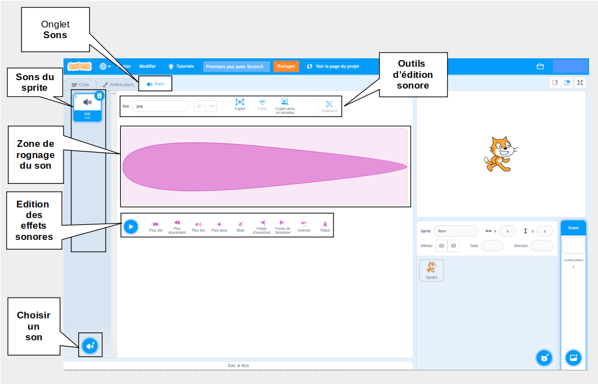
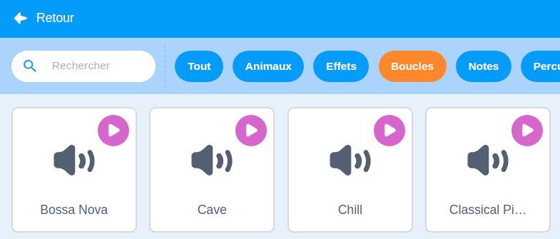

## Effets sonores

Pour ajouter du son à ton projet, utilise les blocs `Son`{:class="block3sound"}. Par exemple, tu peux créer une bande-son continue ou ajouter des sons qui jouent à intervalles réguliers.

{:width="600px"}

Tout d'abord, sélectionne un son dans la bibliothèque de sons ou enregistre ton propre son.

[[[scratch3-add-sound]]]

[[[scratch3-record-sound]]]

Ajoute du code pour exécuter des blocs `Son`{:class="block3sound"} là où tu veux du son dans ton projet.

--- collapse ---
---
title: Ajouter un son long pour créer une bande son en continu
---

Clique sur le drapeau vert pour entendre les sons.

**Bande son radio** : [Voir à l'intérieur](https://scratch.mit.edu/projects/444581851/editor){:target="_blank"}

<div class="scratch-preview">
 <iframe allowtransparency="true" width="485" height="402" src="https://scratch.mit.edu/projects/embed/444581851/?autostart=false" frameborder="0"></iframe>
</div>

Tu peux utiliser un bloc `jouer le son jusqu'au bout`{:class="block3sound"} dans un bloc `répéter indéfiniment`{:class="block3control"}. Une fois le son terminé, la boucle `répéter indéfiniment`{:class="block3control"} recommencera le son depuis le début.

Ce code utilise un seul long clip sonore répété comme bande sonore :

```blocks3
when green flag clicked
forever
play sound (Dance Snare Beat v) until done
end
```

**Remarque :** Lorsque tu choisis un nouveau son, si tu sélectionnes la catégorie **Boucles**, Scratch ne te montrera que les sons qui conviennent à une bande-son jouée en boucle.



--- /collapse ---

--- collapse ---
---
title: Ajouter une séquence de sons courts pour créer une bande son en continu
---

Clique sur le drapeau vert pour entendre les sons.

**Une performance de champion** : [Voir à l'intérieur](https://scratch.mit.edu/projects/444673165/editor){:target="_blank"}

<div class="scratch-preview">
 <iframe allowtransparency="true" width="485" height="402" src="https://scratch.mit.edu/projects/embed/444673165/?autostart=false" frameborder="0"></iframe>
</div>

 Utilise un bloc `répéter indéfiniment`{:class="block3control"} pour créer un son en boucle. Tu peux :
+ Mettre une série de sons courts dans une séquence, ou
+ Utiliser différentes notes et effets sonores

```blocks3
when flag clicked
forever
play sound (Low Boing v) until done
play sound (Low Boing v) until done
play sound (Drum Buzz v) until done
play sound (Pop v) until done
play sound (Bird v) until done
play sound (Bark v) until done
play sound (Glug v) until done
End
```

--- /collapse ---

--- collapse ---
---
title: Ajouter des sons qui jouent à intervalles réguliers
---

**Sons de football** : [Voir à l'intérieur](https://scratch.mit.edu/projects/450870079/editor){:target="_blank"}

Clique sur le drapeau vert pour entendre les sons.

<div class="scratch-preview">
 <iframe allowtransparency="true" width="485" height="402" src="https://scratch.mit.edu/projects/embed/450870079/?autostart=false" frameborder="0"></iframe>
</div>

 Dans ce projet, la **Scène** a du code pour jouer un son à intervalles réguliers :

 ```blocks3
 when flag clicked
 forever
 wait (3) seconds
 play sound (Cheer v) until done
 end
 ```

Le sprite **Whistle** joue également un son à intervalles réguliers :

 ```blocks3
 when this sprite clicked
 forever
 play sound (Referee Whistle v) until done
 wait (4) seconds
 end
 ```

--- /collapse ---

--- collapse ---
---
title: Ajouter des sons qui jouent en même temps
---

Il y a deux blocs `Son`{:class="block3sound"} avec une différence importante :

+ Lorsque tu utilises `jouer le son jusqu'au bout`{:class="block3sound"}, le son est émis entièrement. La ligne de code suivante du script ne s'exécutera pas tant que le son n'aura pas fini de jouer.

+ Lorsque tu utilises `jouer le son`{:class="block3sound"}, le son joue, mais le prochain bloc démarrera immédiatement et n'attendra pas que le son finisse.

Cela signifie que si tu avais une série de blocs `jouer le son`{:class="block3sound"}, les sons seraient tous joués presque en même temps, superposés. L'effet peut être intéressant et parfois désordonné.

Amuse-toi avec ça un jour !

```blocks3
when green flag clicked
start sound (Meow v)
start sound (Alien Creak2 v)
start sound (Boing v)
start sound (Boom Cloud v)
start sound (Baa v)
```

--- /collapse ---

Une fois que tu as choisi tes sons, tu peux changer le `volume`{:class="block3sound"}, la `hauteur`{:class="block3sound"}, ou l'effet `panoramique`{:class="block3sound"} (pour que tu entendes le son sortir du haut-parleur gauche ou droit).

--- collapse ---
---
title: Volume, hauteur et panoramique
---

Clique sur le drapeau vert pour entendre les sons.

**L'orchestre répète** : [Voir à l'intérieur](https://scratch.mit.edu/projects/451697380/editor){:target="_blank"}

<div class="scratch-preview">
 <iframe allowtransparency="true" width="485" height="402" src="https://scratch.mit.edu/projects/embed/451697380/?autostart=false" frameborder="0"></iframe>
</div>

Le sprite **Percussions** utilise les blocs `mettre le volume à`{:class="block3sound"}, `mettre l'effet hauteur à`{:class="block3sound"} et `mettre l'effet stéréo gauche/droite (panoramique) sur`{:class="block3sound"} pour changer le son :

```blocks3
set volume to (80) %
set [pitch v] effect to (50) :: sound
set [pan left/right v] effect to (-100) :: sound
play sound (Drum Funky v) until done
```

+ Tu peux `mettre le volume à`{:class="block3sound"} une valeur de `0` (silencieux) à `100` (volume à fond). C'est utile si tu veux que certains sons soient plus forts que d'autres, ou si tu veux qu'un sprite semble être plus loin.

+ L'effet `hauteur`{:class="block3sound"} contrôle à quel point un son est aigu ou grave. Régler la hauteur sur une valeur plus élevée rend également un son plus rapide. Tu peux `régler l'effet hauteur à`{:class="block3sound"} des valeurs comprises entre `-360` (très grave) et `360` (très aigu).

+ L'effet `stéréo gauche/droite`{:class="block3sound"} (panoramique) te permet de contrôler si un son sort du côté gauche ou droit ou des deux côtés des haut-parleurs ou d'un casque. Tu peux `mettre l'effet stéréo gauche/droit à`{:class="block3sound"} des valeurs entre `-100` (tous les sons viennent de la gauche) à `100` (tous les sons viennent de la droite).

--- /collapse ---

Tu peux également utiliser l'extension `Synthèse vocale`{:class="block3extensions"} :

[[[scratch3-text-to-speech]]]

