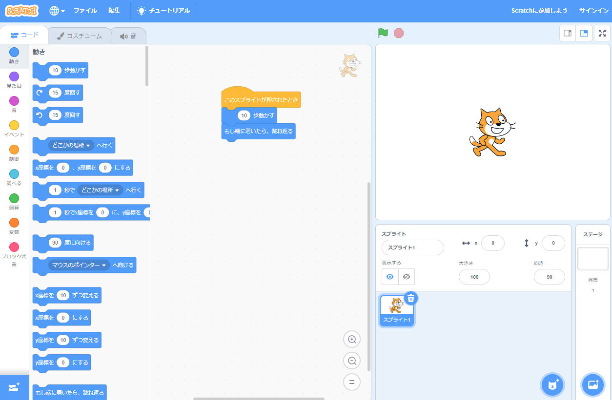

## Scratchとは？
Scratchは、MITメディアラボのLifelong Kindergartenグループによって開発されたグラフィカルプログラミング言語です。 Scratchでは、コードブロックをドラッグして組み合わせて、アニメーション、ストーリー、楽器、ゲームなどのさまざまなプログラムを作成できます。 これは、ブロックのおもちゃのプログラム版のようなものです。

スクラッチは、カリキュラムの一部として多くの学校で使われています。 無料であり、若い人たちがクラブだけでなく自宅でも利用できます。

Scratchを使用すると、若い人たちがテキストベースのプログラミング言語を習得しなくても、コーディングの概念を学び、インタラクティブなプロジェクトを作成できます。 Scratchを使用するために、すばやくタイプしたり、複雑なコードを覚えたりする必要はありません。

### このリファレンスガイドの使い方
以前にScratchを使用したことがない場合、このガイドがセットアップと最初のプロジェクトの作成に役立ちます。

Scratchで独自のプロジェクトを作成するとき、このガイドに戻って必要な情報を検索するために使用できます。

ガイドの最後には、初心者から上級者までのScratchプロジェクトのパスへのリンクがあり、楽しくて面白いアプリ、ゲーム、ストーリー、アニメーション、アート、音楽を作成してコーディングを学ぶことができます。

--- collapse ---
---
title: 必要なもの
---
### ハードウェア

+ Scratch3を実行できるコンピューターまたはタブレット

### ソフトウェア

+ このガイドでは、Scratch 3( [オンライン](https://scratch.mit.edu/){:target="_blank"}または [オフライン](https://scratch.mit.edu/download){:target="_blank"})の使用を開始する方法について説明します。

--- /collapse ---
