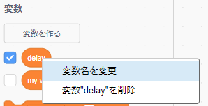
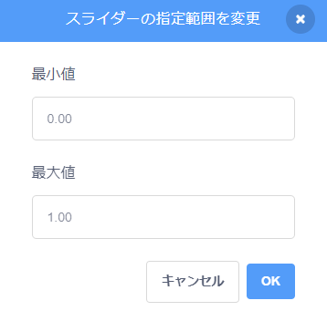

## 変数

`変数`{:class="block3variables"}は、数値やテキストを格納する方法です。

独自の変数を作成して、ステージに表示するかどうかを選択できます。

[[[generic-scratch3-add-variable]]]

変数を作成するときに開始値を設定する必要があるかどうかを検討する必要があります。

[[[scratch3-create-set-variable]]]

気が変わったら、変数の名前を変更できます。

--- collapse ---
---
title: 変数の名前を変更する
---

変数のより良い名前を思いつくことがあります。

変数に新しい名前を付けることができます。 `変数`{:class="block3variables"}ブロックメニューで `変数`{:class="block3variables"}を右クリック(またはタブレットではタップしたままに)して、 **変数名を変更**を選びます。



これにより、その変数を使用したすべてのブロックの変数名が変更されます。

--- /collapse ---

**ヒント：** `...にする`{:class="block3variables"}と `...に変更`{:class="block3variables"}の違いを確認してください。 `にする`{:class="block3variables"}は、変数に格納されている値を置き換えます。 `ずつ変える`{:class="block3variables"}は数値変数の値を選択した量だけ変更します `1``ずつ変える`{:class="block3variables"} は変数に1を加えます。 `-1```ずつ変える{:class="block3variables"} は、変数から1を減らします。


**ヒント:** ステージ上の変数は、常にすべてのスプライトの上の層に表示されます。 移動するスプライトがある場合、スプライトはステージ上のすべての変数の下を通過します。

スライダーを使用して、変数の値を制御できます。

[[[scratch3-slider-variable]]]

変数を使用するためのその他のアイデア：

[[[generic-scratch3-high-score]]]

[[[scratch3-join-text]]]

[[[scratch3-set-variable-with-button]]]

[[[scratch3-change-variable-in-loop]]]


--- collapse ---
---
title: 変数スライダーでグラフィック効果を制御する
---

変数スライダーの使用方法の例を次に示します。


この例では、 `幽霊`{:class="block3looks"}のグラフィック効果を変えて、虹が透けて見えるようにします。

**透明な虹**: [中を見る](https://scratch.mit.edu/projects/451544795/editor){:target="_blank"}

<div class="scratch-preview">
  <iframe allowtransparency="true" width="485" height="402" src="https://scratch.mit.edu/projects/embed/451544795/?autostart=false" frameborder="0"></iframe>
</div>

`透明度`{:class="block3variables"}変数を使用して `最前面`{:class="block3looks"}の層にあるスプライトの `幽霊`{:class="block3looks"}効果を制御できます。下の層のスプライトが現れたり隠れたりするようにします。

```blocks3
when flag clicked
go to [front v] layer
```

```blocks3
when flag clicked
forever
set [ghost v] effect to (transparent)
```

`明るさ`{:class="block3looks"}や `色`{:class="block3looks"}などの他のグラフィック効果でも同じアプローチを使用してみてください。

--- /collapse ---

--- collapse ---
---
title: 変数で移動速度を制御する
---

**壁のてんとう虫**: [中を見る](https://scratch.mit.edu/projects/451545341/editor){:target="_blank"}

<div class="scratch-preview">
  <iframe allowtransparency="true" width="485" height="402" src="https://scratch.mit.edu/projects/embed/451545341/?autostart=false" frameborder="0"></iframe>
</div>

`速さ`{:class="block3variables"}変数を `(10)歩動かす`{:class="block3motion"}ブロックへの入力として使用します。

```blocks3
when flag clicked
forever
move (speed) steps
if on edge, bounce
```
プロジェクトに合わせて、スライダーの範囲の最小値と最大値を設定します。

--- /collapse ---

--- collapse ---
---
title: 変数で回転速度を制御する
---

**宇宙犬**: [中を見る](https://scratch.mit.edu/projects/451543041/editor){:target="_blank"}

<div class="scratch-preview">
  <iframe allowtransparency="true" width="485" height="402" src="https://scratch.mit.edu/projects/embed/451543041/?autostart=false" frameborder="0"></iframe>
</div>

`角度`{:class="block3variables"}変数を` 右へ (15)度回す`{:class="block3motion"}ブロックへの入力として使用します。

```blocks3
when flag clicked
forever
turn right (angle) degrees
```

--- /collapse ---

--- collapse ---
---
title: 待つブロックの時間を変更する
---

**ガイコツのダンス**: [中を見る](https://scratch.mit.edu/projects/451536565/editor){:target="_blank"}

<div class="scratch-preview">
  <iframe allowtransparency="true" width="485" height="402" src="https://scratch.mit.edu/projects/embed/451536565/?autostart=false" frameborder="0"></iframe>
</div>

`待ち時間`{:class="block3variables"} 変数を `(1)秒待つ`{:class="block3control"} ブロックへの入力として使用します。

```blocks3
when flag clicked
forever
wait (delay) seconds
next costume
```

1秒以上待つのは非常に長い時間です。 スライダーの範囲に小数点を含めると、一度に100分の1秒ずつ値を変更できます。

`0.00` から `1.00` の範囲指定で `0` 秒(遅延なし) から `1` 秒の間の遅延を選択することができます。



ユーザーがプロジェクトで使用できるようにする最小値と最大値の値を変更します。

--- /collapse ---

--- collapse ---
---
title: 効果音を変更する
---

**ドラムのピッチ**: [中を見る](https://scratch.mit.edu/projects/451547017/editor){:target="_blank"}

<div class="scratch-preview">
  <iframe allowtransparency="true" width="485" height="402" src="https://scratch.mit.edu/projects/embed/451547017/?autostart=false" frameborder="0"></iframe>
</div>

`変数`{:class="block3variables"}を`[ピッチv]の効果を(100)にする`{:class="block3sound"}ブロックで使用できます。 音のピッチを上げると、音が高くなり、音速が速くなります。

```blocks3
when flag clicked
forever
set [pitch v] effect to (beat) :: sound
```

音を再生を別の `ずっと`{:class="block3control"}ループで行い、再生が終了するのを待たずにピッチがすぐに変更されるようにします。

```blocks3
when flag clicked
forever
play sound [Dance Head Nod v] until done
```

`変数`{:class="block3variables"}を使用して、音量とパン(左右のスピーカーの音量差)効果を変更することもできます。

--- /collapse ---


