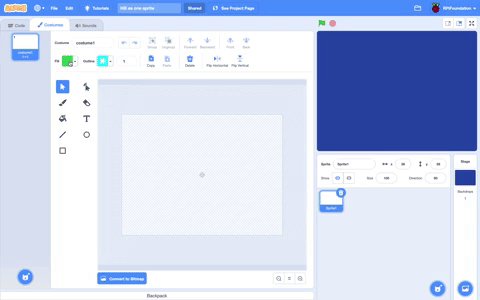

## ペイントエディタ

ペイントエディタを使って、独自の背景やコスチュームを作成したり、既存の背景やコスチュームを編集したりできます。

{:width="600px"}

[[[scratch3-paint-a-new-backdrop-extended]]]

[[[scratch3-backdrops-and-sprites-using-shapes]]]

[[[scratch3-use-text-tool]]]

[[[scratch3-add-costumes-to-a-sprite]]]

[[[scratch-crosshair]]]

[[[scratch3-copy-parts-between-sprite-costumes]]]

--- collapse ---
---
title: コスチュームを複製、編集してアニメーションで使う
---

一部のScratchスプライトには、コスチュームが1つしかない場合や、複数あっても、アニメーションとして機能しない場合があります。 コスチュームを1つ選び、それを複製(コピーを作成) して小さな変更を加えると、アニメーション効果を作成できます。

**ロボットのアニメーション**: [中を見る](https://scratch.mit.edu/projects/436260207/editor){:target="_blank"}

  <iframe allowtransparency="true" width="485" height="402" src="https://scratch.mit.edu/projects/embed/436260207/?autostart=false" frameborder="0"></iframe>

スプライトの**コスチューム**タブに切り替えます。

使用するコスチュームを選択し、他のコスチュームはアニメーションに必要ないため、削除してください。 たとえば、 **Robot** スプライトには、3つの異なるロボットのコスチュームが付属しているため、コスチュームの1つを選択し、他のコスチュームを削除する必要があります。

コスチュームを右クリック(またはタブレットでは長押し) して、 **複製**を選択します。

コスチュームのコピーに小さな変更を加えます。 たとえば、コスチュームの全部または一部を移動、回転、または変更できます。 移動線を追加することもできます。

コスチュームがベクターグラフィックを使用している場合は、コスチュームのパーツを選択して、各パーツを個別に変更できます。

コスチュームをもう一度複製し、さらに変更を加えて、アニメーションにフレームを追加することができます。

これで、簡単なスプライトアニメーションでコスチュームを使用できます。

--- /collapse ---

--- collapse ---
---
title: 塗りつぶしツールを使用して、コスチュームの色を変更する
---

スプライトの色を変更できます。 まず、ステージの下のスプライトリストでスプライトを選択し、**コスチューム**タブをクリックします。

**選択** (矢印) ツールを使用して、色を変更するコスチュームの部分を強調表示します。

{:width="200px"}

{:width="300px"}

**塗りつぶし** 色選択パネルに移動し、色を選択します。 選択した図形が自動的に塗りつぶされます。

{:width="300px"}

見逃したコスチュームの部分、または色を変更したいコスチュームの他の部分について、上記の手順を繰り返します。

{:width="300px"}

{:width="300px"}

{:width="300px"}

--- /collapse ---

以下のヒントを使用して、ペイントエディタでスプライトの独自のデザインを作成するのに役立ててください。

--- collapse ---
---
title: スプライトの風景を作成する
---

**スプライトの丘**: [中を見る](https://scratch.mit.edu/projects/452582516/editor){:target="_blank"}

{:width="400px"}

上の例に示す、あなた自身の**丘**スプライトを作るには、ペイントエディタの **円** と **四角形** ツールを使います。

+ **スプライトを選ぶ** から **描く** を選択して、新しいスプライトコスチュームを作成します。

{:width="400px"}

+ **塗りつぶし** を選択します。 **枠線** をクリックして選択を解除します(これを行うには、メニューの左下隅にある対角線のあるボックスをクリックします)。 そして、 **円** ツールを使って楕円を描きます。 次に、**四角形**ツールを選択し、楕円の下に長方形を描きます。

+ 図形にさまざまな色を使用する場合 **手前に出す** および **奥に下げる** ツールを使用して、図形を前後に移動し、背景内に正しく配置されるようにする必要があります。

+ すべての図形を選択し、**グループ化** でまとめると、1つの図形として調整したり、移動したりできます。

{:width="400px"}

プロジェクトのアイデアに合う場合は、背景用に他のスプライトを作成します。

スプライトに名前を付けることを忘れないでください。

--- /collapse ---

--- collapse ---
---
title: 直線ツールを使用して三角形を作成する
---

三角形などの多角形を作成し、それを使って屋根や山を作成できます。

**スプライトを選ぶ** から **描く** を選択して、新しいスプライトコスチュームを作成します。 この例では、家を作ります。

**家**: [中を見る](https://scratch.mit.edu/projects/453595663/editor){:target="_blank"}

{:width="400px"}

以下の手順に従って、 **直線** ツールで任意の形状を作成することができます。
+ **塗りつぶし** を選択します。 黒色を選択するには、 **明るさ** をゼロ(`0`) まで減らします。

{:width="150px"}

+ **枠線なし**を選択します。

{:width="200x"}

+ **四角形** ツールを使用して、長方形を描きます。
+ **直線** ツールを使用して、三角形を描きます。 三角形を完成させるようにしてください。でないと、塗りつぶしができません。
+ 2つの図形を一つに くっつけます。
+ **塗りつぶし** (バケツ) ツールを選択し、三角形を塗りつぶします。
+ **四角形** ツールを使用して、煙突用に別の長方形を描きます。
+ **手前に出す** および **奥に下げる** ツールを使用して図形を前後に移動し、正しく配置されるようにします。 この例では、図形がシルエットに見えるように黒く作っているので、これを行う必要はありません。
+ すべての図形を選択し、 **グループ化** でまとめると、1つの図形として調整したり、移動したりできます。

家の形を(たとえば、街並みを作るのに使うために) 複製するには、 次の**図形を複製して風景のコスチュームを作成する** ヒントに従ってください。

--- /collapse ---

--- collapse ---
---
title: 図形を複製して風景のコスチュームを作成する
---

コスチューム内で図形を複製して、風景がにぎわったり、または混雑しているように見せることができます。

**たくさんの雲**: [中を見る](https://scratch.mit.edu/projects/447278432/editor){:target="_blank"}

{:width="400px"}

図形を増殖する効果は、プロのアニメーターが雨や雲などの気象パターンや、建物や木などの物体のかたまり、またはシーン内の人々のあつまりを表現するのに使われます。

--- no-print ---

--- /no-print ---

任意のタイプの図形を増殖するには：
+ **スプライトを選ぶ** から、この例では、 **雲** スプライトを選択します。
+ **コスチューム** タブで、 **選択** ツールを使用して、図形全体を強調表示します。
+ **コピー** および **貼り付け** ツールを使用して、図形を複製します。
+ ペイントエディタ内で図形を移動するには**選択** ツールを使用します。
+ たとえば、図形のサイズを変更して、3D効果の感覚を高めることができます。
+ すべての図形を選択し、 **グループ化** でまとめると、1つの図形として調整したり、移動したりできます。

--- /collapse ---

--- collapse ---
---
title: 鮮やかさと明るさを使用して奥行きを作成する
---

現実の世界では、遠くにあるものは色が薄く見えます。 よりリアルな3D風景を作り上げるために、各スプライトの色の **鮮やかさ** および/または **明るさ**を**減少** して、ずっと遠くに見えるようにします。

{:width="400px"}

--- /collapse ---

--- collapse ---
---
title: 隙間から向こうが見えるスプライトを作成する
---

隙間から向こうが見えるスプライトを作成することができます。 そのスプライトが、前の層に配置され、ステージいっぱいのサイズである場合、檻(おり) または窓のバーを通しての景色のように見えるでしょう。

--- no-print ---

**檻(おり)の中のライオン**: [中を見る](https://scratch.mit.edu/projects/445680159/editor){:target="_blank"}

--- /no-print ---

一部を覆い隠すタイプのスプライトを作成するには：
+ **スプライトを選ぶ** から、**描く** を選択します。
+ **塗りつぶし** 色と **枠線** なしを選択し、縦長の長方形を描画します
+ **コピー** および **貼り付け** ツールを使用して、図形を繰り返し複製します。
+ **選択** ツールを使用して、図形を移動します。
+ 図形をを配置するときは、プロジェクトのアイデアに合うように、ステージの端にぴったりと合うようにしてください。

--- /collapse ---

**ヒント:** 大きなスプライトが小さなスプライトを覆っているなど、ステージ上でスプライトを管理するのが難しい場合は、 **表示しない** をクリックして、スプライトが表示されないようにすることができます。 その後、作業が終了したら、また**表示する**をクリックしてください。

{:width="300px"}
