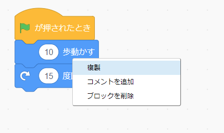
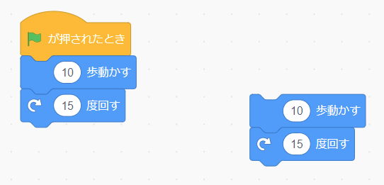

## 編集のヒント
コードブロックをコピーしたり削除したりするする方法や、スプライトを複製する方法を覚えておくと便利です。

**ヒント:** <kbd>Ctrl-z</kbd> (Ctrlキーを押しながら「z」を押す) を使用して、Scratchの多くのアクションを元に戻すことができます。 あなたが誤ってスプライトやその他の項目を削除した場合、元に戻すのに**編集** メニューの **削除の取り消し** が使えます 。

不要になったコードブロックを削除できます。

[[[scratch-delete]]]

コードを複製またはコピーすると、プロジェクトを作成する時間を節約できます。

--- collapse ---
---
title: ブロックを複製する
---

スプライトのプログラムで再利用するためにブロックまたはブロックのセットを複製します。

* **コード**タブをクリックします。
* コピーする最初のブロックを右クリック(またはタブレットではタップアンドホールド) します。 その下のブロックもすべて選択されます。
* ドロップダウンメニューから**複製**を選びます。 {:width="300px"}
* 複製したコードを目的の場所にドラッグします。 {:width="300px"}
* 不要なブロックを削除します。

--- /collapse ---

[[[scratch3-duplicate-sprite]]]

新しいスプライトを作成し、最初のスプライトのコードのすべてまたは一部をコピーします。

--- collapse ---
---
title: スプライトのコードをコピーする
---

スプライトリストの右下隅にある **スプライトを選ぶ** をクリックして、追加するスプライトを選択します。

最初のスプライトをクリックして、その **コード** タブに移動します。 最初のスプライトのコード領域にあるコードをスプライトリストの2番目のスプライトの画像にドラッグし、コードを離して2番目のスプライトへのコピーを終了します。 `緑のフラグが押されたとき`{:class="block3events"}ブロックで始まるスクリプトもあれば、`このスプライトが押されたとき`{:class="block3events"}で始まるものもあるでしょう。 作成したコードスクリプトを **すべて** コピーしてください。

{:width="300px"}

2番目のスプライトには、最初のスプライトとまったく同じコードがあります。 2番目のスプライトのコードの変更を開始するまでプログラムを実行しないでください。2番目のスプライトは最初のスプライトの下に配置されている可能性があるため、表示されない場合があります。

--- /collapse ---

プロジェクト間でコスチューム、スプライト、サウンド、スクリプトをコピーする場合は、それらを **バックパック**にドラッグします。

[[[scratch-backpack]]]

プロジェクトを理解しやすくするために、ベストプラクティスに従っていることを確認するために時間を費やす価値は常にあります。

--- collapse ---
---
title: Scratchプロジェクトのベストプラクティス
---

- すべてのスプライト、コスチューム、サウンド、変数、およびメッセージに適切な名前を付けます。 役立つ名前を使用するプロジェクトを理解する方がはるかに簡単です。
- プロジェクトページに適切なタイトル、説明、メモを記入して、ユーザーがプロジェクトの使用方法とアイデアの入手先を理解できるようにします。
- コードが何をしているのかを説明する短いコメントを追加します。
- **コード** タブでスクリプトが整理されていることを確認してください。 右クリックして**きれいにする**を選択するか、スクリプトを適切な方法で配置できます。 同様のスクリプトをまとめてみてください。

--- /collapse ---
