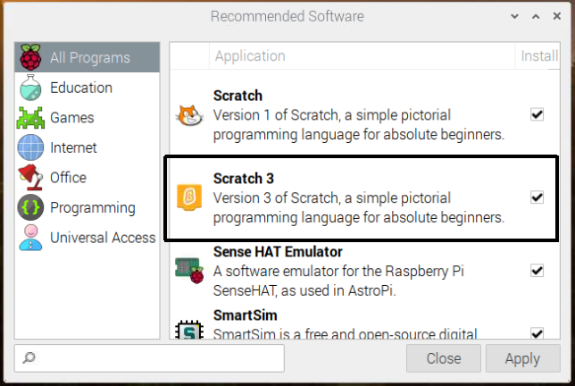
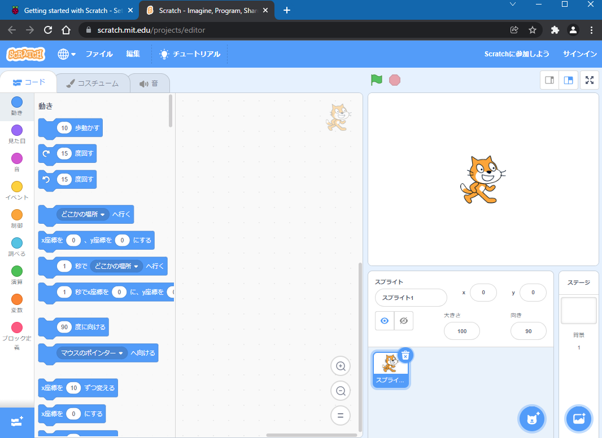
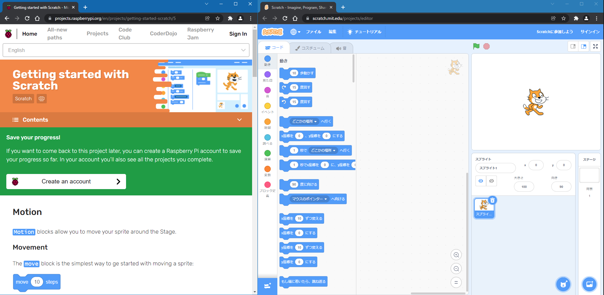
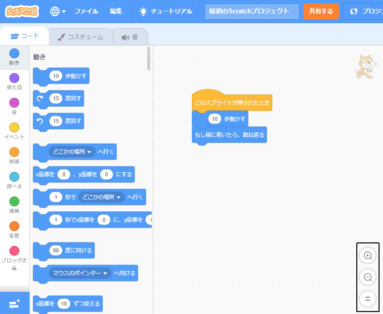

## Scratchをセットアップする
Scratchは、ノートパソコンまたはデスクトップコンピューター、あるいはタブレットで使用できます。 RaspberryPiコンピューターでScratchを使用することもできます。

--- task ---

コンピューターまたはタブレットでウェブブラウザを開き、 [rpf.io/scratch-new](https://rpf.io/scratch-new){:target="_blank"}にアクセスして、Scratchエディターで新しいプロジェクトを開きます。 Scratchは、ウェブブラウザの新しいタブで開きます。

**ヒント:** [scratch.mit.edu](https://scratch.mit.edu/){:target="_blank"}にアクセスし、**作る**をクリックして始めることもできます 。

--- collapse ---
---
title: インターネットに接続せずにオフラインで作業する
---

もし、オフラインで(インターネットに接続せずに)作業する必要がある場合は、[Scratchをダウンロード](https://scratch.mit.edu/download){:target="_blank"}してコンピュータにインストールします。

タブレットを使用している場合、オフラインで作業することはできません。

--- /collapse ---

--- collapse ---
---
title: Raspberry PiのScratch
---

Raspberry Piコンピューターを使用している場合は、Scratchが既にインストールされている可能性があります。 **Raspberry Pi**アイコンをクリックしてメニューを開き、 **プログラミング**をクリックし、**Scratch3**を選択します 。

Scratchをインストールする必要がある場合は、次のプロセスに従ってください。
+ Raspberry Piアイコンをクリックしてメニューを開きます
+ **設定**をクリックします。
+ **Recommended Software**クリックします
+ **Scratch3**を選択します。
+ **OK**をクリックします。

詳細については [Raspberry PiのためのScratch3デスクトップ](https://www.raspberrypi.org/blog/scratch-3-desktop-for-raspbian-on-raspberry-pi/) を参照してください。

--- /collapse ---

--- /task ---

--- task ---

このガイドや私たちのプロジェクトでScratchを使用する際は、Scratchとプロジェクトの説明を切り替える必要があります。

--- collapse ---
---
title: ブラウザのタブを切り替える
---

ブラウザタブのタイトルをクリック(タブレットではタップ) して、Scratchエディタとプロジェクトの説明を切り替えます。

--- /collapse ---

--- collapse ---
---
title: 説明とScratchを横並びで使う
---

画面が十分に大きい場合は、プロジェクトの説明の横にScratchを表示できます。

Microsoft Windows 10を使用している場合は、ウェブブラウザの[Scratch] タブをドラッグして別のウィンドウに表示し、カーソルが画面の右端に到達するまでドラッグを続けます。 そうすると、ウィンドウは画面の右側に配置されます。

次に、このガイドまたはプロジェクトの説明が含まれているウィンドウを、カーソルが左端に達するまで画面の左側にドラッグします。 ウィンドウは画面の左半分いっぱいに表示されます。

ウィンドウのサイズを変更して、希望どおりのウィンドウにすることができます。

**ヒント：** <kbd>Windows</kbd> キーを押しながら、 <kbd>左</kbd> 矢印キーまたは <kbd>右</kbd> 矢印キーを押して、画面の左半分または右半分にウィンドウを配置することもできます。

--- /collapse ---

今すぐ試して、どのやり方がいいかを確認してください。

--- /task ---

--- task ---

ウェブブラウザでScratchを使用している場合は、ズームインまたはズームアウトしてサイズを調整できます。

例えば、あなたがMicrosoft Windowsを使用していて、Google ChromeまたはMicrosoft Edgeのウェブページ上でズームを使いたい場合は、 <kbd>Ctrlキー</kbd>を押しながら <kbd>+</kbd> キーまたは <kbd>-</kbd> キーを押して、ズームインまたはズームアウトします。

--- collapse ---
---
title: コードエリアでズームを使用
---

Scratchのコードエリアにあるズームコントロールを使用して、コードエリアのコードブロックのサイズを変更することもできます。

--- /collapse ---

--- /task ---

