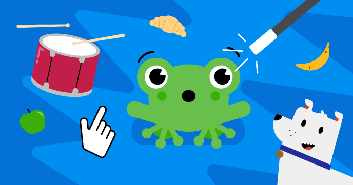

## Scratchプロジェクト

私たちのScratchコースにはそれぞれ6つのプロジェクトがあり、独自のプロジェクトを独自に作成するために、Scratchのさまざまなスキルを学ぶのに役立ちます。

習得したスキルを思い出す必要があるときはいつでも、このリファレンスガイド「Scratch入門」に戻ることができます。

これらのプロジェクトは、Scratch3が実行できるコンピューターまたはタブレットで実行することができます。

### 初心者向けScratchプロジェクト

Scratchを初めて使用する場合は、初心者向けのコースから始めてください。

[Introduction to Scratch: sprites, scripts, and loops](https://projects.raspberrypi.org/en/pathways/scratch-intro){:target="_blank"} 
この初心者向けの入門編では、アニメーション、ゲーム、アプリ、ストーリーを作成するときに必要な、スプライトにコード、コスチューム、サウンドを追加する方法を学びます。

[Look after yourself](https://projects.raspberrypi.org/en/pathways/look-after-yourself){:target="_blank"} 
Scratchプロジェクトで自分や他の人の世話をして、笑ったり、リラックスしたり、コントロールしたり、創作したり、運動したり、集中したりする方法を学びます。

[Scratch module 1](https://projects.raspberrypi.org/en/pathways/scratch-module-1){:target="_blank"}

 

### 基本的なScratchプロジェクトの次に

スプライト、コスチューム、背景、ループについてすでに知っている場合は、次のプロジェクトを試してください。

[More Scratch: broadcast, decisions, and variables](https://projects.raspberrypi.org/en/pathways/more-scratch){:target="_blank"} 
More Scratchは、Introduction to Scratchで紹介した基本を超えています。 メッセージを送る、もし..なら および もし..なら..でなければ の条件分岐、および変数を使用して、アプリ、ゲーム、およびシミュレーションを作成します。

[Scratch module 2](https://projects.raspberrypi.org/en/pathways/scratch-module-2){:target="_blank"} 

 

### 高度なScratchプロジェクト

リスト、クローン、および独自のブロック定義について知りたい場合は、次のプロジェクトを試してください。

[Further Scratch: clones, my blocks, and boolean logic](https://projects.raspberrypi.org/en/pathways/further-scratch){:target="_blank"} 
Further Scratchは、「Introduction to Sctratch」および「More Scratach」で紹介したスキルを超えています。 真偽値、関数、クローンなどを使用して、アプリ、ゲーム、コンピューターアート、シミュレーションを作成します。

[Protect our planet](https://projects.raspberrypi.org/en/pathways/protect-our-planet){:target="_blank"} 
私たちの惑星と将来の世代のために環境を保護する方法について学ぶためにScratchを使用します。

[Scratch for social enterprise](https://projects.raspberrypi.org/en/coderdojo/scratch-for-social-enterprise){:target="_blank"} 

[Scratch module 3](https://projects.raspberrypi.org/en/pathways/scratch-module-3){:target="_blank"} 

 

### RaspberryPi用のScratch GPIOハードウェアプロジェクト

Raspberry Piコンピューターをお持ちの場合は、これらのプロジェクトを試すこともできます。 追加の電子部品が必要になります。

 

[Physical computing with Scratch path](https://projects.raspberrypi.org/en/pathways/physical-computing-with-scratch-and-the-raspberry-pi){:target="_blank"}

 

[Physical computing with Scratch additional projects](https://projects.raspberrypi.org/en/projects?software%5B%5D=scratch&hardware%5B%5D=raspberry-pi){:target="_blank"}

 

Scratchガイドをお楽みいただけましたか？ 問題を見つかりましたか？ 下の[ **フィードバックを送信**] ボタンをクリックして、お知らせください。
