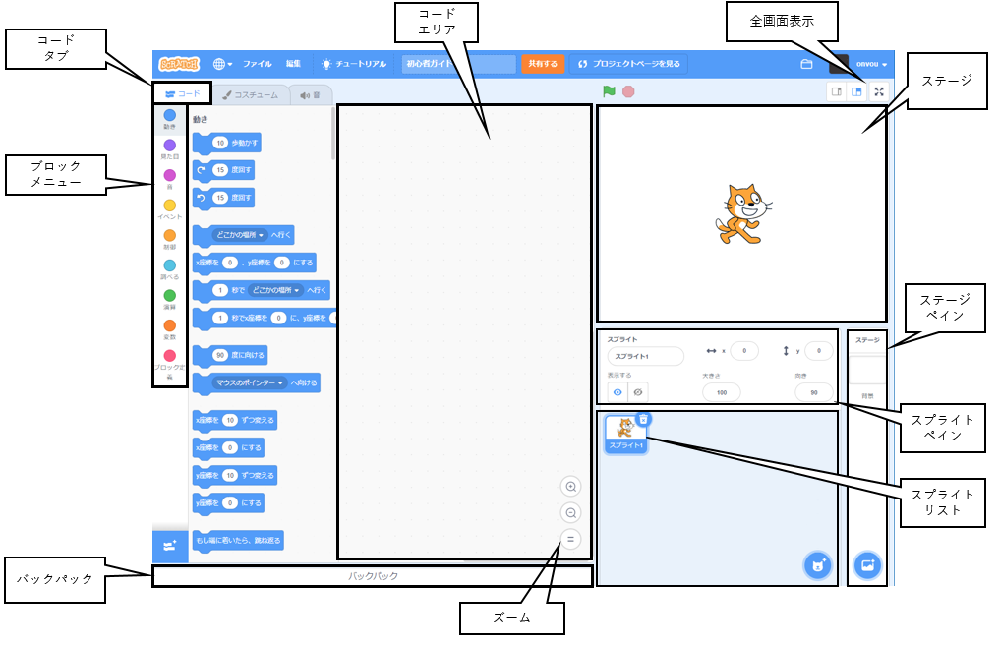

## Scratchエディタ

**ステージ** は、プロジェクトでアクションが実行される場所です。 ステージには**背景**と呼ばれる1つ以上の背景画像があります。

**スプライト** は **ステージ** に表示されるキャラクターとオブジェクトです。 スプライトには、Scratchコードブロックを使用して指示が与えられます。 それは**プログラミング**と呼ばれます。

**コードブロック** を **ブロックメニュー** から **コード領域** にドラッグして、スプライトとステージをプログラムします。 コードブロックを使用すると、スプライトを動かしたり、外観を変更したり、サウンドを再生したりできます。

スプライトは、いくつもの**コスチューム**持つことができます。 コスチュームを変更して、スプライトの外観を変更できます。 歩いているような効果を出すときなどに使えます。

**スクリプト** は、ステージまたはスプライトに指示を与えるために結合される一連のブロックです。 ステージとスプライトには、それぞれ多くの異なるスクリプトを含めることができます。 

