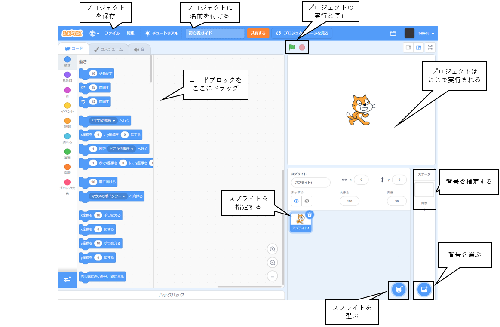
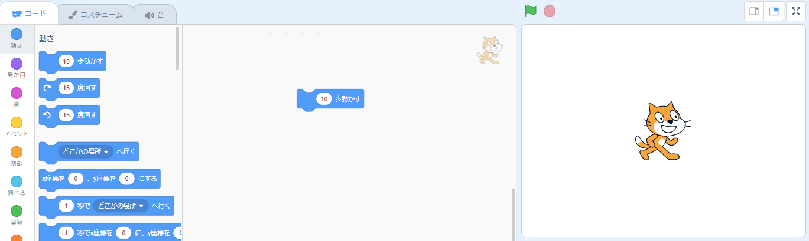
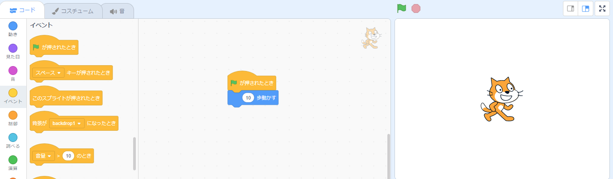
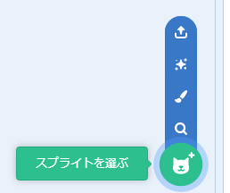
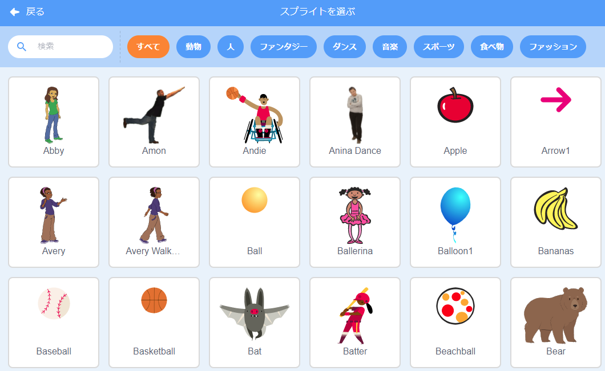
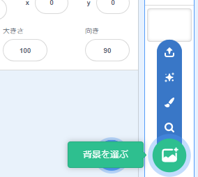
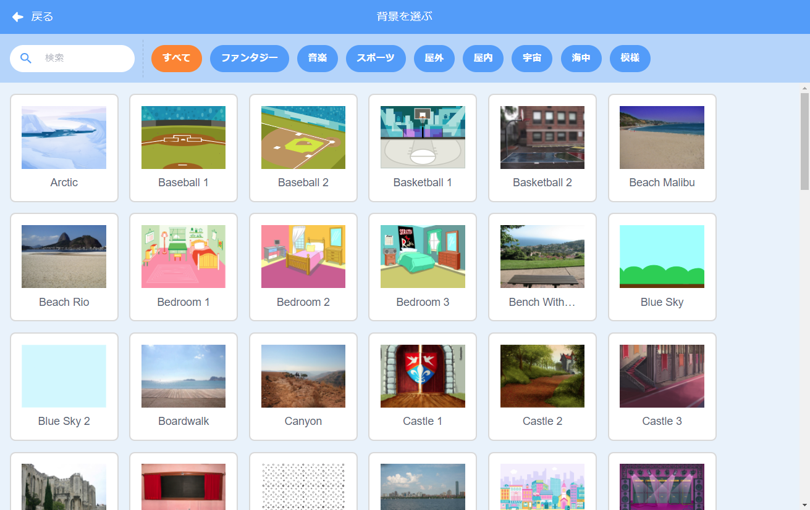
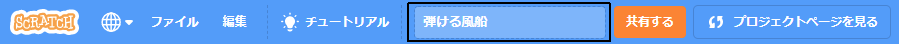

## 最初のScratchプロジェクト



--- task ---

新しいスクラッチプロジェクトを作成すると、そこには **猫** スプライトがいます。

ブロックを[ブロック] メニューから[コード] エリアにドラッグして、猫に何かをさせます。

試してみるには、`動き`{:class="block3motion"}ブロックメニューから `(10)歩動かす`{:class="block3motion"}ブロックをドラッグします。 ブロックは、見つけやすいように色分けされています。



コードエリアのブロックをクリックして実行できます。 `(10)歩動く`{:class="block3motion"}ブロックをクリックすると、猫が移動します。

**ヒント:** タブレットでScratchを使用している場合は、アイテムをタップしてクリックできます。

**ハットブロック** は、特定のイベントが発生したときに、その下のブロックを実行します。 `グリーンフラッグが押されたとき`{:class="block3events"}ブロックは、ステージの上にある緑色の旗をクリックすると、あなたのプロジェクトを実行するコードを実行します。

`緑のフラグが押されたとき`{:class="block3events"}ブロックを `(10)歩動く`{:class="block3motion"}ブロックの上にドラッグするとブロック同士がつながります。



コードは次のようになります。

```blocks3
when flag clicked
move (10) steps
```

**ヒント:** Scrathブロックは色分けされているため、`緑色のフラグが押されたとき `{:class="block3events"}ブロックを、 `イベント`{;class="block3events"}ブロックメニューで見つけることができます。

ステージの上にある緑色の旗をクリックしてみてください。猫が動きます。

--- /task ---

プロジェクトにスプライトを追加したり、背景を追加したりすることもできます。

--- task ---

--- collapse ---
---
title: スプライトを選ぶ
---

スプライトリストで、 **スプライトを選ぶ** をクリックして、すべてのScratchスプライトのライブラリを表示します。



スプライトを検索したり、カテゴリやテーマ別に閲覧したりできます。 スプライトをクリックして、プロジェクトに追加します。



--- /collapse ---

--- /task ---

--- task ---

--- collapse ---
---
title: 背景を選ぶ
---

[ステージ] ペインの右下隅にある **[背景を選ぶ]**をクリックします。



背景を検索したり、カテゴリやテーマ別に閲覧したりできます。 背景をクリックしてプロジェクトに追加します。



--- /collapse ---

--- /task ---

--- task ---

--- collapse ---
---
title: プロジェクトに名前をつけて保存する
---

メニューの **ファイル** をクリックします。 Scratchアカウントを持っている場合は、**直ちに保存**をクリックします。 アカウントを持っていない場合は、 **コンピュータに保存する**をクリックします。

プロジェクト名ボックスをクリックし、プロジェクトに一致するように名前を変更します。



プロジェクトを共有すると、他の人にもこの名前が表示されるので、意味がある名前であることを確認してください。

--- /collapse ---

--- /task ---

あなたの最初のScratchプロジェクトが作成されました。

これで、Scratchを学ぶ準備ができました。 初めての人のために設計された[Scratch: Module 1](https://projects.raspberrypi.org/en/raspberrypi/scratch-module-1){:target="_blank"} か [Look after yourself](https://projects.raspberrypi.org/en/raspberrypi/look-after-yourself){:target="_blank"} コースから始めることおおすすめします。

 コースのプロジェクトまたはあなた自身が作成したプロジェクトで作業しているとき、Scratchの使いかたについてサポートが必要な場合は、このガイドに戻ることができます。 


