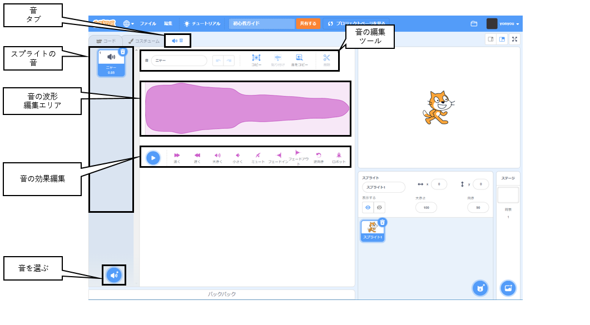
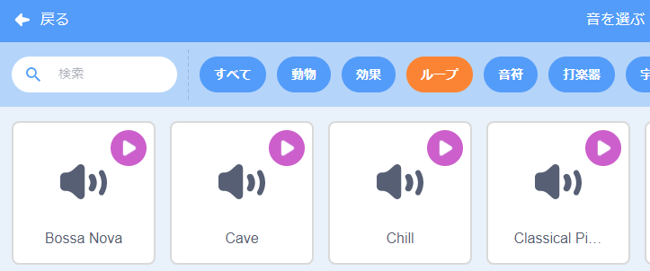

## 音

プロジェクトにサウンドを追加するには、 `音`{:class="block3sound"}ブロックを使用します。 たとえば、連続したバックグラウンドサウンドトラックを作成したり、一定の間隔で再生されるサウンドを追加したりできます。

{:width="600px"}

まず、サウンドライブラリからサウンドを選択するか、独自のサウンドを録音します。

[[[scratch3-add-sound]]]

[[[scratch3-record-sound]]]

プロジェクトでサウンドが必要なところで `音`{:class="block3sound"} ブロックが動作するようにコードを追加します。

--- collapse ---
---
title: 長いサウンドを追加して、連続したサウンドトラックを作成します
---

緑の旗をクリックするとサウンドを聞くことができます。

**ラジオのサウンドトラック**: [中を見る](https://scratch.mit.edu/projects/444581851/editor){:target="_ blank"}

<div class="scratch-preview">
 <iframe allowtransparency="true" width="485" height="402" src="https://scratch.mit.edu/projects/embed/444581851/?autostart=false" frameborder="0"></iframe>
</div>

`ずっと`{:class="block3control"} ループの中で`終わるまで(ニャー)の音を鳴らす`{:class="block3sound"} ブロックを使います。 サウンドが終了すると、 `ずっと`{:class="block3control"}ループにより、サウンドが最初から再開されます。

このコードは、サウンドトラックとして繰り返される一つの長いサウンドクリップを使っています。

```blocks3
when green flag clicked
forever
play sound (Dance Snare Beat v) until done
end
```

**注: ** 新しいサウンドを選択するときに、 **ループ** カテゴリを選択すると、Scratchは一つでループするサウンドトラックに適したサウンドのみを表示します。



--- /collapse ---

--- collapse ---
---
title: 一連の短いサウンドを追加して、連続したサウンドトラックを作成します
---

緑の旗をクリックするとサウンドを聞くことができます。

**チャンピオンのパフォーマンス**: [中を見る](https://scratch.mit.edu/projects/444673165/editor){:target="_blank"}

<div class="scratch-preview">
 <iframe allowtransparency="true" width="485" height="402" src="https://scratch.mit.edu/projects/embed/444673165/?autostart=false" frameborder="0"></iframe>
</div>

 `ずっと`{:class="block3control"}ブロックを使用して、ループサウンドを作成します。 やり方は以下のとおりです。
+ 一連の短い音を順番に並べる。または、
+ 異なる楽器の音と効果を使う

```blocks3
when flag clicked
forever
play sound (Low Boing v) until done
play sound (Low Boing v) until done
play sound (Drum Buzz v) until done
play sound (Pop v) until done
play sound (Bird v) until done
play sound (Bark v) until done
play sound (Glug v) until done
End
```

--- /collapse ---

--- collapse ---
---
title: 一定の間隔で再生されるサウンドを追加します
---

**サッカーの音**: [中を見る](https://scratch.mit.edu/projects/450870079/editor){:target="_ blank"}

緑の旗をクリックするとサウンドを聞くことができます。

<div class="scratch-preview">
 <iframe allowtransparency="true" width="485" height="402" src="https://scratch.mit.edu/projects/embed/450870079/?autostart=false" frameborder="0"></iframe>
</div>

 このプロジェクトでは、 **ステージ** に一定の間隔でサウンドを再生するコードがあります。

 ```blocks3
 when flag clicked
 forever
 wait (3) seconds
 play sound (Cheer v) until done
 end
 ```

**Whistle** スプライトも、一定の間隔でサウンドを再生します。

 ```blocks3
 when this sprite clicked
 forever
 play sound (Referee Whistle v) until done
 wait (4) seconds
 end
 ```

--- /collapse ---

--- collapse ---
---
title: 同時に再生を開始するサウンドを追加します
---

`音`{:class=”block3sound”}ブロックは2種類あり、重要な違いがあります。

+ `終わるまで(ニャー)の音を鳴らす`{:class=”block3sound”}場合、サウンドは最後まで再生されます。 スクリプトの次のコード行は、サウンドの再生が終了するまで実行されません。

+ `(ニャー)の音を鳴らす`{:class=”block3sound”}の場合、サウンドが再生されますが、サウンドが終わるのを待ってからではなく、次のブロックがすぐに実行されます。

これは`(ニャー)の音を鳴らす`{:class="block3sound"}ブロックが続いている場合、サウンドはすべてほぼ同時に再生され、互いに重なって再生されることを意味します。 この効果は面白く、時には厄介なものになるでしょう。

いちどやってみてください！

```blocks3
when green flag clicked
start sound (Meow v)
start sound (Alien Creak2 v)
start sound (Boing v)
start sound (Boom Cloud v)
start sound (Baa v)
```

--- /collapse ---

サウンドを選択したら、 `音量`{:class="block3sound"}、 `ピッチ`{:class="block3sound"}、または `パン`{:class="block3sound"}（左側または右側のどちらのスピーカーから音が聞こえるか）を変更したいと思うでしょう。

--- collapse ---
---
title: ボリューム、ピッチ、パン
---

緑の旗をクリックするとサウンドを聞くことができます。

**バンドの練習**: [中を見る](https://scratch.mit.edu/projects/451697380/editor){:target="_blank"}

<div class="scratch-preview">
 <iframe allowtransparency="true" width="485" height="402" src="https://scratch.mit.edu/projects/embed/451697380/?autostart=false" frameborder="0"></iframe>
</div>

**Drums** スプライトは、 `音量を(80)%にする`{:class="block3sound"}、 `(ピッチ)の効果を(50)にする`{:class="block3sound"}、 `左右のパンの効果を(-100)にする`{:class="block3sound "}ブロック使ってサウンドを変更しています。

```blocks3
set volume to (80) %
set [pitch v] effect to (50) :: sound
set [pan left/right v] effect to (-100) :: sound
play sound (Drum Funky v) until done
```

+ `音量を(100%)にする`{:class="block3sound"} で`0` （消音）から `100` （最大音量）までの値を指定できます。 これは、一部のサウンドを他のサウンドよりも大きく再生したい場合、またはスプライトを遠くに表示したい場合に便利です。

+ `ピッチ`{:class="block3sound"}効果は、サウンドの音程の高低を制御します。 ピッチを高く設定すると、再生速度も速くなります。 `(ピッチ)の効果を(100)にする`:class="block3sound"}で `-360` （非常に低い）から `360` （非常に高い）までの値を指定できます。

+ `左右にパン`{:class="block3sound"}効果を使用すると、サウンドがスピーカーまたはヘッドフォンの左側または右側、あるいはその両方から出るかどうかを制御できます。 `(左右にパン)の効果`{:class="block3sound"}で `-100` （すべての音を左側から）から `100` （すべての音を右側から）までの値を指定できます。

--- /collapse ---

`Text to Speech`{:class="block3extensions"} (文字の読み上げ)拡張機能を使うこともできます。

[[[scratch3-text-to-speech]]]

