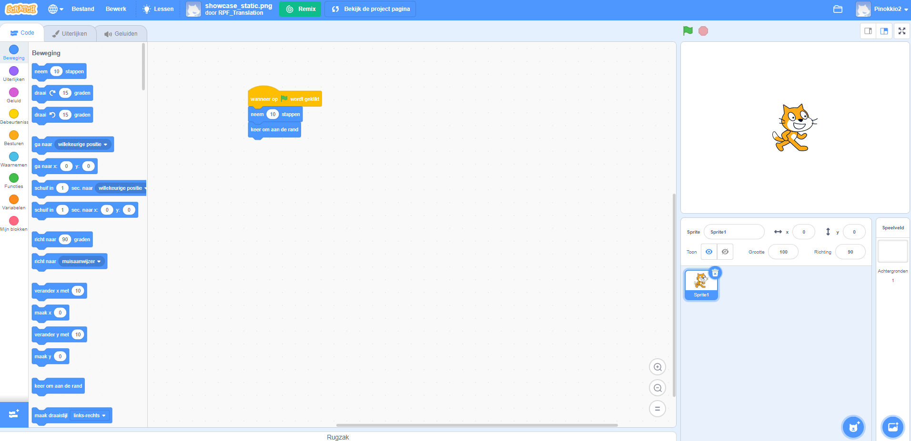

## Wat is Scratch?
Scratch is een grafische programmeertaal die is ontwikkeld door de Lifelong Kindergarten-groep van het MIT Media Lab. In Scratch kun je codeblokken slepen en combineren om een reeks programma's te maken, waaronder animaties, verhalen, muziekinstrumenten en games. Het lijkt een beetje op programmeren met bouwstenen!

Scratch wordt op veel scholen gebruikt als onderdeel van het leerplan. Het is gratis en jongeren kunnen het zowel thuis als in clubs gebruiken.

Met Scratch kunnen jongeren codeer concepten leren en interactieve projecten maken zonder een op tekst gebaseerde programmeertaal te hoeven leren. Je hoeft niet snel te kunnen typen of complexe code te onthouden om Scratch te gebruiken.

### Hoe kun je deze referentiegids gebruiken
Als je Scratch nog niet eerder hebt gebruikt, dan helpt deze handleiding je bij het opzetten en maken van je eerste project.

Je kunt terugkeren naar deze handleiding en deze gebruiken om informatie op te zoeken die je nodig hebt om je eigen projecten in Scratch te maken.

Aan het einde van de handleiding vind je links naar Scratch-projecten, van beginner tot gevorderd, waar je kunt leren programmeren door leuke en interessante apps, games, verhalen, animaties, kunst en muziek te maken.

--- collapse ---
---
title: Wat heb je nodig
---
### Hardware

+ Een computer die Scratch 3 kan uitvoeren

### Software

+ In deze handleiding wordt uitgelegd hoe je aan de slag kunt gaan met Scratch 3 (ofwel [online](https://scratch.mit.edu/){:target="_blank"} of [offline](https://scratch.mit.edu/download){:target="_blank"})

--- /collapse ---
