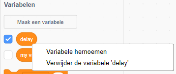
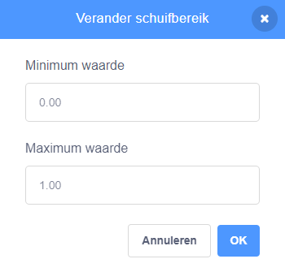

## Variabelen

Een `variabelen`{:class="block3variables"} blok is een manier om getallen en/of tekst op te slaan.

Je kunt je eigen variabelen maken en kiezen of ze in het Speelveld worden weergegeven:

[[[generic-scratch3-add-variable]]]

Je moet nadenken of je een startwaarde moet instellen wanneer je een variabele maakt:

[[[scratch3-create-set-variable]]]

Je kunt de naam van een variabele wijzigen als je van gedachten verandert:

--- collapse ---
---
title: De naam van een variabele wijzigen
---

Soms bedenk je een betere naam voor een variabele.

Je kunt een variabele een nieuwe naam geven: ga naar het `Variabelen`{:class="block3variables"} blokkenmenu, klik met de rechtermuisknop (of op een tablet, tik en houd vast) op de `variabele`{:class="block3variables"}, en kies **Variabele hernoemen**.



Dit zal de naam van de variabele veranderen in alle blokken waarin je hem hebt gebruikt.

--- /collapse ---

**Tip:** Zorg ervoor dat je het verschil weet tussen `maak`{:class="block3variables"} en `verander met`{:class="block3variables"} blokken. Een `maak`{:class="block3variables"} blok vervangt de waarde die is opgeslagen in een variabele. Het `veranderen met`{:class="block3variables"} blok zal de waarde van een getal variabele veranderen met het getal dat je kiest, `veranderen met`{:class="block3variables"} `1` zal één toevoegen aan de variabele. `veranderen met`{:class="block3variables"} `-1` zal de variabele met 1 verlagen.


**Tip:** Variabelen in het Speelveld verschijnen altijd in een laag boven alle sprites. Als je een bewegende sprite hebt, gaat de sprite onder iedere variabele in het Speelveld.

Je kunt een schuifregelaar gebruiken om de waarde in een variabele in te stellen.

[[[scratch3-slider-variable]]]

Meer ideeën voor het gebruik van variabelen:

[[[generic-scratch3-high-score]]]

[[[scratch3-join-text]]]

[[[scratch3-set-variable-with-button]]]

[[[scratch3-change-variable-in-loop]]]


--- collapse ---
---
title: Grafische effecten maken met een variabele schuifregelaar
---

Hier zijn enkele voorbeelden van hoe je de variabele schuifregelaar kunt gebruiken:


Dit voorbeeld verandert het `transparantie`{:class="block3looks"} grafische effect zodat je door de regenboog heen kunt kijken.

**Transparante regenboog**: [Bekijk van binnen](https://scratch.mit.edu/projects/451544795/editor){:target="_blank"}

<div class="scratch-preview">
  <iframe allowtransparency="true" width="485" height="402" src="https://scratch.mit.edu/projects/embed/451544795/?autostart=false" frameborder="0"></iframe>
</div>

Je kunt een `transparant`{:class="block3variables"} variabele gebruiken om het `transparantie`{:class="block3looks"} effect op een sprite op de `voorste`{:class="block3looks"} laag te besturen, en gebruiken om sprites in lagere lagen te tonen of te verbergen.

```blocks3
when flag clicked
go to [front v] layer
```

```blocks3
when flag clicked
forever
set [ghost v] effect to (transparant)
```

Probeer dit ook met andere grafische effecten zoals `helderheid`{:class="block3looks"} of `kleuren`{:class="block3looks"}.

--- /collapse ---

--- collapse ---
---
title: Regel de bewegingssnelheid met een variabele
---

**Lieveheersbeestje op een muur**: [Bekijk van binnen](https://scratch.mit.edu/projects/451545341/editor){:target="_blank"}

<div class="scratch-preview">
  <iframe allowtransparency="true" width="485" height="402" src="https://scratch.mit.edu/projects/embed/451545341/?autostart=false" frameborder="0"></iframe>
</div>

Gebruik de `snelheid`{:class="block3variables"} variabele als invoer voor een `neem..stappen`{:class="block3motion"} blok:

```blocks3
when flag clicked
forever
move (snelheid) steps
if on edge, bounce
```
Stel de minimum- en maximumwaarden in voor het bereik van de schuifregelaar die bij jouw project passen.

--- /collapse ---

--- collapse ---
---
title: Regel de draaisnelheid met een variabele
---

**Ruimtehond**: [bekijk van binnen](https://scratch.mit.edu/projects/451543041/editor){:target="_blank"}

<div class="scratch-preview">
  <iframe allowtransparency="true" width="485" height="402" src="https://scratch.mit.edu/projects/embed/451543041/?autostart=false" frameborder="0"></iframe>
</div>

Gebruik een `hoek`{:class="block3variables"} variabele als invoer voor een `draai rechts`{:class="block3motion"} blok:

```blocks3
when flag clicked
forever
turn right (hoek) degrees
```

--- /collapse ---

--- collapse ---
---
title: De vertraging in een wachtblok wijzigen
---

**Skeletten dans**: [Bekijk van binnen](https://scratch.mit.edu/projects/451536565/editor){:target="_blank"}

<div class="scratch-preview">
  <iframe allowtransparency="true" width="485" height="402" src="https://scratch.mit.edu/projects/embed/451536565/?autostart=false" frameborder="0"></iframe>
</div>

Gebruik een `vertraging`{:class="block3variables"} variabele als invoer voor een `wacht`{:class="block3control"} blok:

```blocks3
when flag clicked
forever
wait (vertraging) seconds
next costume
```

Een vertraging van meer dan een seconde is behoorlijk lang. Als je een decimaal getal in het bereik van een schuifregelaar opneemt, kun je de waarde telkens met een honderdste van een seconde wijzigen.

Met een bereik van `0.00` tot `1.00` kun je een vertraging kiezen tussen `0` seconden (geen vertraging) en `1` seconden.



Wijzig de getallen om de minimum- en maximumwaarden te krijgen die gebruikers in jouw project kunnen gebruiken.

--- /collapse ---

--- collapse ---
---
title: Geluidseffecten wijzigen
---

**Drumtoonhoogte**: [Bekijk van binnen](https://scratch.mit.edu/projects/451547017/editor){:target="_blank"}

<div class="scratch-preview">
  <iframe allowtransparency="true" width="485" height="402" src="https://scratch.mit.edu/projects/embed/451547017/?autostart=false" frameborder="0"></iframe>
</div>

Je kunt een `variabele`{:class="block3variables"} gebruiken in een `zet effect toonhoogte op`{:class="block3sound"} blok. Als je de toonhoogte van een geluid verhoogt, worden de noten hoger en versnelt het geluid.

```blocks3
when flag clicked
forever
set [pitch v] effect to (verslaan) :: sound
```

Speel het geluid af in een aparte `herhaal`{:class="block3control"}-lus, zodat de toonhoogte onmiddellijk verandert, in plaats van te wachten tot het geluid is afgespeeld:

```blocks3
when flag clicked
forever
play sound [Dance Head Nod v] until done
```

Je kunt ook een `variabele`{:class="block3variables"} gebruiken om het volume en het kanaal links/rechts-effect te wijzigen.

--- /collapse ---


