## Uiterlijken bewerken

Gebruik de Teken-editor om je eigen achtergronden en uiterlijken te maken en om bestaande achtergronden en uiterlijken te bewerken.

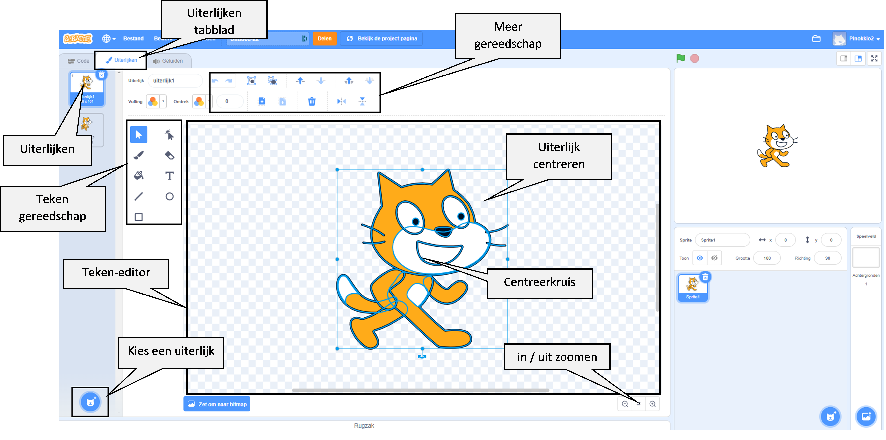{:width="600px"}

[[[scratch3-paint-a-new-backdrop-extended]]]

[[[scratch3-backdrops-and-sprites-using-shapes]]]

[[[scratch3-use-text-tool]]]

[[[scratch3-add-costumes-to-a-sprite]]]

[[[scratch-crosshair]]]

[[[scratch3-copy-parts-between-sprite-costumes]]]

--- collapse ---
---
title: Een uiterlijk kopiëren en bewerken om in een animatie te gebruiken
---

Sommige Scratch-sprites hebben slechts één uiterlijk, of hebben meerdere uiterlijken die niet als animatie werken. Als je één uiterlijk kiest, het dan dupliceert (maak er een kopie van) en een kleine wijziging aanbrengt, kan het wel een animatie-effect creëren.

**Robot-animatie**: [Bekijk van binnen](https://scratch.mit.edu/projects/436260207/editor){:target="_blank"}

  <iframe allowtransparency="true" width="485" height="402" src="https://scratch.mit.edu/projects/embed/436260207/?autostart=false" frameborder="0"></iframe>

Ga naar het **Uiterlijken** tabblad voor jouw sprite.

Kies het uiterlijk dat je wilt gebruiken en verwijder het andere uiterlijken, want je hebt ze niet nodig voor je animatie. De **Robot** wordt bijvoorbeeld geleverd met uiterlijken voor drie verschillende robots, dus je moet een van de uiterlijken kiezen en de andere uiterlijken verwijderen.

Klik met de rechtermuisknop (of tik op een tablet en houd vast) op het uiterlijk en kies **dupliceren**.

Breng kleine wijzigingen aan in de kopie van het uiterlijk. Je kunt bijvoorbeeld het uiterlijk geheel of gedeeltelijk verplaatsen, draaien of veranderen. Je kunt ook bewegingslijnen toevoegen.

Als je uiterlijk vectorafbeeldingen gebruikt, kun je delen van een uiterlijk selecteren en elk onderdeel afzonderlijk wijzigen.

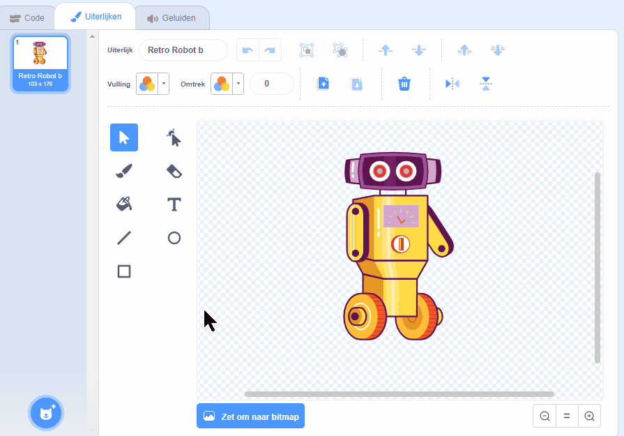

Je kunt het uiterlijk opnieuw dupliceren en meer wijzigingen aanbrengen om meer frames aan je animatie toe te voegen.

Je kunt je uiterlijken nu gebruiken in een eenvoudige sprite-animatie.

--- /collapse ---

--- collapse ---
---
title: Gebruik het gereedschap Vulling om de kleuren in een uiterlijk te wijzigen
---

Je kunt de kleur van je sprite wijzigen. Selecteer eerst je sprite in de Sprite lijst onder het Speelveld en klik vervolgens op het tabblad **Uiterlijken**.

Gebruik **Selecteer** (pijl) om het deel van het uiterlijk dat je van kleur wilt veranderen te markeren.

{:width="200px"}

{:width="300px"}

Ga naar de **Vulling** kleurkiezer en selecteer een kleur. Het vult automatisch de vorm die je hebt geselecteerd.

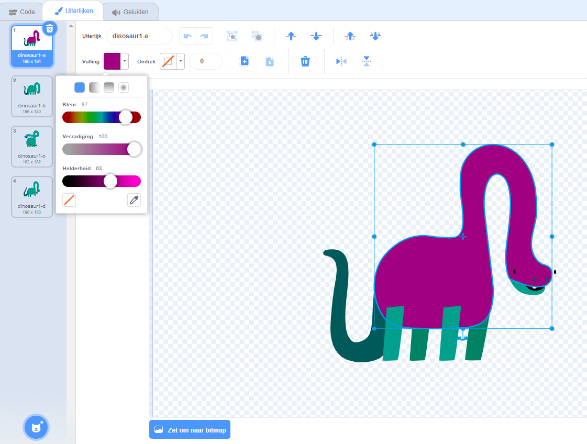{:width="300px"}

Herhaal de bovenstaande stappen voor elk deel van het uiterlijk dat je hebt gemist, of voor elk ander deel van het uiterlijk dat je van kleur wilt veranderen.

{:width="300px"}

{:width="300px"}

{:width="300px"}

--- /collapse ---

Gebruik de onderstaande tips om je te helpen je eigen ontwerpen voor je sprites te maken in de Teken-editor.

--- collapse ---
---
title: Landschappen maken als sprites
---

**Heuvel als sprite**: [Bekijk van binnen](https://scratch.mit.edu/projects/452582516/editor){:target="_blank"}

{:width="400px"}

Om je eigen **Heuvel** sprite te maken, zoals weergegeven in het bovenstaande voorbeeld, kun je de **Cirkel** en **Rechthoek** in de Teken-editor gebruiken:

+ Ga naar **Kies een Sprite** en selecteer **Teken** om een nieuw sprite uiterlijk te maken.

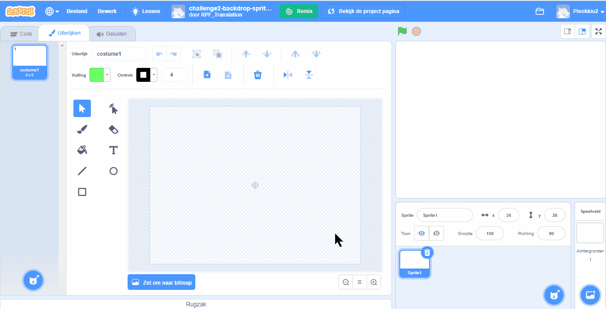{:width="400px"}

+ Kies een kleur met **Vulling**. Klik op **Omtrek** en deselecteer deze (klik hiervoor op het vakje met de diagonale lijn in de linkerbenedenhoek van het menu). Gebruik nu het **Cirkel** gereedschap om een ovaal te tekenen. Selecteer vervolgens het **Rechthoek** gereedschap en teken een rechthoek onder het ovaal.

+ Als je verschillende kleuren voor de vormen gebruikt, moet je misschien de **Naar voren** en **Naar achteren** knoppen in de Teken-editor gebruiken om je vormen naar voren of naar achteren te verplaatsen, zodat ze correct binnen je achtergrond worden geplaatst.

+ Je kunt alle vormen selecteren en ze samen **Groeperen** zodat je ze als één geheel kunt aanpassen of verplaatsen.

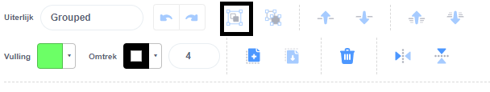{:width="400px"}

Maak nu andere sprites voor je landschap, als dat past bij jouw projectidee.

Vergeet niet je sprite(s) een naam te geven.

--- /collapse ---

--- collapse ---
---
title: Gebruik het gereedschap Lijn om een driehoek te maken
---

Je kunt veelhoeken maken, zoals een driehoek, en deze vormen gebruiken om daken of bergen te maken.

Ga naar **Kies een Sprite** en selecteer **Teken** om een nieuw sprite uiterlijk te maken. In dit voorbeeld ga je huizen maken.

**Huis**: [Bekijk van binnen](https://scratch.mit.edu/projects/453595663/editor){:target="_blank"}

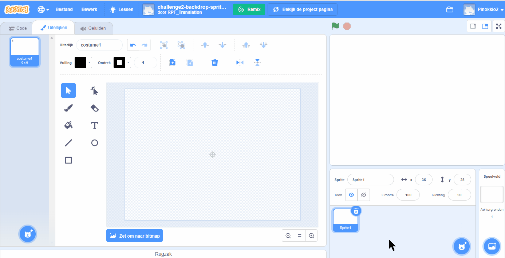{:width="400px"}

Als je de onderstaande instructies volgt, kun je het **Lijn** gereedschap gebruiken om elke vorm te maken:
+ Kies een kleur met **Vulling**. Om de kleur zwart te kiezen, verlaag je de **Helderheid** naar nul (`0`).

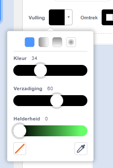{:width="150px"}

+ Selecteer **Geen omtrek**.

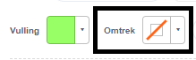{:width="200x"}

+ Gebruik het **Rechthoek** gereedschap om een rechthoek te tekenen.
+ Gebruik het **Lijn** gereedschap om een driehoek te tekenen. Zorg ervoor dat je de driehoek voltooit, anders wordt deze niet gevuld met kleur.
+ Voeg de twee vormen samen.
+ Selecteer het **Vullen** gereedschap (Emmer) en vul de driehoek met kleur.
+ Gebruik het **Rechthoek** gereedschap om met een andere rechthoek de schoorsteen te tekenen.
+ Als je verschillende kleuren voor de vormen gebruikt, moet je misschien de **Naar voren** en **Naar achteren** knoppen in de Teken-editor gebruiken om je vormen naar voren of naar achteren te verplaatsen, zodat ze correct binnen je achtergrond worden geplaatst. In dit voorbeeld hoef je dit niet te doen, omdat de vormen zwart zijn om een silhouet te maken.
+ Je kunt alle vormen selecteren en ze samen **Groeperen** zodat je ze als één geheel kunt aanpassen of verplaatsen.

Om dubbele vormen van je huis te maken (bijvoorbeeld om een skyline te maken), volg je de tips onder **Vormen dupliceren om een landschaps-uiterlijk te maken** hieronder.

--- /collapse ---

--- collapse ---
---
title: Vormen dupliceren om een landschaps-uiterlijk te maken
---

Misschien wil je vormen binnen een uiterlijk dupliceren, zodat je landschap drukker lijkt.

**Meerdere wolken**: [Bekijk van binnen](https://scratch.mit.edu/projects/447278432/editor){:target="_blank"}

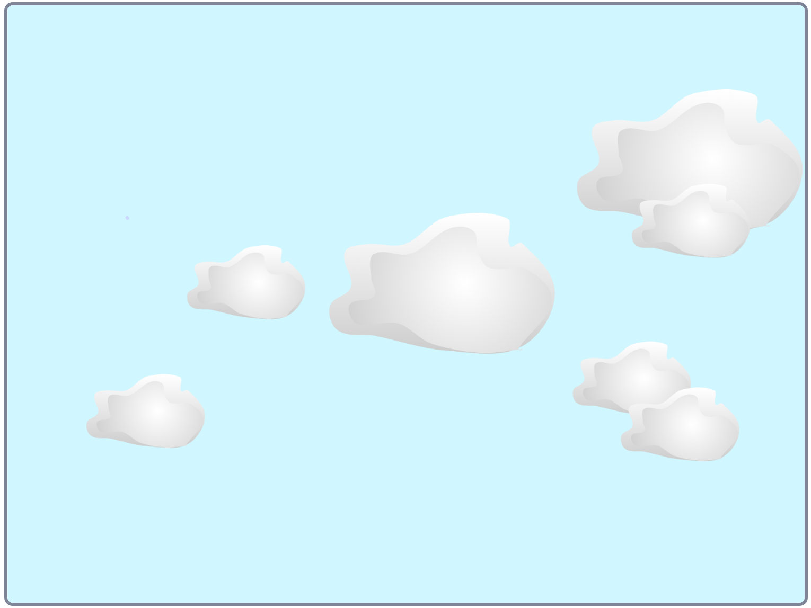{:width="400px"}

Het effect van het vermenigvuldigen van vormen wordt door professionele animators gebruikt om de indruk te wekken van weerpatronen, zoals regen of wolken; een groep van objecten, zoals gebouwen of een bos; of een menigte mensen in een scène.

--- no-print ---

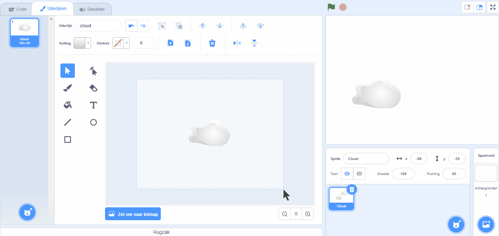

--- /no-print ---

Om elk type vorm te vermenigvuldigen:
+ Ga naar **Kies een Sprite** en selecteer in dit voorbeeld de **Cloud** sprite
+ Gebruik op het tabblad **Uiterlijken** het **Selecteren** gereedschap om de hele vorm te markeren
+ Gebruik de **Kopie maken** en **Plakken** knoppen om duplicaten van de vorm te maken
+ Gebruik het **Selecteren** gereedschap om de vorm in de Teken-editor te verplaatsen
+ Je kunt de grootte van de vormen variëren om bijvoorbeeld een groter gevoel van 3D-effecten te creëren
+ Je kunt alle vormen selecteren en ze samen **Groeperen** zodat je ze als één geheel kunt aanpassen of verplaatsen

--- /collapse ---

--- collapse ---
---
title: Gebruik verzadiging en helderheid om diepte te creëren
---

In de echte wereld lijken objecten die verder weg zijn lichter van kleur. Om een meer realistisch 3D-landschap te maken, kun je de **Verzadiging** en/of de **Helderheid** van de kleur van elke sprite **verlagen**, zodat ze verder en verder weg lijken.

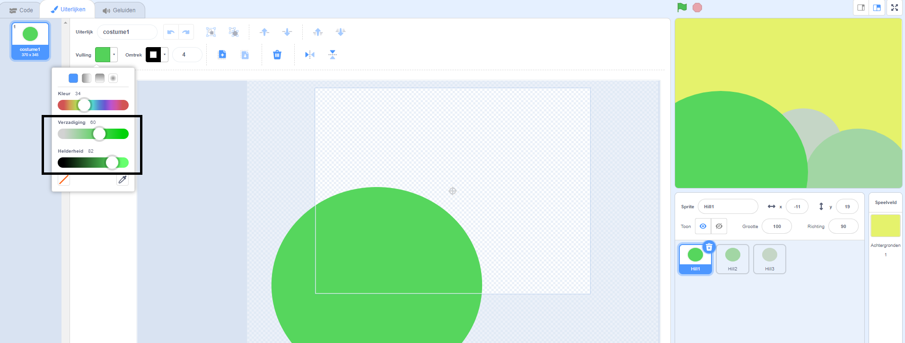{:width="400px"}

--- /collapse ---

--- collapse ---
---
titlel: Maak een sprite met gaten waar je doorheen kunt kijken
---

Je kunt een sprite maken met gaten waar je doorheen kunt kijken. Als de sprite als de voorste laag is gezet en de grootte heeft van het werkgebied, kan het eruitzien als een kijkje door de tralies van een kooi of een raam.

--- no-print ---

**Gekooide leeuw**: [Bekijk van binnen](https://scratch.mit.edu/projects/445680159/editor){:target="_blank"}

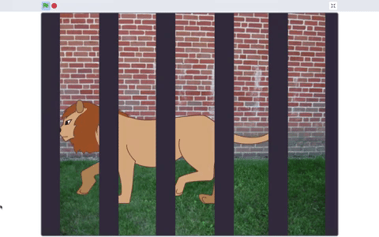

--- /no-print ---

Een soort maskeer-sprite maken:
+ Ga naar het **Kies een achtergrond** menu en kies **Tekenen**
+ Kies een **Vulling** kleur zonder **Omtrek** en teken een verticale rechthoek
+ Gebruik de **Kopie maken** en **Plakken** knoppen om duplicaten van de vorm te maken
+ Gebruik het **Selecteren** gereedschap om de vorm in de Teken-editor te verplaatsen
+ Zorg er bij het plaatsen van je vormen voor dat ze de rand van het werkgebied raken, zodat ze in jouw projectidee passen

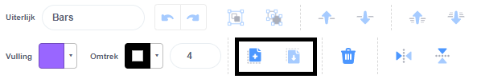

--- /collapse ---

**Tip:** Als je het moeilijk vindt om de sprites in je werkgebied te beheren, bijvoorbeeld als je een grote sprite hebt die steeds over een kleinere valt, kun je u op de **Verdwijn** knop klikken zodat de sprite niet meer zichtbaar is. Als je klaar bent, klik je nogmaals op de **Verschijn** knop.

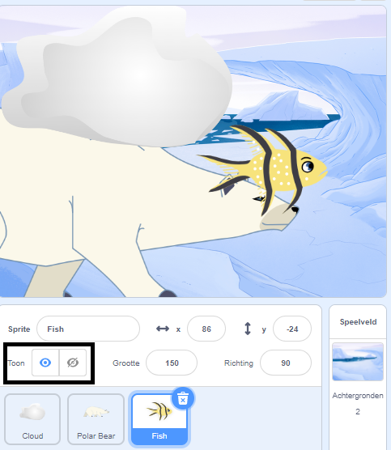{:width="300px"}
