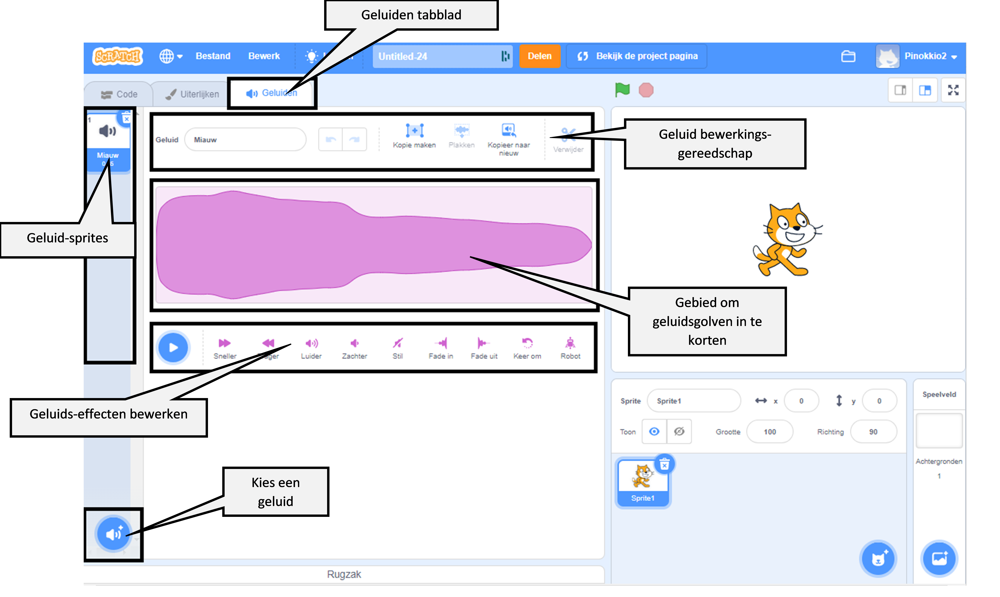

## Geluid bewerken

Gebruik de Geluids-editor om bestaande geluiden toe te voegen en te bewerken en om je eigen geluiden op te nemen.

{:width="600px"}

### Geluiden maken

\[[[scratch3-add-sound]]\] \[[[scratch3-record-sound\]]]

### Geluiden bewerken

Bewerk hele geluiden of delen van geluiden.

\[[[scratch3-reverse-sound]]\] \[[[scratch3-crop-sound\]]] [[[scratch3-sound-effects]]]
