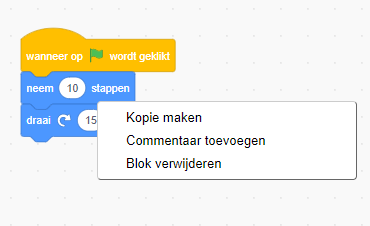
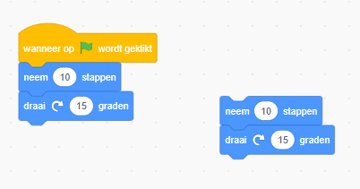
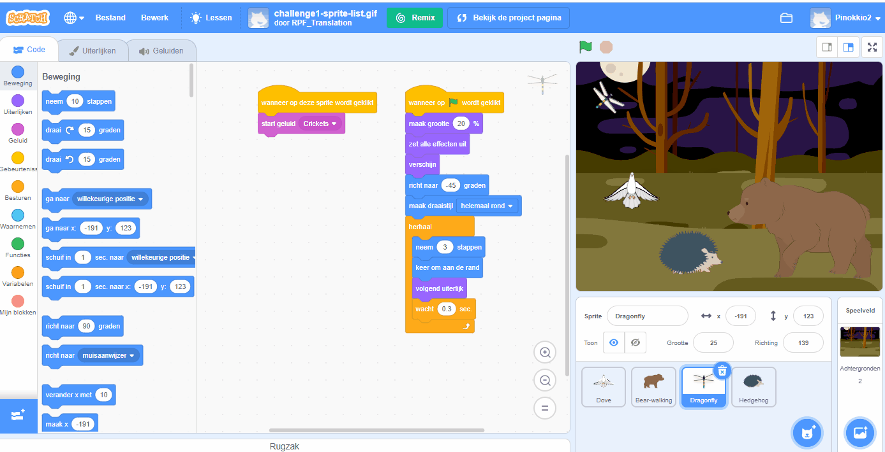

## Bewerkingstips
Het is handig om te leren hoe je codeblokken kopieert en verwijdert en sprites dupliceert.

**Tip:** Je kunt <kbd>Ctrl-z</kbd> (houd de Ctrl-toets ingedrukt en tik op 'z') gebruiken om veel acties in Scratch ongedaan te maken. Als je per ongeluk een Sprite of ander item verwijdert, kun je **Herstel** in het **Bewerken** menu gebruiken om het terug te krijgen.

Je kunt codeblokken verwijderen die je niet meer nodig hebt:

[[[scratch-delete]]]

Het dupliceren of kopiëren van code kan je tijd besparen bij het maken van een project.

--- collapse ---
---
title: Blokken kopiëren
---

Kopieer blokken of sets van blokken om deze opnieuw te gebruiken in het programma van een sprite:

* Ga naar het tabblad **Code**.
* Klik met de rechtermuisknop (of tik op een tablet en houd vast) op het eerste blok dat je wilt kopiëren. Het zal ook alle blokken eronder selecteren.
* Selecteer **Kopie maken** in het vervolgkeuzemenu. {:breedte="300px"}
* Sleep de gekopieerde code naar de gewenste plaats. {:breedte="300px"}
* Verwijder alle blokken die je niet nodig hebt.

--- /collapse ---

[[[scratch3-duplicate-sprite]]]

Maak een nieuwe sprite en kopieer alle of een deel van de code van de eerste sprite.

--- collapse ---
---
title: Kopieer de code van een sprite
---

Klik in de rechterbenedenhoek van de Sprite-lijst op **Kies een Sprite** en selecteer de sprite die je wilt toevoegen.

Klik op de eerste sprite en ga naar het tabblad **Code**. Sleep de code in het code werkgebied van de eerste sprite naar de afbeelding van de tweede sprite in de lijst met sprite's en laat de code los om het kopiëren naar de tweede sprite. Je kunt een script hebben dat begint met een `wanneer op de groene vlag wordt geklikt`{:class="block3events"} blok, of een ander script dat begint met een `wanneer op deze sprite wordt geklikt`{:class="block3events"} blok. Zorg ervoor dat je **alle** codescripts kopieert die je hebt gemaakt.

{:width="300px"}

Je tweede sprite heeft nu precies dezelfde code als je eerste sprite. Voer het programma niet uit voordat je de code van de tweede sprite hebt aangepast - het kan zijn dat je de tweede sprite niet ziet omdat deze zich onder de eerste sprite bevindt.

--- /collapse ---

Als je uiterlijken, sprites, geluiden en scripts tussen projecten wilt kopiëren, sleep je ze naar de **Rugzak**.

[[[scratch-backpack]]]

Het is altijd de moeite waard wat tijd te besteden om ervoor te zorgen dat je de best practices hebt gevolgd, zodat jouw project gemakkelijk te begrijpen is.

--- collapse ---
---
title: Best practices voor Scratch-projecten
---

- Geef alle sprites, uiterlijken, geluiden, variabelen en berichten een duidelijke naam. Projecten met duidelijke namen zijn veel gemakkelijker te begrijpen.
- Vul de projectpagina in met een goede titel, instructies en opmerkingen, zodat gebruikers weten hoe ze je project moeten gebruiken en waar je jouw ideeën vandaan hebt.
- Voeg korte opmerkingen toe die uitleggen wat je code doet.
- Zorg ervoor dat je scripts netjes zijn in het **Code** tabblad. Je kunt met de rechtermuisknop klikken en **Blokken opruimen** of de scripts rangschikken op een manier die voor jou logisch is. Probeer vergelijkbare scripts samen te voegen.

--- /collapse ---
