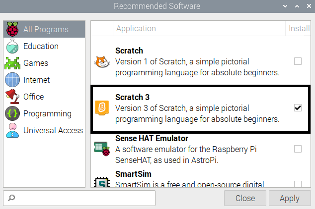
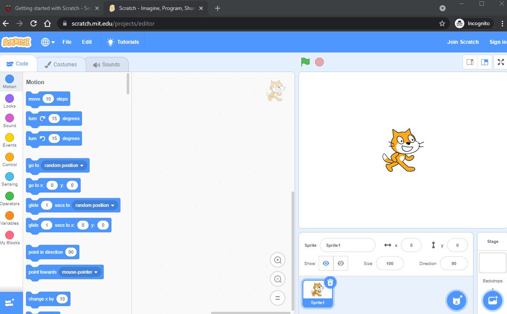
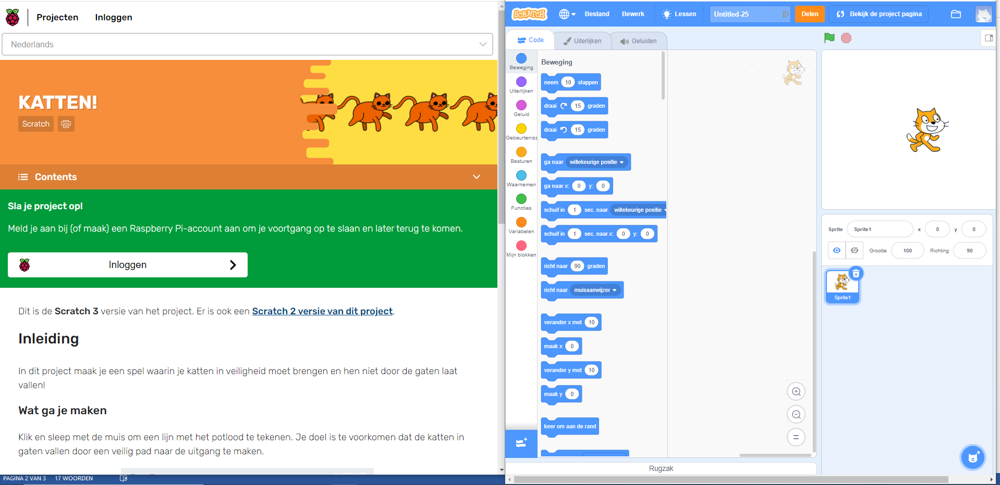
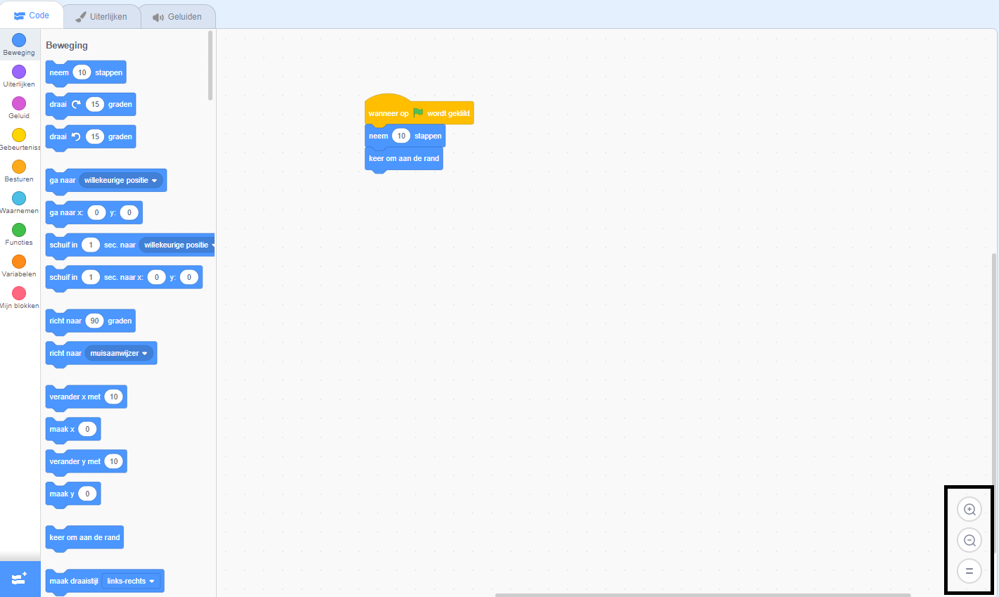

## Scratch installeren
Je kunt Scratch gebruiken op een laptop of desktop computer, of op een tablet. Je kunt Scratch ook op een Raspberry Pi-computer gebruiken.

--- task ---

Open een webbrowser op je computer of tablet en ga naar [rpf.io/scratch-new](https://rpf.io/scratch-new){:target="_blank"} om een nieuw project in de Scratch-editor te openen. Scratch wordt geopend in een nieuw tabblad in je web browser.

**Tip:** Je kunt ook naar [scratch.mit.edu](https://scratch.mit.edu/){:target="_blank"} gaan en vervolgens op **Maak** klikken.

--- collapse ---
---
title: Offline werken zonder internetverbinding
---

Als je offline (zonder internetverbinding) wilt werken, dan kun je [Scratch downloaden](https://scratch.mit.edu/download){:target="_ blank"} en installeren op een computer.

Je kunt niet offline werken op een tablet.

--- /collapse ---

--- collapse ---
---
title: Scratch op Raspberry Pi
---

Als je een Raspberry Pi-computer gebruikt, is Scratch mogelijk al geïnstalleerd. Klik op het **Raspberry Pi** pictogram om het menu te openen, klik vervolgens op **Programmeren** en selecteer vervolgens **Scratch 3**.

Als je Scratch moet installeren, volg dan dit proces:
+ Klik op het Raspberry Pi-pictogram om het menu te openen
+ Klik op **Voorkeuren**
+ Klik op **Aanbevolen Software**
+ Klik op **Scratch 3**
+ Klik op **OK**

Zie [Scratch 3 Desktop voor Raspberry Pi](https://www.raspberrypi.org/blog/scratch-3-desktop-for-raspbian-on-raspberry-pi/) voor meer informatie.

--- /collapse ---

--- /task ---

--- task ---

Wanneer je Scratch gebruikt met deze handleiding of een van onze projecten, moet je schakelen tussen Scratch en de project instructies.

--- collapse ---
---
title: Schakelen tussen browser tabbladen
---

Klik op (of tik op een tablet) op de titel van een browser tabblad om te schakelen tussen de Scratch-editor en projectinstructies.

--- /collapse ---

--- collapse ---
---
title: Instructies en Scratch naast elkaar
---

Als je scherm groot genoeg is, kun je Scratch bekijken naast de projectinstructies.

Als je Microsoft Windows 10 gebruikt, sleep je het tabblad Scratch in je webbrowser zodat het in een apart venster staat en blijf je slepen totdat de cursor de rechterrand van je scherm bereikt. Het venster komt dan aan de rechterkant van het scherm te staan.

Sleep nu het venster met deze handleiding of je projectinstructies naar de linkerkant van je scherm totdat de cursor de linkerrand bereikt. Het venster neemt de linkerhelft van je scherm in beslag.

Je kunt het formaat van de vensters wijzigen om ze precies zo te krijgen als je wilt.

**Tip:** Je kunt ook de <kbd>Windows</kbd> toets ingedrukt houden en op de <kbd>Linker</kbd> pijltoets of <kbd>Rechter</kbd> pijltoets drukken om een venster in de linker- of rechterhelft van je scherm te plaatsen.

--- /collapse ---

Probeer het nu en kijk hoe je het liefst werkt.

--- /task ---

--- task ---

Wanneer je Scratch in een webbrowser gebruikt, kun je in- of uitzoomen om de grootte aan te passen.

Als je bijvoorbeeld Microsoft Windows gebruikt en je wilt zoomen op een webpagina in Google Chrome of Microsoft Edge, houdt dan de <kbd>Ctrl</kbd> ingedrukt en druk op de toets <kbd>+</kbd> of <kbd>-</kbd> om in of uit te zoomen.

--- collapse ---
---
title: Gebruik zoom in het codegebied
---

Je kunt ook de zoomknoppen in het codegebied in Scratch gebruiken om de grootte van de codeblokken in het codegebied te wijzigen.

--- /collapse ---

--- /task ---

