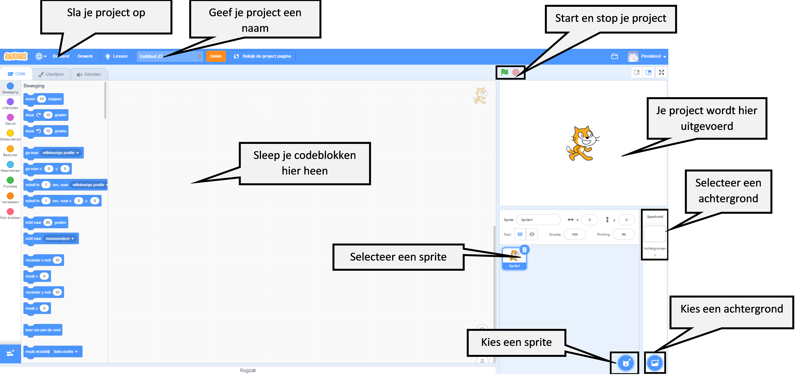
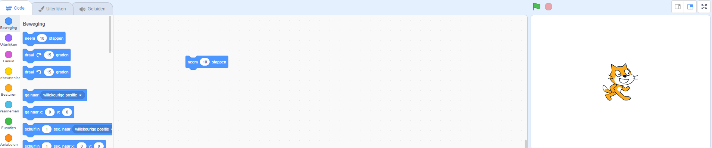
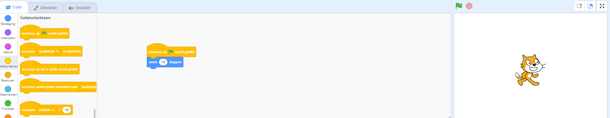
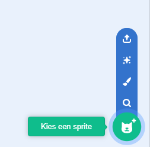
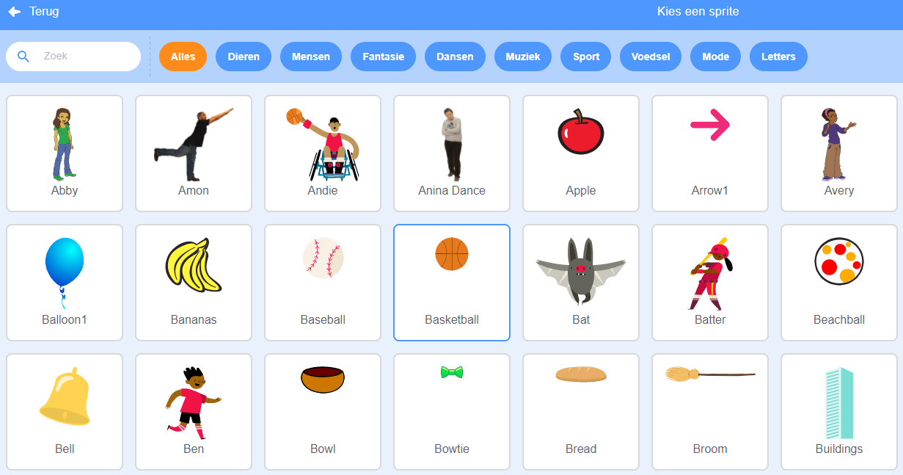
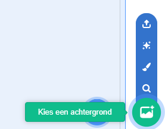
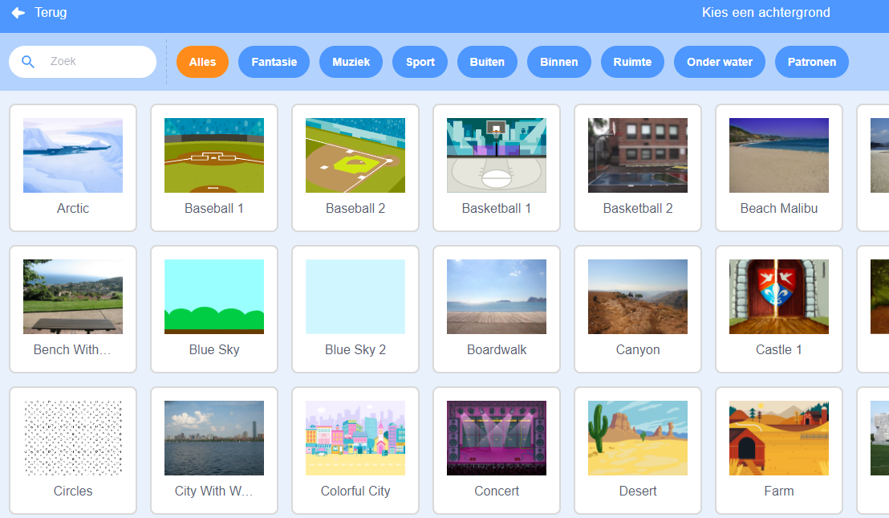

## Je eerste Scratch-project



--- task ---

Wanneer je een nieuw Scratch-project aanmaakt, bevat het een **kat** sprite.

Sleep blokken van het menu Blokken naar het werkgebied voor code om de kat iets te laten doen.

Om een voorbeeld te proberen, sleep je een `neem 10 stappen`{:class="block3motion"} blok uit het `Beweging`{:class="block3motion"} blokken menu. De blokken hebben een kleurcode om je te helpen ze te vinden.



Je kunt op blokken in het werkgebied voor code klikken om ze uit te voeren. Klik op het `neem 10 stappen`{:class="block3motion"} blok en de kat zal bewegen.

**Tip:** Als je Scratch op een tablet gebruikt, kun je op een item tikken door erop te klikken.

**Hoed-blokken** voeren de blokken eronder uit wanneer er een bepaalde gebeurtenis plaatsvindt. Het `wanneer op groene vlag wordt geklikt`{:class="block3events"}-blok voert code uit wanneer je op de groene vlag boven het Speelveld klikt om je project uit te voeren.

Sleep een `wanneer op de groene vlag wordt geklikt`{:class="block3events"} blok boven het `neem 10 stappen`{:class="block3motion"} blok, zodat ze in elkaar klikken.



Je code zou er als volgt uit moeten zien:

```blocks3
when flag clicked
move (10) steps
```

**Tip:** Scratch blokken hebben een kleurcode, dus je vindt het `wanneer op de groene vlag wordt geklikt`{:class="block3events"} blok in het `Gebeurtenissen`{:class="block3events"} gedeelte.

Klik nu op de groene vlag boven het Speelveld en de kat zal bewegen.

--- /task ---

Je kunt meer sprites aan je project toevoegen en je kunt ook een achtergrond toevoegen.

--- task ---

--- collapse ---
---
title: Kies een sprite
---

Klik in de Sprite-lijst op **Kies een Sprite** om de bibliotheek met alle Scratch-sprites te zien.



Je kunt zoeken naar een sprite of bladeren op categorie of thema. Klik op een sprite om deze aan je project toe te voegen.



--- /collapse ---

--- /task ---

--- task ---

--- collapse ---
---
title: Kies een achtergrond
---

Klik in de rechterbenedenhoek van het deelvenster Speelveld op **Kies een achtergrond**.



Je kunt zoeken naar een achtergrond of bladeren op categorie of thema. Klik op een achtergrond om aan je project toe te voegen.



--- /collapse ---

--- /task ---

--- task ---

--- collapse ---
---
title: Geef je project een naam en sla het op
---

Ga naar **Bestand** in het menu. Als je een Scratch-account hebt, klik dan op **Nu opslaan**. Als je geen account hebt, klik dan op **Opslaan op je computer**.

Klik in het vak projectnaam en pas de naam van je project aan.


Als je je project deelt, zullen andere mensen deze naam ook zien, dus zorg ervoor dat het een logische naam is.

--- /collapse ---

--- /task ---

Je hebt je eerste Scratch-project gemaakt!

Je bent nu klaar om Scratch te leren. We recommend that you start with our [Introduction to Scratch](https://projects.raspberrypi.org/en/raspberrypi/scratch-intro){:target="_blank"}, [Scratch: Module 1](https://projects.raspberrypi.org/en/raspberrypi/scratch-module-1){:target="_blank"} and/or [Look after yourself](https://projects.raspberrypi.org/en/raspberrypi/look-after-yourself){:target="_blank"} paths, which are designed for beginners.

 Je kunt naar deze gids terugkeren als je hulp nodig hebt bij het gebruik van Scratch wanneer je aan onze trajectprojecten of aan je eigen projecten werkt. 


