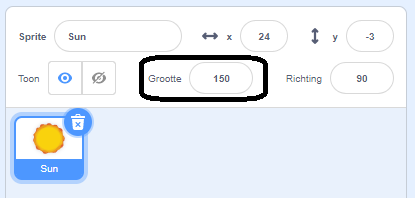

## Uiterlijken

`Uiterlijken`{:class="block3looks"} blokken bepalen het uiterlijk van een sprite in het Speelveld.

Sprites kunnen communiceren met `Uiterlijken`{:class="block3looks"}, via een `zeg`{:class="block3looks"} tekstballon, een `denk`{:class="block3looks"} gedachtenballon, of via hun `grafische effecten`{:class="block3looks"}.

### Zeg en denk

```blocks3
say () for () seconds

say ()

think () for () seconds

think ()
```

--- collapse ---
---
title: Gebruik een tekstballon om te communiceren
---

Sprites kunnen `zeggen`{:class="block3looks"} en `denken`{:class="block3looks"} om te communiceren.

De `zeg () voor () seconden`{:class="block3looks"} en `denk () voor () seconden`{:class="block3looks"} blokken worden gebruikt om iets te zeggen of te denken voor een bepaalde tijd.

```blocks3
when this sprite clicked
say [Hello!] for [2] seconds // spraak verbergen na 2 seconden
```

De sprite toont gedurende twee seconden een tekstballon wanneer erop wordt geklikt.

**Ruimte praat**: [Bekijk van binnen](https://scratch.mit.edu/projects/485673032/editor){:target="_blank"}

Klik op de sprites om ze te zien communiceren met spraak en gedachten.

<div class="scratch-preview">
  <iframe allowtransparency="true" width="485" height="402" src="https://scratch.mit.edu/projects/embed/485673032/?autostart=false" frameborder="0"></iframe>
</div>

De `zeg()`{:class="block3looks"} en `denk()`{:class="block3looks"} blokken worden gebruikt om iets te zeggen of te denken, totdat een ander bericht of een leeg `zeg()`{:class="block3looks"} of `denk()`{:class="block3looks"} blok het vervangt.

--- /collapse ---

### Grootte

Maak of verander de `grootte`{:class="block3looks"} van je sprites.

```blocks3
change size by ()

set size to () %

(size)
```

--- collapse ---
---
title: Stel de grootte van je sprite in
---

Wanneer je een sprite aan je project toevoegt, wordt de grootte ingesteld op `100` procent. Dit kan te groot of te klein zijn voor jouw project.

Je kunt code gebruiken om de grootte van een sprite in te stellen. Gebruik hiervoor een `maak grootte`{:class="block3looks"} blok:

```blocks3
set size to (50) %
```

Als je de grootte van een sprite instelt op `50` procent, is deze half zo hoog en half zo breed. Als je de grootte van een sprite instelt op `200` procent, wordt deze twee keer zo hoog en twee keer zo breed.

Om de grootte van een sprite in te stellen wanneer het project wordt gestart, plaats je een `maak grootte`{:class="block3looks"} blok onder een `wanneer op de groene vlag wordt geklikt`{:class="block3events"} blok:

```blocks3
when green flag clicked
set size to (50) %
```

Je kunt ook snel de grootte van een sprite instellen in de **Grootte** in het Sprite-venster onder het Speelveld:

{:width="400px"}

--- /collapse ---

### Grafische effecten

Stel een reeks visuele effecten zoals kleur, vissenoog, draaikolk, pixelleren, mozaïek, helderheid en transparant in of wijzig deze.

```blocks3
change [color v] effect by ()

set [color v] effect to ()

clear graphic effects
```

[[[scratch3-graphic-effects]]]

### Uiterlijken

Om een animatie-effect te maken met je sprites, kun je hun uiterlijk veranderen.

```blocks3
verander uiterlijk naar ( v)

volgend uiterlijk

(uiterlijk [nummer v])
```

[[[scratch3-change-costumes-to-show-mood]]]

--- collapse ---
---
title: Verander uiterlijk om een animatie-effect te maken
---

**Kloppend hart**: [Bekijk van binnen](https://scratch.mit.edu/projects/435725413/editor){:target="_blank"}

<div class="scratch-preview">
  <iframe allowtransparency="true" width="485" height="402" src="https://scratch.mit.edu/projects/embed/435725413/?autostart=false" frameborder="0"></iframe>
</div>

Je kunt de `maak grootte`{:class="block3looks"} of `verander grootte`{:class="block3looks"} blokken gebruiken om een pulserend effect te creëren, zoals een kloppend hart.

**Opmerking:** Het `maak grootte`{:class="block3looks"} blok stelt de grootte in op een specifieke waarde, terwijl het `verander grootte`{:class="block3looks"} blok de waarde verandert van wat het eerder was, bijv. `verander grootte met`{:class="block3looks"} `10` voegt 10 toe aan de waarde van de grootte.

```blocks3
when green flag clicked
set size to (160) %
forever
change size by (40)
wait (0.2) seconds
change size by (20)
wait (0.2) seconds
change size by (-20)
wait (0.2) seconds
change size by (-40)
wait (0.2) seconds
end
```

Deze code gebruikt een serie van `verander grootte`{:class="block3looks"} en `wacht`{:class="block3control"} blokken om het hart te laten groeien en krimpen. Probeer je eigen pulserende sprite te maken.

Je kunt ook het `grafische effect`{:class="block3looks"}-blok gebruiken om een sprite te maken die zijn uiterlijk blijft veranderen.

```blocks3
when green flag clicked
change [ghost v] effect by (75)
wait (1) seconds
change [ghost v] effect by (-75)
```

**Opmerking:** Als je code gebruikt die een grafisch effect wijzigt en vervolgens weer terug wijzigt, vergeet dan niet om een `wacht`{:class="block3control"} blok te gebruiken tussen de `verander grafisch effect`{:class="block3looks"} blokken, anders gaat het zo snel dat je het niet ziet!

Je kunt een `zet alle effecten uit`{:class="block3looks"} blok gebruiken om de effecten te resetten:

```blocks3
clear graphic effects
```

--- /collapse ---

--- collapse ---
---
title: Klik om te wijzigen en dan terug te veranderen
---

Je kunt acties toevoegen die een sprite veranderen en deze vervolgens ongedaan maken, zoals groeien, wachten en vervolgens verkleinen.

**Plet de bal wanneer erop wordt geklikt**: [Bekijk van binnen](https://scratch.mit.edu/projects/435723273/editor){:target="_blank"}

<div class="scratch-preview">
  <iframe src="https://scratch.mit.edu/projects/435723273/embed" allowtransparency="true" width="485" height="402" frameborder="0" scrolling="no" allowfullscreen></iframe>
</div>

Deze code maakt een sprite groter, past het `vissenoog`{:class="block3looks"}-effect gedurende 0,5 seconden toe en zet de sprite vervolgens terug naar zijn oorspronkelijke uiterlijk:

```blocks3
when this sprite clicked
set size to (110)
set [fisheye v] effect to (50)
wait (0.5) seconds
set [fisheye v] effect to (0)
set size to (100)
```

--- /collapse ---

[[[scratch3-animate-movement-costumes]]]

### Achtergronden

Je kunt ook code gebruiken om de achtergrond te wijzigen.

```blocks3
switch backdrop to ( v)

next backdrop

(backdrop [number v])
```

[[[scratch3-changing-backdrops-pages-levels]]]

### Zichtbaarheid

De `verschijn`{:class="block3looks"} en `verdwijn`{:class="block3looks"} blokken bepalen de zichtbaarheid van een sprite.

```blocks3
show 

hide
```

[[[scratch3-show-hide-sprites-backdrops]]]

### Lagen

Je kunt lagen gebruiken om de manier waarop jouw sprites ten opzichte van elkaar worden weergegeven te wijzigen.

```blocks3
go to [front v] layer

go [forward v] () layers
```

[[[scratch3-positioning-with-layers]]]

--- collapse ---
---
title: Sprites in meerdere lagen plaatsen
---

**Door het raam met boom**: [Bekijk van binnen](https://scratch.mit.edu/projects/454188775/editor){:target="_blank"}

<div class="scratch-preview">
  <iframe allowtransparency="true" width="485" height="402" src="https://scratch.mit.edu/projects/embed/454188775/?autostart=false" frameborder="0"></iframe>
</div>

In dit voorbeeld verschijnt het **Window frame** vóór de **Sun**. De **Avery Walking** en **Tree** sprites bevinden zich elk in hun eigen lagen tussen de **Window frame** sprite en de **Sun** sprite.

Gebruik het `ga naar achteren`{:class="block3looks"} `1` `laag`{:class="block3looks"} blok om een sprite één laag achter de sprite aan de voorkant te plaatsen:

``` blocks3
when green flag clicked
go to [front v] layer
+go [backward v] (1) layers
```

Verander de waarde in de `ga naar achteren`{:class="block3looks"} `1` `laag`{:class="block3looks"} blok voor elke sprite, afhankelijk van waar je deze wilt plaatsen ten opzichte van andere sprites:

``` blocks3
when green flag clicked
go to [front v] layer
+go [backward v] (2) layers
```

--- /collapse ---

