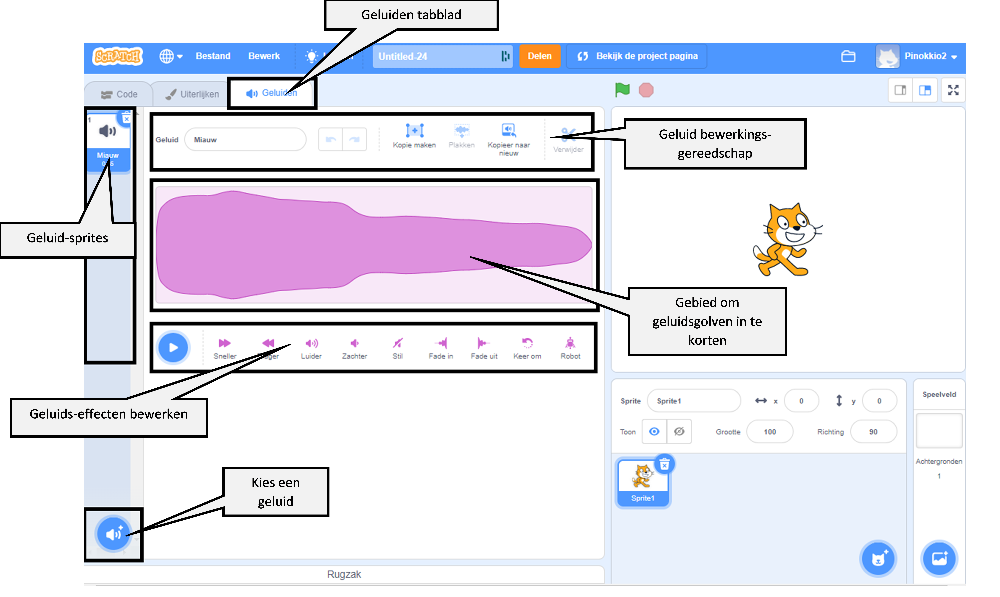

## Geluid

Om geluid aan je project toe te voegen, gebruik je `Geluid`{:class="block3sound"} blokken. Je kunt bijvoorbeeld een doorlopende soundtrack op de achtergrond maken of geluiden toevoegen die met regelmatige tussenpozen worden afgespeeld.

{:width="600px"}

Selecteer eerst een geluid uit de Geluidsbibliotheek of neem je eigen geluid op.

[[[scratch3-add-sound]]]

[[[scratch3-record-sound]]]

Voeg code toe om `Geluid`{:class="block3sound"} blokken uit te voeren waar je geluid wilt in je project.

--- collapse ---
---
title: Voeg een lang geluid toe om een doorlopende soundtrack te creëren
---

Klik op de groene vlag om de geluiden te horen.

**Radio soundtrack**: [Bekijk van binnen](https://scratch.mit.edu/projects/444581851/editor){:target="_blank"}

<div class="scratch-preview">
 <iframe allowtransparency="true" width="485" height="402" src="https://scratch.mit.edu/projects/embed/444581851/?autostart=false" frameborder="0"></iframe>
</div>

Je kunt een `start geluid en wacht`{:class="block3sound"}-blok gebruiken in een `herhaal`{:class="block3control"}-lus. Zodra het geluid is afgelopen laat het `herhaal`{:class="block3control"}-lus het geluid weer vanaf het begin spelen.

Deze code gebruikt een enkele lange geluidsclip die als soundtrack wordt herhaald:

```blocks3
when green flag clicked
forever
play sound (Dance Snare Beat v) until done
end
```

**Opmerking:** Als je een nieuw geluid kiest en je selecteert de **Lussen**, zal Scratch je alleen de geluiden laten zien die geschikt zijn voor een enkele herhaal-soundtrack.


--- /collapse ---

--- collapse ---
---
title: Voeg een reeks korte geluiden toe om een doorlopende soundtrack te creëren
---

Klik op de groene vlag om de geluiden te horen.

**Kampioen optreden**: [Bekijk van binnen](https://scratch.mit.edu/projects/444673165/editor){:target="_blank"}

<div class="scratch-preview">
 <iframe allowtransparency="true" width="485" height="402" src="https://scratch.mit.edu/projects/embed/444673165/?autostart=false" frameborder="0"></iframe>
</div>

 Gebruik een `herhaal`{:class="block3control"} blok om een lusgeluid te creëren. Jij kunt:
+ Een serie korte klanken in een reeks plaatsen, of
+ Verschillende instrumentnoten en effecten gebruiken

```blocks3
when flag clicked
forever
play sound (Low Boing v) until done
play sound (Low Boing v) until done
play sound (Drum Buzz v) until done
play sound (Pop v) until done
play sound (Bird v) until done
play sound (Bark v) until done
play sound (Glug v) until done
End
```

--- /collapse ---

--- collapse ---
---
title: Geluiden toevoegen die met regelmatige tussenpozen spelen
---

**Voetbalgeluiden**: [Bekijk van binnen](https://scratch.mit.edu/projects/450870079/editor){:target="_blank"}

Klik op de groene vlag om de geluiden te horen.

<div class="scratch-preview">
 <iframe allowtransparency="true" width="485" height="402" src="https://scratch.mit.edu/projects/embed/450870079/?autostart=false" frameborder="0"></iframe>
</div>

 In dit project heeft het **Speelveld** codes om met regelmatige tussenpozen een geluid af te spelen:

 ```blocks3
 when flag clicked
 forever
 wait (3) seconds
 play sound (Cheer v) until done
 end
 ```

De **Whistle** sprite speelt ook een geluid met regelmatige tussenpozen:

 ```blocks3
 when this sprite clicked
 forever
 play sound (Referee Whistle v) until done
 wait (4) seconds
 end
 ```

--- /collapse ---

--- collapse ---
---
title: Geluiden toevoegen die tegelijkertijd beginnen te spelen
---

Er zijn twee `Geluid`{:class="block3sound"} blokken met een belangrijk verschil:

+ Wanneer je `start geluid en wacht`{:class="block3sound"}, zal het geluid helemaal doorspelen. De volgende regel code in het script wordt pas uitgevoerd als het geluid is afgespeeld.

+ Wanneer je `start geluid`{:class="block3sound"} gebruikt, wordt het geluid afgespeeld, maar het volgende blok wordt onmiddellijk uitgevoerd en wacht niet tot het geluid eerst is afgespeeld.

Dit betekent dat als je een reeks van `start geluid`{:class="block3sound"} blokken had, de geluiden bijna allemaal tegelijkertijd zouden spelen, op elkaar gestapeld. Het effect kan interessant en soms rommelig zijn.

Ga er een keer mee spelen!

```blocks3
when green flag clicked
start sound (Meow v)
start sound (Alien Creak2 v)
start sound (Boing v)
start sound (Boom Cloud v)
start sound (Baa v)
```

--- /collapse ---

Als je eenmaal je geluiden hebt gekozen, wil je misschien de `volume`{:class="block3sound"}, `toonhoogte`{:class="block3sound"} of `kanaal`{:class="block3sound"} ( zodat je het geluid uit de linker- of rechterluidspreker hoort) veranderen.

--- collapse ---
---
title: Volume, toonhoogte en kanaal
---

Klik op de groene vlag om de geluiden te horen.

**Bandoefening**: [Bekijk van binnen](https://scratch.mit.edu/projects/451697380/editor){:target="_blank"}

<div class="scratch-preview">
 <iframe allowtransparency="true" width="485" height="402" src="https://scratch.mit.edu/projects/embed/451697380/?autostart=false" frameborder="0"></iframe>
</div>

De **Drums** sprite `zet volume`{:class="block3sound"}, `zet effect toonhoogte`{:class="block3sound"} en `zet effect kanaal links/rechts`{:class="block3sound"} blokken om het geluid te veranderen:

```blocks3
set volume to (80) %
set [pitch v] effect to (50) :: sound
set [pan left/right v] effect to (-100) :: sound
play sound (Drum Funky v) until done
```

+ Je kunt het `zet volume`{:class="block3sound"} blok een waarde van `0` (stil) tot `100` (volledig volume) geven. Dit is handig als je wilt dat sommige geluiden luider klinken dan andere, of als je een sprite verder weg wilt laten verschijnen.

+ Het `toonhoogte`{:class="block3sound"} effect bepaalt hoe hoog of laag een geluid is. Door de toonhoogte op een hogere waarde in te stellen, wordt het geluid ook sneller. Je kunt het `zet toonhoogte effect`{:class="block3sound"} instellen op waarden tussen `-360` (zeer laag) en `360` (zeer hoog).

+ Met het `kanaal links/rechts`{:class="block3sound"} effect kun je bepalen of een geluid uit een linker- of rechterluidspreker of hoofdtelefoon komt of beide. Je kunt het `zet kanaal links/rechts effect`{:class="block3sound"} blok instellen op waarden van `-100` (al het geluid van links) tot `100` (al het geluid van rechts).

--- /collapse ---

Je kunt ook de `Tekst naar spraak`{:class="block3extensions"} uitbreiding gebruiken:

[[[scratch3-text-to-speech]]]

