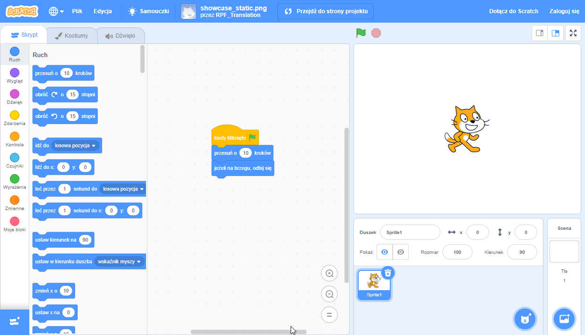

## Co to jest Scratch?
Scratch to graficzny język programowania opracowany przez grupę Lifelong Kindergarten w MIT Media Lab. W Scratch można przeciągać i łączyć bloki kodu, aby tworzyć różne programy, w tym animacje, historie, instrumenty muzyczne i gry. To trochę taki odpowiednik w programowaniu, dla klocków do budowania!

Scratch jest używany w wielu szkołach jako część programu nauczania. Jest bezpłatny, a młodzi ludzie mogą z niego korzystać zarówno w domu, jak iw klubach.

Scratch pozwala młodym ludziom uczyć się koncepcji kodowania i tworzyć interaktywne projekty bez konieczności uczenia się tekstowego języka programowania. Nie musisz być w stanie szybko pisać ani zapamiętywać złożonego kodu, aby korzystać ze Scratch.

### Jak korzystać z tego przewodnika
Jeśli nie korzystałeś wcześniej ze Scratcha, ten przewodnik pomoże Ci zacząć i stworzyć swój pierwszy projekt.

Możesz wrócić do tego przewodnika i użyć go do wyszukania informacji potrzebnych podczas tworzenia własnych projektów w Scratchu.

Na końcu przewodnika znajdziesz linki do projektów Scratch, od początkującego do zaawansowanego, gdzie możesz uczyć się programowania, tworząc zabawne i ciekawe aplikacje, gry, historie, animacje, grafikę i muzykę.

--- collapse ---
---
title: Czego będziesz potrzebować
---
### Sprzęt

+ Komputer lub tablet obsługujący Scratch 3

### Oprogramowanie

+ Ten przewodnik wyjaśnia, jak rozpocząć korzystanie ze Scratch 3 ([online](https://scratch.mit.edu/){:target="_blank"} lub [offline](https://scratch.mit.edu/download){:target="_blank"})

--- /collapse ---
