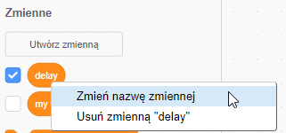
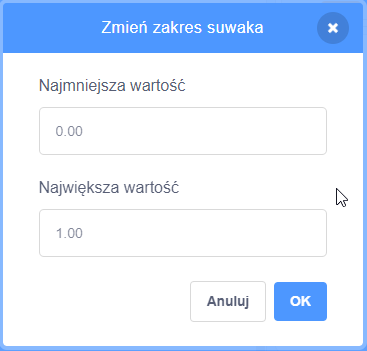

## Zmienne

`Zmienne`{:class="block3variables"} to sposób przechowywania liczb i/lub tekstu.

Możesz tworzyć własne zmienne i wybrać, czy mają się wyświetlać na Scenie:

[[[generic-scratch3-add-variable]]]

Powinieneś zastanowić się, czy nie musisz ustawić wartości początkowej podczas tworzenia zmiennej:

[[[scratch3-create-set-variable]]]

Możesz zmienić nazwę zmiennej, jeśli zmienisz zdanie:

--- collapse ---
---
title: Zmień nazwę zmiennej
---

Czasami wpadnie Ci do głowy lepsza nazwa dla zmiennej.

Możesz nadać zmiennej nową nazwę: przejdź do `Zmienne`{:class="block3variables"}, kliknij prawym przyciskiem myszy (lub na tablecie naciśnij i przytrzymaj) na `zmiennej`{:class="block3variables" "} i wybierz **Zmień nazwę zmiennej**.



Spowoduje to zmianę nazwy zmiennej we wszystkich blokach, w których jej użyłeś.

--- /collapse ---

**Wskazówka:** Upewnij się, że znasz różnicę między `ustaw na`{:class="block3variables"} a `zmień o`{:class="block3variables"}. Blok `ustaw na`{:class="block3variables"} zastąpi wartość przechowywaną w zmiennej. Natomiast `zmień o`{:class="block3variables"} zmieni wartość zmiennej liczbowej o wybraną przez Ciebie wartość, `zmień o`{:class="block3variables"}`1` doda jeden do zmiennej. `zmień o`{:class="block3variables"}`-1` odejmie jeden od zmiennej.


**Wskazówka:** Zmienne na Scenie zawsze pojawiają się na warstwie ponad wszystkimi duszkami. Jeśli masz poruszającego się duszka, będzie on przechodził pod każdą zmienną na Scenie.

Możesz użyć suwaka, aby kontrolować wartość zmiennej.

[[[scratch3-slider-variable]]]

Więcej pomysłów na wykorzystanie zmiennych:

[[[generic-scratch3-high-score]]]

[[[scratch3-join-text]]]

[[[scratch3-set-variable-with-button]]]

[[[scratch3-change-variable-in-loop]]]


--- collapse ---
---
title: Kontroluj efekty graficzne za pomocą suwaka zmiennej
---

Oto kilka przykładów wykorzystania suwaka zmiennej:


Ten przykład zmienia efekt graficzny `duch`{:class="block3looks"}, dzięki czemu można widzieć poprzez tęczę.

**Przezroczysta tęcza**: [Zajrzyj do środka](https://scratch.mit.edu/projects/451544795/editor){:target="_blank"}

<div class="scratch-preview">
  <iframe allowtransparency="true" width="485" height="402" src="https://scratch.mit.edu/projects/embed/451544795/?autostart=false" frameborder="0"></iframe>
</div>

Można użyć `przezroczystej`{:class="block3variables"} zmiennej aby sterować efektem `duch`{:class="block3looks"} na duszku na `wierzchu`{:class="block3looks"} i użyć jej aby odsłonić lub ukryć duszki na niższych warstwach.

```blocks3
when flag clicked
go to [front v] layer
```

```blocks3
when flag clicked
forever
set [ghost v] effect to (transparent)
```

Spróbuj użyć tej samej metody z innymi efektami graficznymi, takimi jak `jasność`{:class="block3looks"} lub `kolor`{:class="block3looks"}.

--- /collapse ---

--- collapse ---
---
title: Kontroluj prędkość ruchu za pomocą zmiennej
---

**Biedronka na ścianie**: [Zajrzyj do środka](https://scratch.mit.edu/projects/451545341/editor){:target="_blank"}

<div class="scratch-preview">
  <iframe allowtransparency="true" width="485" height="402" src="https://scratch.mit.edu/projects/embed/451545341/?autostart=false" frameborder="0"></iframe>
</div>

Użyj zmiennej `speed`{:class="block3variables"} jako danej wejściowej do bloku `przesuń o`{:class="block3motion"}:

```blocks3
when flag clicked
forever
move (speed) steps
if on edge, bounce
```
Ustaw minimalne i maksymalne wartości zakresu suwaka, aby dopasować je do swojego projektu.

--- /collapse ---

--- collapse ---
---
tytuł: Kontroluj prędkość obrotu za pomocą zmiennej
---

**Kosmiczny pies**: [Zajrzyj do środka](https://scratch.mit.edu/projects/451543041/editor){:target="_blank"}

<div class="scratch-preview">
  <iframe allowtransparency="true" width="485" height="402" src="https://scratch.mit.edu/projects/embed/451543041/?autostart=false" frameborder="0"></iframe>
</div>

Użyj zmiennej `angle`{:class="block3variables"} jako danej wejściowej do bloku `obróć w prawo`{:class="block3motion"}:

```blocks3
when flag clicked
forever
turn right (angle) degrees
```

--- /collapse ---

--- collapse ---
---
title: Zmień opóźnienie w bloku czekaj
---

**Taniec szkieleta**: [Zajrzyj do środka](https://scratch.mit.edu/projects/451536565/editor){:target="_blank"}

<div class="scratch-preview">
  <iframe allowtransparency="true" width="485" height="402" src="https://scratch.mit.edu/projects/embed/451536565/?autostart=false" frameborder="0"></iframe>
</div>

Użyj zmiennej `opóźnienie`{:class="block3variables"} jako danej wejściowej do bloku `czekaj`{:class="block3control"}:

```blocks3
when flag clicked
forever
wait (delay) seconds
next costume
```

Opóźnienie powyżej jednej sekundy to dość długi czas. Jeśli w zakresie suwaka umieścisz liczbę dziesiętną, możesz zmienić jego wartość o setną część sekundy.

Zakres od `0,00` do `1,00` pozwala wybrać opóźnienie od `0` sekund (bez opóźnienia) do `1` sekundy.



Zmień liczby, aby uzyskać minimalne i maksymalne wartości, których użytkownicy będą mogli używać w projekcie.

--- /collapse ---

--- collapse ---
---
title: Zmień efekty dźwiękowe
---

**Wysokość dźwięku bębna**: [Zajrzyj do środka](https://scratch.mit.edu/projects/451547017/editor){:target="_blank"}

<div class="scratch-preview">
  <iframe allowtransparency="true" width="485" height="402" src="https://scratch.mit.edu/projects/embed/451547017/?autostart=false" frameborder="0"></iframe>
</div>

Możesz użyć `zmiennej`{:class="block3variables"} w bloku `ustaw efekt płynność dźwięku na`{:class="block3sound"}. Jeśli zwiększysz płynność dźwięku, nuty staną się wyższe, a dźwięk przyspieszy.

```blocks3
when flag clicked
forever
set [pitch v] effect to (beat) :: sound
```

Odtwórz dźwięk w oddzielnej pętli `zawsze`{:class="block3control"}, dzięki czemu tonacja zmieni się natychmiast, zamiast czekać na zakończenie odtwarzania dźwięku:

```blocks3
when flag clicked
forever
play sound [Dance Head Nod v] until done
```

Możesz także użyć `zmiennej`{:class="block3variables"}, aby zmienić głośność i efekt przesuwania w lewo/prawo (balans).

--- /collapse ---


