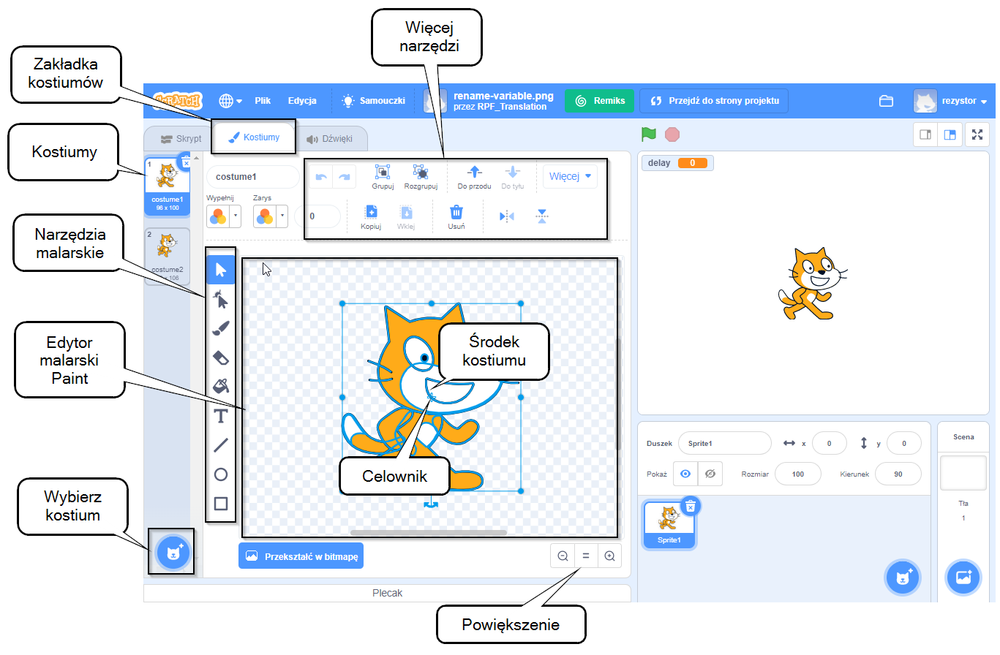

## Edytor malowania- Paint

Użyj edytora Paint, aby tworzyć własne tła i kostiumy oraz edytować istniejące tła i kostiumy.

{:width="600px"}

[[[scratch3-paint-a-new-backdrop-extended]]]

[[[scratch3-backdrops-and-sprites-using-shapes]]]

[[[scratch3-use-text-tool]]]

[[[scratch3-add-costumes-to-a-sprite]]]

[[[scratch-crosshair]]]

[[[scratch3-copy-parts-between-sprite-costumes]]]

--- collapse ---
---
title: Duplikuj i edytuj kostium do wykorzystania w animacji
---

Niektóre duszki Scratcha mają tylko jeden kostium lub mają kilka kostiumów, które jednak nie działają jako animacja. Jeśli wybierzesz jeden kostium, a następnie zduplikujesz go (zrobisz jego kopię) i dokonasz małej zmiany, może to stworzyć efekt animacji.

**Animacja robota**: [Zajrzyj do środka](https://scratch.mit.edu/projects/436260207/editor){:target="_blank"}

  <iframe allowtransparency="true" width="485" height="402" src="https://scratch.mit.edu/projects/embed/436260207/?autostart=false" frameborder="0"></iframe>

Przejdź do zakładki **Kostiumy** dla swojego duszka.

Wybierz kostium, którego chcesz użyć i usuń inne kostiumy, ponieważ nie będziesz ich potrzebować do animacji. Na przykład duszek **Robot** zawiera kostiumy dla trzech różnych robotów, więc powinieneś wybrać jeden ze strojów i usunąć pozostałe.

Kliknij prawym przyciskiem myszy (lub na tablecie naciśnij i przytrzymaj) kostium i wybierz **duplikuj**.

Wprowadź drobne zmiany w kopii kostiumu. Na przykład możesz przesuwać, obracać lub zmieniać całość lub część kostiumu. Możesz także dodać linie ruchu.

Jeśli twój kostium wykorzystuje grafikę wektorową, możesz wybrać części kostiumu i zmienić każdą część osobno.

Możesz ponownie zduplikować kostium i wprowadzić więcej zmian, aby dodać więcej klatek do animacji.

Możesz teraz używać swoich kostiumów w prostej animacji duszka.

--- /collapse ---

--- collapse ---
---
title: Użyj narzędzia Wypełnij, aby zmienić kolory kostiumu
---

Możesz zmienić kolor swojego duszka. Najpierw wybierz swojego duszka z listy duszków pod Sceną, a następnie kliknij zakładkę **Kostiumy**.

Użyj narzędzia **Wybierz** (strzałka), aby podświetlić część kostiumu, której kolor chcesz zmienić.

{:width="200px"}

{:width="300px"}

Przejdź do palety kolorów **Wypełnij** i wybierz kolor. To automatycznie wypełni wybrany przez Ciebie kształt.

{:width="300px"}

Powtórz powyższe kroki dla dowolnej części stroju, którą opóściłeś, lub dla każdej innej części stroju, której kolor chcesz zmienić.

{:width="300px"}

{:width="300px"}

{:width="300px"}

--- /collapse ---

Skorzystaj z poniższych wskazówek, które pomogą Ci stworzyć własne projekty dla swoich duszków w edytorze Paint.

--- collapse ---
---
title: Stwórz scenerię jako duszki
---

**Wzgórze jako duszek**: [Zajrzyj do środka](https://scratch.mit.edu/projects/452582516/editor){:target="_blank"}

{:width="400px"}

Aby stworzyć własne **Wzgórze** pokazane w powyższym przykładzie, możesz użyć narzędzi **Okrąg** i **Prostokąt** w edytorze graficznym Paint:

+ Przejdź do **Wybierz duszka** i wybierz **Maluj** aby stworzyć nowy kostium duszka.

{:width="400px"}

+ Wybierz kolor w **Wypełnij**. Kliknij na **Zarys** i odznacz go (w tym celu kliknij pole z ukośną linią w lewym dolnym rogu menu). Teraz użyj narzędzia **Okrąg**, aby narysować owal. Następnie wybierz narzędzie **Prostokąt** i narysuj prostokąt pod owalem.

+ Jeśli używasz różnych kolorów dla kształtów, może być konieczne użycie narzędzi **Do przodu** i **Do tyłu** w edytorze Paint, aby przesunąć kształty na wierzch lub na spód, tak aby były prawidłowo umieszczone w tle.

+ Możesz zaznaczyć wszystkie kształty i wybrać **Grupuj**, dzięki czemu można dostosować je lub przenieść jako jeden kształt.

{:width="400px"}

Teraz stwórz inne duszki do swojej scenerii, jeśli pasuje to do twojego pomysłu na projekt.

Pamiętaj, aby nazwać swoje duszki.

--- /collapse ---

--- collapse ---
---
title: Użyj narzędzia Linia, aby zrobić trójkąt
---

Możesz tworzyć wielokąty, takie jak trójkąt, i używać tych kształtów do tworzenia dachów lub gór.

Przejdź do **Wybierz duszka** i wybierz **Maluj** aby stworzyć nowy kostium duszka. W tym przykładzie zrobisz domy.

**Dom**: [Zajrzyj do środka](https://scratch.mit.edu/projects/453595663/editor){:target="_blank"}

{:width="400px"}

Postępując zgodnie z poniższymi instrukcjami, użyjesz narzędzia **Linia**, aby stworzyć dowolny kształt:
+ Wybierz kolor w **Wypełnij**. Aby wybrać kolor czarny, zmniejsz **Jasność** do zera (`0`).

{:width="150px"}

+ Wybierz **Brak zarysu**.

{:width="200x"}

+ Użyj narzędzia **Prostokąt**, aby narysować prostokąt.
+ Użyj narzędzia **Linia**, aby narysować trójkąt. Upewnij się, że zrobiłeś trójkąt, w przeciwnym razie nie wypełni się kolorem.
+ Przesuń oba kształty razem.
+ Wybierz narzędzie **Wypełnij** (Wiadro) i wypełnij trójkąt kolorem.
+ Użyj narzędzia **Prostokąt**, aby narysować kolejny prostokąt dla komina.
+ Możesz użyć narzędzi **Do przodu** i **Do tyłu** w edytorze Paint, aby przesuwać kształty na wierzch lub na spód, tak aby były prawidłowo umiejscowione. W tym przykładzie nie musisz tego robić, ponieważ kształty są czarne, aby stworzyć kontur.
+ Zaznacz wszystkie kształty i **Grupuj** je ze sobą, dzięki czemu można je dostosować lub przenosić jako jeden kształt.

Aby powielić kształty swojego domu (aby na przykład stworzyć panoramę), postępuj zgodnie ze wskazówkami w **Powiel kształty, aby utworzyć kostium scenerii** poniżej.

--- /collapse ---

--- collapse ---
---
title: Powiel kształty, aby stworzyć kostium scenerii
---

Możesz powielić kształty w kostiumie, aby Twoja sceneria wydawała się bardziej ruchliwa lub zatłoczona.

**Wiele chmur**: [Zajrzyj do środka](https://scratch.mit.edu/projects/447278432/editor){:target="_blank"}

{:width="400px"}

Efekt powielania kształtów wykorzystywany jest przez profesjonalnych animatorów do stworzenia wrażenia wzorów pogodowych, takich jak deszcz czy chmury; skupisk obiektów, takich jak budynki lub drewno; lub tłumu ludzi na scenie.

--- no-print ---

--- /no-print ---

Aby powielić dowolny rodzaj kształtu:
+ Przejdź do **Wybierz duszka** i wybierz, w tym przykładzie, duszka **Chmura**
+ Na karcie **Kostiumy** użyj narzędzia **Wybierz**, aby podświetlić cały kształt
+ Użyj narzędzi **Kopiuj** i **Wklej**, aby utworzyć duplikaty kształtu
+ Użyj narzędzia **Wybierz**, aby przesunąć kształt w edytorze Paint
+ Możesz na przykład zmieniać rozmiar kształtów, aby uzyskać lepsze wrażenie efektów 3D
+ Można zaznaczyć wszystkie kształty i użyć **Grupuj**, dzięki czemu można dostosować je lub przenieść je jako jeden kształt

--- /collapse ---

--- collapse ---
---
title: Użyj Nasycenia i Jasności, aby stworzyć głębię
---

W rzeczywistym świecie obiekty znajdujące się dalej wydają się jaśniejsze. Aby uzyskać bardziej realistyczną scenerię 3D, możesz **zmniejszyć** wartość **Nasycenia** i/lub **Jasności** dla każdego duszka tak, aby wydawały się być coraz dalej.

{:width="400px"}

--- /collapse ---

--- collapse ---
---
title: Stwórz duszka z przerwami, przez które możesz widzieć
---

Możesz stworzyć duszka, który ma luki, przez które możesz widzieć. Jeśli jest on umieszczony jako warstwa przednia i ma rozmiar Sceny, może wyglądać jak widok przez pręty/paski klatki lub okna.

--- no-print ---

**Lew w klatce**: [Zajrzyj do środka](https://scratch.mit.edu/projects/445680159/editor){:target="_blank"}

--- /no-print ---

Aby utworzyć rodzaj duszka maskującego:
+ Przejdź do **Wybierz duszka** i wybierz **Maluj**
+ Wybierz kolor w **Wypełnij** bez **Konturu** i narysuj pionowy prostokąt
+ Użyj narzędzi **Kopiuj** i **Wklej**, aby powtórzyć ten kształt
+ Użyj narzędzia **Wybierz**, aby przesunąć kształty
+ Umieszczając kształty, upewnij się, że dotykają krawędzi Sceny, aby pasowały do Twojego pomysłu na projekt

--- /collapse ---

**Wskazówka:** Jeśli masz trudności z zapanowaniem nad duszkami na Scenie, na przykład gdy masz dużego duszka, który zakrywa znacznie mniejszego, możesz kliknąć **Ukryj**, aby go nie widzieć. A gdy skończysz, ponownie kliknij **Pokaż**.

{:width="300px"}
