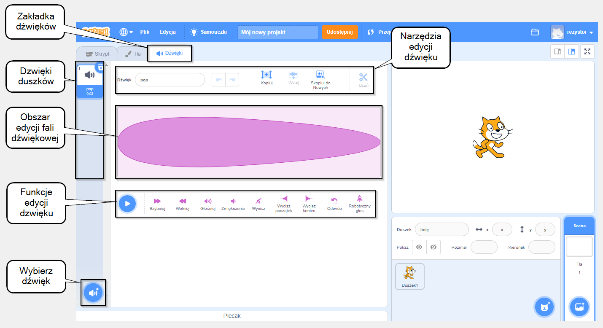

## Edytor dźwięku

Użyj edytora dźwięków, aby dodawać i edytować istniejące dźwięki oraz nagrywać własne dźwięki.

{:width="600px"}

### Tworzenie dźwięków

\[[[scratch3-add-sound]]\] \[[[scratch3-record-sound\]]]

### Edycja dźwięków

Edytuj całe dźwięki lub ich części.

\[[[scratch3-reverse-sound]]\] \[[[scratch3-crop-sound\]]] [[[scratch3-sound-effects]]]
