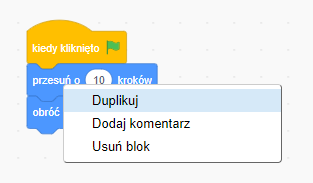
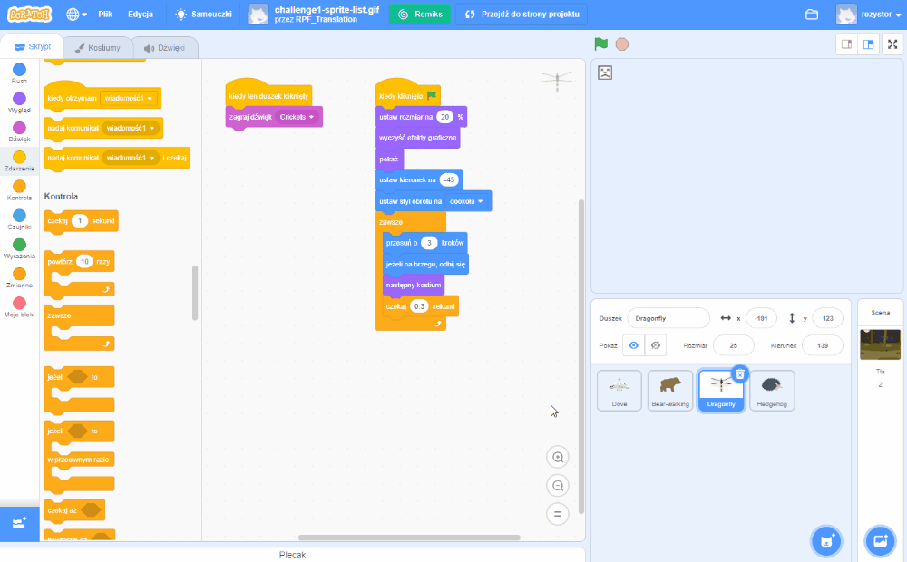

## Wskazówki dotyczące edytowania
Warto nauczyć się jak kopiować i usuwać bloki kodu oraz duplikować duszki.

**Wskazówka:** Możesz użyć <kbd>Ctrl-z</kbd> (przytrzymaj klawisz Ctrl i dotknij „z”), aby wycofać wiele czynności w Scratchu. Jeśli przypadkowo usuniesz Duszka lub inny element, możesz użyć **Cofnij** z menu **Edycji** aby go odzyskać.

Możesz usunąć bloki kodu, których już nie potrzebujesz:

[[[scratch-delete]]]

Powielanie lub kopiowanie kodu pozwala zaoszczędzić czas podczas tworzenia projektu.

--- collapse ---
---
title: Duplikowanie bloków
---

Duplikój bloki lub zestawy bloków do ponownego wykorzystania w programie duszka:

* Przejdź do zakładki **Kod**.
* Kliknij prawym przyciskiem myszy (lub na tablecie naciśnij i przytrzymaj) pierwszy blok, który chcesz skopiować. Zaznaczy to również wszystkie bloki poniżej.
* Wybierz **Duplikuj** z menu rozwijanego. {:width="300px"}
* Przeciągnij skopiowany (zduplikowany) kod w wybrane miejsce. {:width="300px"}
* Usuń wszystkie niepotrzebne bloki.

--- /collapse ---

[[[scratch3-duplicate-sprite]]]

Utwórz nowego duszka i skopiuj cały lub część kodu pierwszego duszka.

--- collapse ---
---
title: Skopiuj kod duszka
---

W prawym dolnym rogu Listy duszków kliknij **Wybierz duszka** i wybierz tego, którego chcesz dodać.

Kliknij na pierwszego duszka i przejdź do jego zakładki **Kod**. Przeciągnij kod znajdujący się w Obszarze kodu pierwszego duszka na obraz drugiego duszka na Liście duszków, a następnie puść ten kod, aby zakończyć kopiowanie go do drugiego duszka. Możesz mieć jeden skrypt, który zaczyna się od bloku `kiedy kliknięto zieloną flagę`{:class="block3events"}, a także drugi skrypt, który zaczyna się od `kiedy ten duszek kliknięty`{:class="block3events"}. Upewnij się, że skopiowałeś **wszystkie** skrypty kodu, które utworzyłeś.

{:width="300px"}

Twój drugi duszek będzie miał teraz dokładnie taki sam kod jak pierwszy. Nie uruchamiaj programu, dopóki nie zaczniesz zmieniać kodu drugiego duszka — możesz nie widzieć drugiego duszka, jeśli on będzie umieszczony dokładnie pod pierwszym duszkiem.

--- /collapse ---

Jeśli chcesz kopiować kostiumy, duszki, dźwięki i skrypty między projektami, przeciągnij je do **Plecaka**.

[[[scratch-backpack]]]

Zawsze warto poświęcić trochę czasu na upewnienie się, że postępujesz zgodnie z najlepszymi praktykami, dzięki czemu Twój projekt będzie łatwy do zrozumienia.

--- collapse ---
---
title: Najlepsze praktyki dla projektów Scratch
---

- Nadaj sensowne nazwy wszystkim duszkom, kostiumom, dźwiękom, zmiennym i wiadomościom. Dużo łatwiej jest zrozumieć projekty, które używają przydatnych nazw.
- Wypełnij Stronę Projektu dobrym tytułem, instrukcjami i uwagami, aby użytkownicy wiedzieli, jak korzystać z Twojego projektu i skąd masz pomysły.
- Dodaj krótkie komentarze, które wyjaśniają, co robi Twój kod.
- Upewnij się, że masz porządek w skryptach w zakładce **Skrypt**. Możesz kliknąć prawym przyciskiem myszy i wybrać **Posprzątaj bloki** lub ułożyć skrypty w odpowiedni dla siebie sposób. Spróbuj połączyć ze sobą podobne skrypty.

--- /collapse ---
