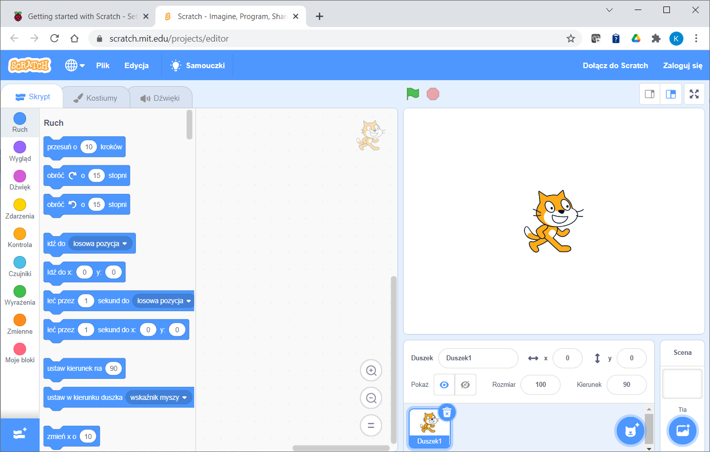
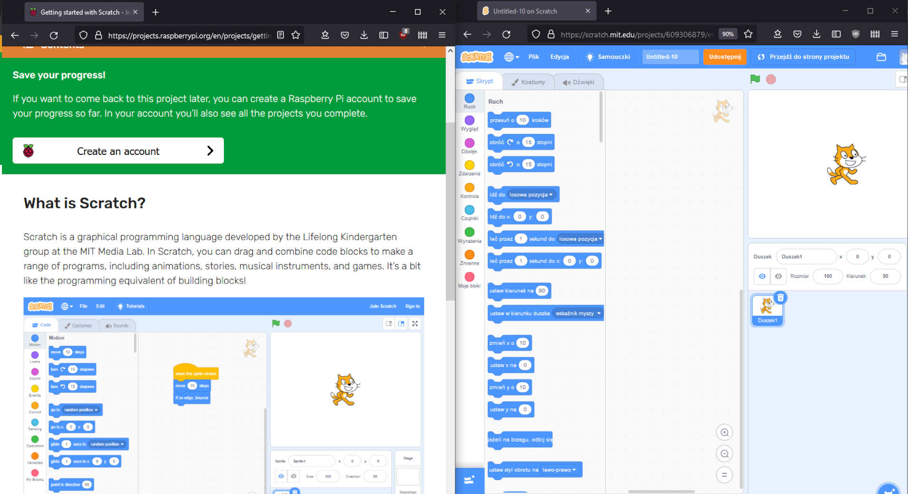
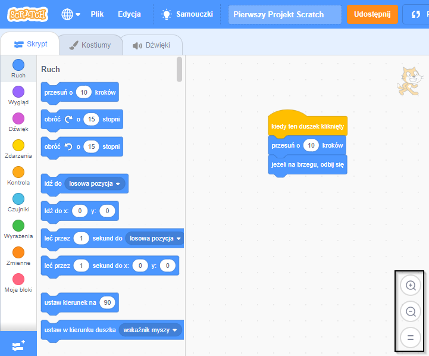

## Skonfiguruj Scratcha
Możesz używać Scratcha na laptopie, komputerze stacjonarnym lub tablecie. Możesz także używać Scratcha na komputerze Raspberry Pi.

--- task ---

Otwórz przeglądarkę internetową na komputerze lub tablecie i odwiedź [rpf.io/scratch-new](https://rpf.io/scratch-new){:target="_blank"}, aby otworzyć nowy projekt w edytorze Scratch. Scratch otworzy się w nowej karcie w Twojej przeglądarce internetowej.

**Wskazówka:** Możesz również odwiedzić [scratch.mit.edu](https://scratch.mit.edu/){:target="_blank"} a następnie kliknąć **Stwórz**.

--- collapse ---
---
title: Praca w trybie offline bez połączenia z internetem
---

Jeśli potrzebujesz pracować w trybie offline (bez połączenia z Internetem), możesz [pobrać](https://scratch.mit.edu/download){:target="_blank"} i zainstalować go na komputerze.

Nie możesz pracować w trybie offline, jeśli używasz tabletu.

--- /collapse ---

--- collapse ---
---
title: Scratch na Raspberry Pi
---

Jeśli używasz komputera Raspberry Pi, Scratch może być już zainstalowany. Kliknij ikonę **Raspberry Pi** aby otworzyć menu, następnie kliknij **Programowanie**, a następnie wybierz **Scratch 3**.

Jeśli musisz zainstalować Scratch, wykonaj te kroki:
+ Kliknij ikonę Raspberry Pi, aby otworzyć menu
+ Kliknij **Preferencje**
+ Kliknij **Rekomendowane oprogramowanie**
+ Wybierz **Scratch 3**
+ Kliknij **OK**

Zobacz [Scratch 3 Desktop dla Raspberry Pi](https://www.raspberrypi.org/blog/scratch-3-desktop-for-raspbian-on-raspberry-pi/) aby uzyskać więcej informacji.

--- /collapse ---

--- /task ---

--- task ---

Kiedy używasz Scratcha z tym przewodnikiem lub jednym z naszych projektów, będziesz musiał przełączać się między Scratchem a instrukcjami projektu.

--- collapse ---
---
title: Przełączanie się między kartami przeglądarki
---

Kliknij (lub dotknij na tablecie) tytuł karty przeglądarki, aby przełączać się między edytorem Scratch a instrukcjami projektu.

--- /collapse ---

--- collapse ---
---
title: Instrukcje i Scratch obok siebie
---

Jeśli Twój ekran jest wystarczająco duży, możesz wyświetlić Scratch obok instrukcji projektu.

Jeśli korzystasz z Microsoft Windows 10, przeciągnij kartę Scratch w przeglądarce internetowej, aby znalazła się w osobnym oknie i przeciągaj ją dalej, aż kursor osiągnie prawą krawędź ekranu. Okno zostanie wówczas umieszczone po prawej stronie ekranu.

Teraz przeciągnij okno zawierające ten przewodnik lub instrukcje dotyczące projektu na lewą stronę ekranu, aż kursor osiągnie lewą krawędź. Okno zajmie lewą połowę ekranu.

Możesz zmienić rozmiar okien, aby mieć je dokładnie tam, gdzie chcesz.

**Wskazówka:** Możesz także przytrzymać klawisz <kbd>Windows</kbd> i nacisnąć klawisz strzałki <kbd>lewo</kbd> lub <kbd>prawo</kbd>, aby umieścić okno w lewej lub prawej połowie ekranu.

--- /collapse ---

Wypróbuj to teraz i sprawdź, jak wolisz pracować.

--- /task ---

--- task ---

Kiedy używasz Scratcha w przeglądarce internetowej, możesz powiększać lub pomniejszać, aby dostosować rozmiar.

Na przykład, jeśli używasz systemu Microsoft Windows i chcesz użyć powiększenia strony internetowej w przeglądarce Google Chrome lub Microsoft Edge, przytrzymaj klawisz <kbd>Ctrl</kbd> i naciśnij klawisz <kbd>+</kbd> lub klawisz <kbd>-</kbd>, aby powiększyć lub pomniejszyć.

--- collapse ---
---
title: Używanie powiększenia w obszarze kodu
---

Możesz także użyć kontrolek powiększenia w obszarze kodu w programie Scratch, aby zmienić rozmiar bloków kodu w obszarze kodu.

--- /collapse ---

--- /task ---

