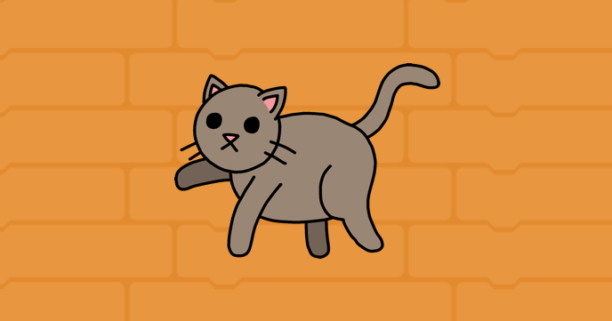
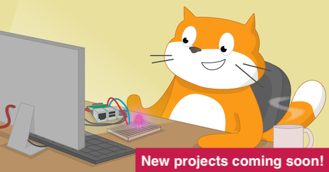

## Nasze projekty Scratch

Nasze ścieżki Scratch zawierają po sześć projektów, które pomogą Ci nauczyć się różnych umiejętności w Scratchu, aby samodzielnie tworzyć własne projekty.

Możesz wrócić do tego przewodnika, Pierwsze kroki ze Scratchem, gdy będziesz chciał przypomnieć sobie umiejętności, których się nauczyłeś.

Projekty te można wykonać na dowolnym komputerze lub tablecie, na którym działa Scratch 3.

### Projekty Scratch dla początkujących

Jeśli jesteś nowy w Scratchu, zacznij od naszych ścieżek dla początkujących:

[Wprowadzenie do Scratcha: duszki, skrypty i pętle](https://projects.raspberrypi.org/en/pathways/scratch-intro){:target="_blank "} 
W tym wprowadzeniu dla początkujących dowiesz się, jak dodawać kod, kostiumy i dźwięki do duszków podczas tworzenia animacji, gry, aplikacji lub historii.

[Dbaj o siebie](https://projects.raspberrypi.org/en/pathways/look-after-yourself){:target="_blank"} 
Dowiedz się jak zadbać o siebie i innych dzięki projektom Scratch, dzięki którym będziesz się śmiać, relaksować, sterować, tworzyć, ćwiczyć i skupiać się.

[Scratch Moduł 1](https://projects.raspberrypi.org/en/pathways/scratch-module-1){:target="_blank"}

 

### Już nie podstawowe projekty Scratch

Jeśli znasz już duszki, kostiumy, tła i pętle, wypróbuj te projekty:

[Więcej Scratcha: wiadomości, decyzje i zmienne](https://projects.raspberrypi.org/en/pathways/more-scratch){:target="_blank"} 
Więcej Scratcha wykracza poza podstawy wprowadzone we Wstępie do Scratcha. Będziesz tworzyć aplikacje, gry i symulacje, korzystając z rozgłaszania wiadomości, decyzji jeśli...to i jeśli...to...w przeciwnym wypadku oraz zmiennych.

[Scratch Moduł 2](https://projects.raspberrypi.org/en/pathways/scratch-module-2){:target="_blank"} 

 

### Zaawansowane projekty Scratch

Jeśli chcesz nauczyć się o listach, klonach i tworzeniu własnych bloków, wypróbuj te projekty:

[Więcej Scratcha: klony, własne bloki i logika Boole'a](https://projects.raspberrypi.org/en/pathways/further-scratch){:target="_blank"} 
Więcej Scratcha wykracza poza wiadomości wprowadzone we Wstępie do Scratcha i Więcej Scratcha. Będziesz tworzyć aplikacje, gry, sztukę generowaną komputerowo i symulacje za pomocą logiki logicznej, funkcji, klonów i nie tylko.

[Chroń naszą planetę](https://projects.raspberrypi.org/en/pathways/protect-our-planet){:target="_blank"} 
Użyj Scratcha, aby poznać naszą planetę i dowiedzieć się jak chronić środowisko dla przyszłych pokoleń.

[Scratch dla inicjatyw społecznych](https://projects.raspberrypi.org/en/coderdojo/scratch-for-social-enterprise){:target="_blank"} 

[Scratch Moduł 3](https://projects.raspberrypi.org/en/pathways/scratch-module-3){:target="_blank"} 

 

### Projekty sprzętowe Scratch GPIO dla Raspberry Pi

Jeśli masz komputer Raspberry Pi, możesz również wypróbować te projekty. Będziesz potrzebować dodatkowych elementów elektronicznych.

 

[Physical computing with Scratch path](https://projects.raspberrypi.org/en/pathways/physical-computing-with-scratch-and-the-raspberry-pi){:target="_blank"}

 

[Physical computing with Scratch additional projects](https://projects.raspberrypi.org/en/projects?software%5B%5D=scratch&hardware%5B%5D=raspberry-pi){:target="_blank"}

 

Podobał Ci się ten przewodnik Scratch? Zauważyłaś/eś jakiś problem? Kliknij poniżej przycisk **Wyślij opinię** i daj nam znać!
