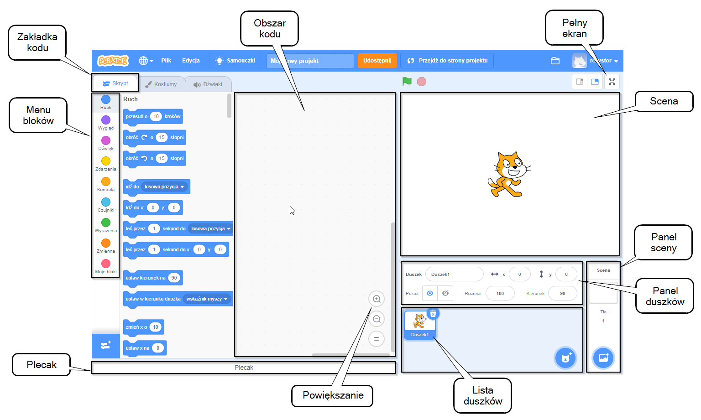

## Edytor Scratch

**Scena** to miejsce, gdzie dzieje się akcja w Twoim projekcie. Scena ma jeden lub więcej obrazów, nazywanych **tła**.

**Duszki** to postacie i obiekty, które pojawiają się na **Scenie**. Duszki otrzymują instrukcje za pomocą bloków kodu Scratch. Nazywa się to **programowaniem**.

Przeciągnij **bloki kodu** z **Menu bloków** do **Obszaru kodu** aby zaprogramować swoje duszki i Scenę. Bloki kodu mogą wprawiać duszka w ruch, zmieniać jego wygląd i odtwarzać dźwięki.

Duszki mogą mieć wiele **kostiumów**. Możesz zmienić kostium, aby zmienić wygląd duszka. Można to wykorzystać do uzyskania efektów takich jak chodzenie.

**Skrypt** to zestaw bloków, które są ze sobą połączone aby przekazywać instrukcje do Sceny lub duszków. Scena i duszki mogą mieć wiele różnych skryptów. 

