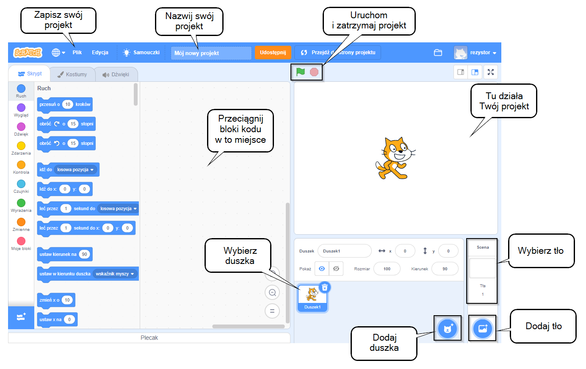
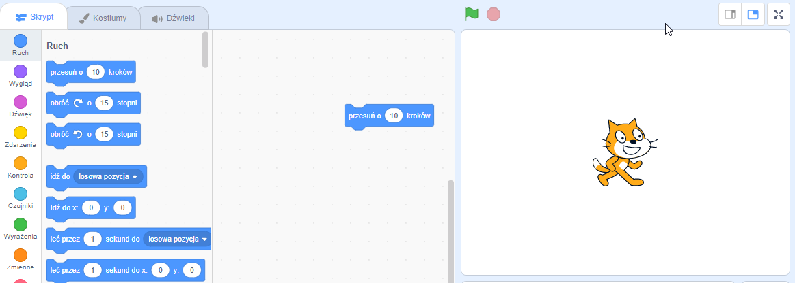
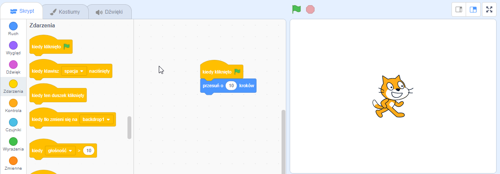
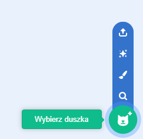
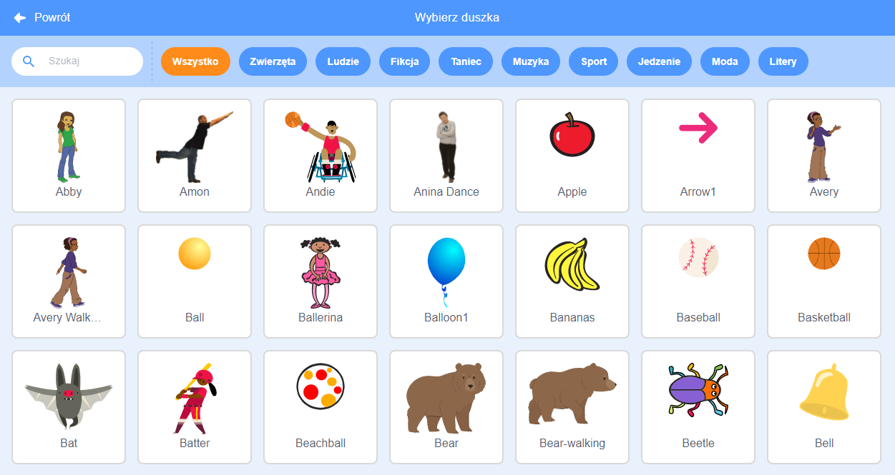
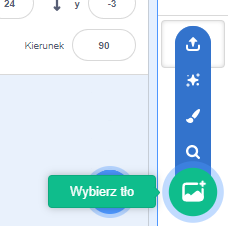
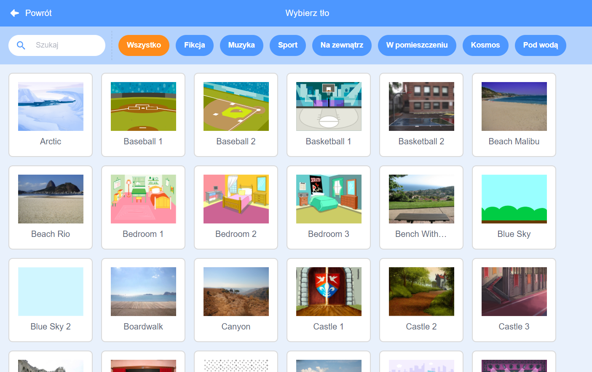
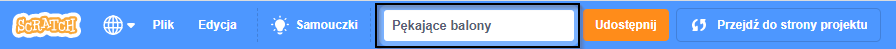

## Twój pierwszy projekt Scratch



--- task ---

Kiedy tworzysz nowy projekt Scratch, zawiera on duszka **kota** (po angielsku cat).

Przeciągnij bloki z Menu bloków do Obszaru kodu, aby sprawić że kot coś zrobi.

Aby wypróbować przykład, przeciągnij blok `przesuń o`{:class="block3motion"} z menu bloków `Ruch`{:class="block3motion"}. Bloki oznaczone są kolorami, aby ułatwić Ci ich odnalezienie.



Możesz kliknąć na bloki w Obszarze kodu, aby je uruchomić. Kliknij blok `przesuń o`{:class="block3motion"}, a kot się poruszy.

**Wskazówka:** Jeśli używasz Scratch na tablecie, możesz stuknąć element, aby go kliknąć.

**Bloki-kapelusze** uruchamiają bloki pod nimi, gdy wystąpi określone zdarzenie. Blok `kiedy kliknięto zieloną flagę`{:class="block3events"} uruchamia kod po kliknięciu zielonej flagi nad Sceną w celu uruchomienia projektu.

Przeciągnij blok `kiedy kliknięto zieloną flagę`{:class="block3events"} i umeść go nad blokiem `przesuń o`{:class="block3motion"} tak, aby oba bloki się zatrzasnęły.



Twój kod powinien wyglądać tak:

```blocks3
po kliknięciu flagi
ruch (10) kroków
```

**Wskazówka:** Wszystkie bloki są oznaczone kolorami, więc znajdziesz blok `kiedy kliknięto zielną flagę`{:class = "block3looks"} w menu bloków `Zdarzenia`{:class = "block3looks"}.

Teraz kliknij zieloną flagę nad Sceną, a kot się poruszy.

--- /task ---

Możesz dodać więcej duszków do swojego projektu, a także dodać tło.

--- task ---

--- collapse ---
---
title: Wybranie duszka
---

Na liście duszków, kliknij na **Wybierz duszka** aby zobaczyć bibliotekę wszystkich duszków Scratcha.



Możesz wyszukać duszka lub przeglądać według kategorii lub motywu. Kliknij duszka, aby dodać go do swojego projektu.



--- /collapse ---

--- /task ---

--- task ---

--- collapse ---
---
title: Wybieranie tła
---

W prawym dolnym rogu panelu Scena kliknij opcję **Wybierz tło**.



Możesz wyszukać interesujące Cię tło lub przeglądać tła według kategorii lub motywu. Kliknij na tło aby je dodać do Twojego projektu.



--- /collapse ---

--- /task ---

--- task ---

--- collapse ---
---
title: Nazwanie i zapisanie projektu
---

Przejdź do opcji menu **Plik**. Jeśli masz konto Scratch, kliknij **Zapisz teraz**. Jeśli nie masz konta, kliknij **Zapisz na swoim komputerze**.

Kliknij w polu nazwy projektu i zmień nazwę, aby pasowała do Twojego projektu.



Jeśli udostępnisz swój projekt, inne osoby również zobaczą tę nazwę, więc upewnij się, że wybrana nazwa ma sens.

--- /collapse ---

--- /task ---

Stworzyłeś swój pierwszy projekt Scratch!

Jesteś teraz gotowy do nauki Scratcha. Zalecamy zacząć od naszych śceżek [Scratch: Moduł 1](https://projects.raspberrypi.org/en/raspberrypi/scratch-module-1){:target="_blank"} i/lub [Dbaj o siebie](https://projects.raspberrypi.org/en/raspberrypi/look-after-yourself){:target="_blank"}, które są przeznaczone dla początkujących.

 Możesz wrócić do tego przewodnika, jeśli potrzebujesz pomocy w korzystaniu ze Scratcha gdy pracujesz nad naszymi ścieżkami projektów lub nad własnymi niezależnymi projektami. 


