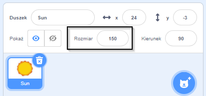

## Wygląd

Bloki `Wygląd`{:class="block3looks"} kontrolują wygląd duszka na scenie.

Duszki mogą się komunikować używając `Wygląd`{:class="block3looks"}, poprzez dymek `powiedz`{:class="block3looks"}, dymek `pomyśl`{:class="block3looks"} lub poprzez swoje `efekty graficzne`{:class="block3looks"}.

### Powiedz i pomyśl

```blocks3
say () for () seconds

say ()

think () for () seconds

think ()
```

--- collapse ---
---
title: Użyj dymka do komunikowania się
---

Duszki mogą `powiedzieć`{:class="block3looks"} oraz `pomyśleć`{:class="block3looks"} aby się komunikować.

Bloki `powiedz () przez () sekund`{:class="block3looks"} i `pomyśl () przez () sekund`{:class="block3looks"} są używane do powiedzenia lub pomyślenia czegoś przez określony czas.

```blocks3
when this sprite clicked
say [Hello!] for [2] seconds // hide speech after 2 seconds
```

Po kliknięciu duszek przez dwie sekundy będzie wyświetlał dymek.

**Kosmiczna rozmowa**: [Zajrzyj do środka](https://scratch.mit.edu/projects/485673032/editor){:target="_blank"}

Kliknij na duszki, aby zobaczyć, jak komunikują się za pomocą mowy i myśli.

<div class="scratch-preview">
  <iframe allowtransparency="true" width="485" height="402" src="https://scratch.mit.edu/projects/embed/485673032/?autostart=false" frameborder="0"></iframe>
</div>

Bloki `powiedz ()`{:class="block3looks"} i `pomyśl ()`{:class="block3looks"} służą do powiedzenia lub pomyślenia czegoś, aż zastąpi je kolejna wiadomość lub pusty blok `powiedz ()`{: class="block3looks"} lub `pomyśl ()`{:class="block3looks"}.

--- /collapse ---

### Rozmiar

Ustaw lub zmień `rozmiar`{:class="block3looks"} swoich duszków.

```blocks3
change size by ()

set size to () %

(size)
```

--- collapse ---
---
title: Ustaw rozmiar swojego duszka
---

Po dodaniu duszka do projektu jego rozmiar jest ustawiony na `100` procent. To może być za dużo lub za mało w Twoim projekcie.

Możesz użyć kodu, aby ustawić rozmiar duszka. Aby to zrobić, użyj bloku `ustaw rozmiaru na`{:class="block3looks"}:

```blocks3
set size to (50) %
```

Jeśli ustawisz rozmiar duszka na `50` procent, będzie on o połowę niższy i o połowę węższy. Jeśli ustawisz rozmiar duszka na `200` procent, będzie on dwa razy wyższy i dwa razy szerszy.

Aby ustawić rozmiar duszka podczas uruchamiania projektu, umieść blok `ustaw rozmiar na`{:class="block3looks"} pod blokiem `kiedy kliknięto zieloną flagę`{:class="block3events"}:

```blocks3
when green flag clicked
set size to (50) %
```

Możesz również szybko ustawić rozmiar duszka we właściwości **Rozmiar** w Panelu duszka poniżej Sceny:

{:width="400px"}

--- /collapse ---

### Efekty graficzne

Ustaw lub dostosuj różne efekty wizualne, takie jak kolor, rybie oko, wir, piksele, mozaika, jasność i efekt duch.

```blocks3
change [color v] effect by ()

set [color v] effect to ()

clear graphic effects
```

[[[scratch3-graphic-effects]]]

### Kostiumy

Aby stworzyć efekt animacji swoich duszków, możesz zmienić ich kostiumy.

```blocks3
zmień kostium na ( v)

następny kostium

(kostium [liczba v])
```

[[[scratch3-change-costumes-to-show-mood]]]

--- collapse ---
---
title: Zmień wygląd, aby stworzyć efekt animacji
---

**Bijące serce**: [Zajrzyj do środka](https://scratch.mit.edu/projects/435725413/editor){:target="_blank"}

<div class="scratch-preview">
  <iframe allowtransparency="true" width="485" height="402" src="https://scratch.mit.edu/projects/embed/435725413/?autostart=false" frameborder="0"></iframe>
</div>

Możesz użyć bloków `ustaw rozmiar na`{:class="block3looks"} lub `zmień rozmiar o`{:class="block3looks"}, aby stworzyć pulsujący efekt, taki jak bicie serca.

**Uwaga:** Blok `ustaw rozmiar na`{:class="block3looks"} ustawia rozmiar na konkretną wartość, podczas gdy blok `zmień rozmiar o`{:class="block3looks"} zmienia wartość jaka była wcześniej, np. `zmień rozmiar o`{:class="block3looks"} `10` dodaje 10 do wartości rozmiaru.

```blocks3
when green flag clicked
set size to (160) %
forever
change size by (40)
wait (0.2) seconds
change size by (20)
wait (0.2) seconds
change size by (-20)
wait (0.2) seconds
change size by (-40)
wait (0.2) seconds
end
```

Ten kod używa serii bloków `zmień rozmiar o`{:class="block3looks"} i `czekaj`{:class="block3control"}, aby serce rosło i zmniejszało się. Spróbuj stworzyć własnego pulsującego duszka.

Możesz również użyć bloku `zmień efekt`{:class="block3looks"}, aby utworzyć duszka, który ciągle zmienia swój wygląd.

```blocks3
when green flag clicked
change [ghost v] effect by (75)
wait (1) seconds
change [ghost v] effect by (-75)
```

**Uwaga:** Jeśli używasz kodu, który zmienia efekt graficzny, a następnie zmienia go z powrotem, pamiętaj, aby użyć bloku `czekaj`{:class="block3control"} pomiędzy blokami `zmień efekt o`{:class=" block3looks"}, bo inaczej stanie się to tak szybko, że tego nie zauważysz!

Aby skasować efekty graficzne, możesz w dowolnym momencie użyć bloku `wyczyść efekty graficzne`{:class="block3looks"}:

```blocks3
clear graphic effects
```

--- /collapse ---

--- collapse ---
---
title: Kliknij, aby zmienić, a potem cofnąć
---

Możesz dodać akcje, które wprowadzają zmianę do duszka, a następnie ją odwracają, takie jak powiększanie, czekanie, a potem zmniejszanie.

**Ściskanie piłki gdy kliknięta**: [Zajrzyj do środka](https://scratch.mit.edu/projects/435723273/editor){:target="_blank"}

<div class="scratch-preview">
  <iframe src="https://scratch.mit.edu/projects/435723273/embed" allowtransparency="true" width="485" height="402" frameborder="0" scrolling="no" allowfullscreen></iframe>
</div>

Ten kod powiększy duszka, zastosuje efekt `rybie oko`{:class="block3looks"} na 0,5 sekundy, a następnie przywróci duszka do jego początkowego wyglądu:

```blocks3
when this sprite clicked
set size to (110)
set [fisheye v] effect to (50)
wait (0.5) seconds
set [fisheye v] effect to (0)
set size to (100)
```

--- /collapse ---

[[[scratch3-animate-movement-costumes]]]

### Tła

Możesz również użyć kodu, aby zmienić tło.

```blocks3
switch backdrop to ( v)

next backdrop

(backdrop [number v])
```

[[[scratch3-changing-backdrops-pages-levels]]]

### Widoczność

Bloki `pokaż`{:class="block3looks"} i `ukryj`{:class="block3looks"} kontrolują widoczność duszka.

```blocks3
show 

hide
```

[[[scratch3-show-hide-sprites-backdrops]]]

### Warstwy

Aby zmienić to, jak Twoje duszki pokazują się względem siebie, możesz użyć warstw.

```blocks3
go to [front v] layer

go [forward v] () layers
```

[[[scratch3-positioning-with-layers]]]

--- collapse ---
---
title: Umieszczanie duszków na wielu warstwach
---

**Poprzez okno z drzewem**: [Zajrzyj do środka](https://scratch.mit.edu/projects/454188775/editor){:target="_blank"}

<div class="scratch-preview">
  <iframe allowtransparency="true" width="485" height="402" src="https://scratch.mit.edu/projects/embed/454188775/?autostart=false" frameborder="0"></iframe>
</div>

W tym przykładzie duszek **Rama okienna** pojawia się z przodu, a duszek **Słońce** pojawia się z tyłu. Duszki **Avery Walking** (Chodząca Avery) i **Drzewo** znajdują się na swoich własnych warstwach pomiędzy duszkami **Rama okienna** i **Słońce**.

Użyj bloku `przesuń do tyłu`{:class="block3looks"} o `1` `warstw`{:class="block3looks"}, aby umieścić duszka o jedną warstwę za duszkiem z przodu:

``` blocks3
when green flag clicked
go to [front v] layer
+go [backward v] (1) layers
```

Zmień wartość w bloku `przesuń do tyłu`{:class="block3looks"} o `1` `warstw`{:class="block3looks"} dla każdego duszka, w zależności od tego, gdzie chcesz go umieścić w stosunku do innych duszków:

``` blocks3
when green flag clicked
go to [front v] layer
+go [backward v] (2) layers
```

--- /collapse ---

