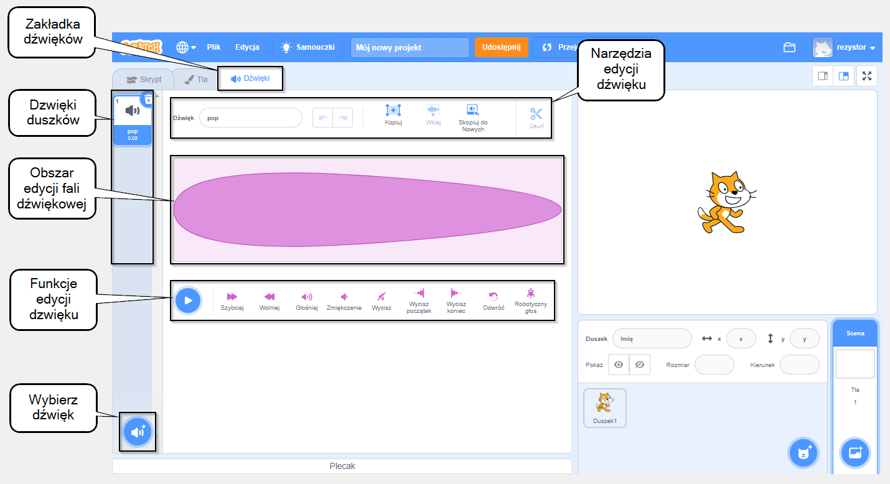

## Dźwięk

Aby dodać dźwięk do projektu, użyj bloków `Dźwięk`{:class="block3sound"}. Na przykład możesz utworzyć ciągłą ścieżkę dźwiękową w tle lub dodać dźwięki odtwarzane w regularnych odstępach czasu.

{:width="600px"}

Najpierw wybierz dźwięk z Biblioteki dźwięków lub nagraj własny dźwięk.

[[[scratch3-add-sound]]]

[[[scratch3-record-sound]]]

Dodaj kod, aby uruchomić bloki `Dźwięk`{:class="block3sound"} tam, gdzie chcesz usłyszeć dźwięk w swoim projekcie.

--- collapse ---
---
title: Dodaj długi dźwięk, aby stworzyć ciągłą ścieżkę dźwiękową
---

Kliknij na zieloną flagę, aby usłyszeć dzwięki.

**Radiowa ścieżka dźwiękowa**: [Zajrzyj do środka](https://scratch.mit.edu/projects/444581851/editor){:target="_blank"}

<div class="scratch-preview">
 <iframe allowtransparency="true" width="485" height="402" src="https://scratch.mit.edu/projects/embed/444581851/?autostart=false" frameborder="0"></iframe>
</div>

Możesz użyć bloku `graj dźwięk aż się skończy`{:class="block3sound"} wewnątrz pętli `zawsze`{:class="block3control"}. Kiedy dzwięk sie skończy, pętla `zawsze`{:class="block3control"} spowoduje, że zacznie się znów od początku.

Ten kod wykorzystuje pojedynczy długi klip dźwiękowy powtarzany jako ścieżka dźwiękowa:

```blocks3
gdy kliknie zielona flaga
zawsze
odtwórz dźwięk (Dance Snare Beat v) aż do zakończenia

```

**Uwaga:** Kiedy wybierasz nowy dzwięk, jeśli wybierzesz kategorię **Pętle**, Scratch pokaże tylko te dźwięki, które są odpowiednie dla pojedynczej zapętlonej ścieżki dźwiękowej.


--- /collapse ---

--- collapse ---
---
title: Dodaj sekwencję krótkich dźwięków, aby utworzyć ciągłą ścieżkę dźwiękową
---

Kliknij na zieloną flagę, aby usłyszeć dzwięki.

**Występ mistrzów**: [Zajrzyj do środka](https://scratch.mit.edu/projects/444673165/editor){:target="_blank"}

<div class="scratch-preview">
 <iframe allowtransparency="true" width="485" height="402" src="https://scratch.mit.edu/projects/embed/444673165/?autostart=false" frameborder="0"></iframe>
</div>

 Użyj bloku `zawsze`{:class="block3control"}, aby utworzyć zapętlony dźwięk. Możesz:
+ Umieścić serię krótkich dźwięków w sekwencji, lub
+ Używać różnych nut i instrumentów

```blocks3
po kliknięciu flagi
zawsze
odtwórz dźwięk (Low Boing v) do zakończenia
odtwarzaj dźwięk (Low Boing v) do zakończenia
odtwarzaj dźwięk (Drum Buzz v) do zakończenia
odtwarzaj dźwięk (Pop v) do zakończenia
odtwarzaj dźwięk (Bird v ) do zakończenia
odtwarzaj dźwięk (Bark v) do
odtwarzaj dźwięk (Glug v) do

```

--- /collapse ---

--- collapse ---
---
title: Dodaj dźwięki grane w regularnych odstępach czasu
---

**Piłkarskie dźwięki**: [Zajrzyj do środka](https://scratch.mit.edu/projects/450870079/editor){:target="_blank"}

Kliknij zieloną flagę, aby usłyszeć dźwięki.

<div class="scratch-preview">
 <iframe allowtransparency="true" width="485" height="402" src="https://scratch.mit.edu/projects/embed/450870079/?autostart=false" frameborder="0"></iframe>
</div>

 W tym projekcie **Scena** zawiera kod służący do odtwarzania dźwięku w regularnych odstępach czasu:

 ```blocks3
 kiedy flaga kliknęła
 zawsze
 czekaj (3) sekundy
 odtwórz dźwięk (Cheer v) do końca

 ```

Duszek **Whistle** również odtwarza dźwięk w regularnych odstępach czasu:

 ```blocks3
 when this sprite clicked
 forever
 play sound (Referee Whistle v) until done
 wait (4) seconds
 end
 ```

--- /collapse ---

--- collapse ---
---
title: Dodaj dźwięki zaczynające się w tym samym czasie
---

Istnieją dwa bloki z grupy `Dzwięk`{:class="block3sound"}, które mają pewną istotną różnicę:

+ Kiedy użyjesz bloku `graj dźwięk aż się skończy`{:class="block3sound"}, dźwięk będzie odtwarzany bez przerywania. Następny wiersz kodu w skrypcie nie zostanie uruchomiony, dopóki dźwięk się nie skończy.

+ Kiedy uzyjesz bloku `zagraj dzwięk`{:class="block3sound"}, dźwięk zostanie zagrany, ale następny blok zostanie uruchomiony natychmiast i nie będzie czekał na zakończenie odtwarzania dźwięku.

Oznacza to, że gdybyś miał serię bloków `zagraj dźwięk`{:class="block3sound"}, wszystkie dźwięki byłyby odtwarzane prawie w tym samym czasie, nałożone na siebie. Ten efekt może być ciekawy, ale czasem może stworzyć bałagan.

Pobaw się z tym kiedyś!

```blocks3
when green flag clicked
start sound (Meow v)
start sound (Alien Creak2 v)
start sound (Boing v)
start sound (Boom Cloud v)
start sound (Baa v)
```

--- /collapse ---

Po wybraniu dźwięków możesz zmienić `głośność`{:class="block3sound"}, `płynność dźwięku`{:class="block3sound"} lub `przesuń w lewo/prawo`{:class="block3sound"} (słychać dźwięk z lewego lub prawego głośnika).

--- collapse ---
---
title: Głośność, płynność i balans
---

Kliknij zieloną flagę, aby usłyszeć dźwięki.

**Próba zespołu**: [Zajrzyj do środka](https://scratch.mit.edu/projects/451697380/editor){:target="_blank"}

<div class="scratch-preview">
 <iframe allowtransparency="true" width="485" height="402" src="https://scratch.mit.edu/projects/embed/451697380/?autostart=false" frameborder="0"></iframe>
</div>

Duszek **Drums** uzywa bloków `ustaw głośność na`{:class="block3sound"}, `ustaw efekt płynność dźwięku na`{:class="block3sound"} i `ustaw efekt lewo-prawo na`{:class=" block3sound"} aby zmienć dźwięk:

```blocks3
ustaw głośność na (80) %
ustaw efekt [pitch v] na (50) :: dźwięk
ustaw efekt [pan left/right v] na (-100) :: dźwięk
odtwarzaj dźwięk (Drum Funky v) aż do zakończenia
```

+ Możesz ustawić wartość w bloku `ustaw głośność na`{:class="block3sound"} od `0` (cichy) do `100` (pełna głośność). Jest to przydatne, jeśli chcesz, aby niektóre dźwięki były odtwarzane głośniej niż inne lub jeśli chcesz, aby duszek wydawał się być dalej.

+ Efekt `płynność dźwięku`{:class="block3sound"} kontroluje, jak wysoki lub niski jest dźwięk. Ustawienie go na wyższą wartość również powoduje, że dźwięk jest szybszy. Wartości w bloku `ustaw efekt płynność dźwięku na`{:class="block3sound"} możesz ustawić pomiędzy `-360` (bardzo niski) a `360` (bardzo wysoki).

+ Efekt `przesuń w lewo/prawo`{:class="block3sound"} pozwala kontrolować, czy dźwięk wydobywa się z lewego lub prawego głośnika lub słuchawki lub jednego i drugiego. Możesz usatwic wartości w bloku `ustaw efekt przesuń w lewo/prawo na`{:class="block3sound"} od `-100` (wszystkie dźwięki z lewej) do `100` (wszystkie dźwięki z prawej).

--- /collapse ---

Możesz również użyć rozszerzenia `Tekst na Mowę`{:class="block3extensions"}:

[[[scratch3-text-to-speech]]]

