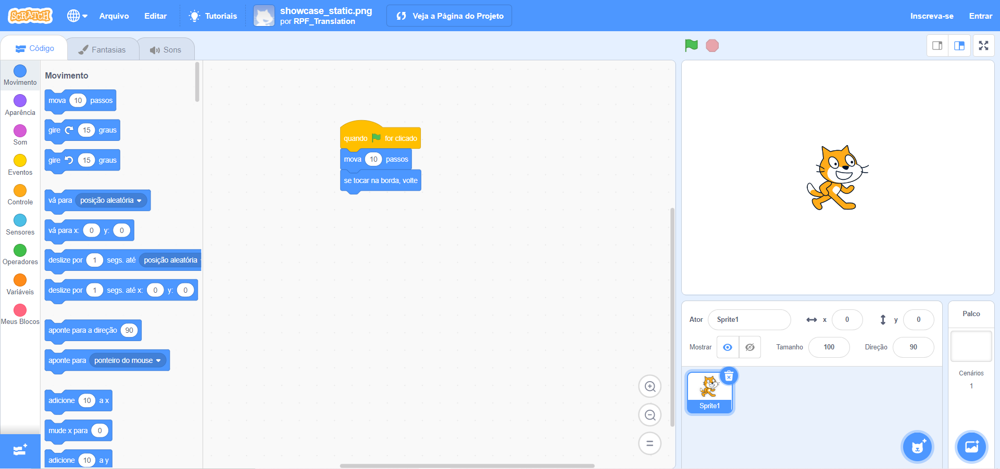

## O que é o Scratch?
Scratch é uma linguagem de programação gráfica desenvolvida pelo grupo Lifelong Kindergarten no Laboratório de Mídia do MIT. No Scratch, você pode arrastar e combinar blocos de código para fazer uma variedade de programas, incluindo animações, histórias, instrumentos musicais e jogos. É um pouco como o equivalente de programação de blocos de construção!

O Scratch é usado em muitas escolas como parte do currículo. É gratuito e os jovens podem usá-lo em casa e também em clubes.

O Scratch permite que os jovens aprendam conceitos de codificação e criem projetos interativos sem a necessidade de aprender uma linguagem de programação baseada em texto. Você não precisará ser capaz de digitar rapidamente ou lembrar de códigos complexos para usar o Scratch.

### Como usar este guia
Se você nunca usou o Scratch antes, este guia o ajudará a configurar e criar seu primeiro projeto.

Você pode voltar a este guia e usá-lo para procurar informações de que precisa quando estiver fazendo seus próprios projetos no Scratch.

No final do guia você encontrará links de projetos do Scratch, do iniciante ao avançado, onde você poderá aprender a programar criando aplicativos divertidos e interessantes, jogos, histórias, animações, arte e música.

--- collapse ---
---
title: O que você vai precisar
---
### Equipamento

+ Um computador ou tablet capaz de executar o Scratch 3

### Programa

+ Este guia explicará como começar com Scratch 3 ([online](https://scratch.mit.edu/){:target="_blank"} ou [offline](https://scratch.mit.edu/download){:target="_blank"})

--- /collapse ---
