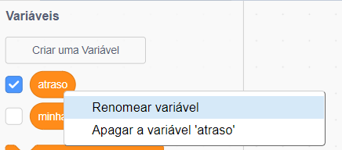
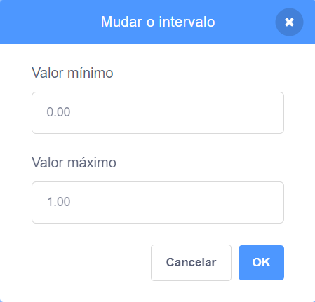

## Variáveis

Uma `variável`{:class="block3variables"} é uma maneira de armazenar números ou texto.

Você pode criar suas próprias variáveis ou escolher se elas aparecem ou não no palco:

[[[generic-scratch3-add-variable]]]

Você deve pensar se vai precisar definir um valor inicial quando criar uma variável:

[[[scratch3-create-set-variable]]]

Você pode renomear uma variável se mudar de ideia:

--- collapse ---
---
title: Renomear uma variável
---

Às vezes você pensa em um nome melhor para uma variável.

Você pode dar um novo nome a uma variável: vá para o menu, na categoria `Variáveis`{:class="block3variables"}, dê um clique com botão direito (ou em um tablet, toque e segure) sobre a `variável`{:class="block3variables"}, e escolha **Renomear Variável**.



Isso vai alterar o nome de uma variável em todos os blocos em que você a usou.

--- /collapse ---

**Dica:** Assegure-se que você sabe a diferença entre `mude`{:class="block3variables"} e `adicione`{:class="block3variables"}. `mude para`{:class="block3variables"} vai substituir o valor armazenado em uma variável. `adicione`{:class="block3variables"} vai alterar o valor de uma variável numérica pela quantidade que você escolher, `adicione`{:class="block3variables"} `1` vai adicionar um a uma variável. `mude para`{:class="block3variables"} `1` vai tirar uma unidade de uma variável.


**Dica:** Variáveis no Palco sempre aparecem em uma camada acima de todos os atores. Se você tiver um ator em movimento, ele ficará sob qualquer variável no Palco.

Você pode usar um controle deslizante para controlar o valor em uma variável.

[[[scratch3-slider-variable]]]

Mais ideias para usar variáveis:

[[[generic-scratch3-high-score]]]

[[[scratch3-join-text]]]

[[[scratch3-set-variable-with-button]]]

[[[scratch3-change-variable-in-loop]]]


--- collapse ---
---
title: Controle os efeitos gráficos com um controle de variável deslizante
---

Aqui estão alguns exemplos de como você pode usar o controle deslizante de variável:


Este exemplo altera o efeito `fantasma`{:class="block3looks"} para que você possa ver através do arco-íris.

**Arco-íris transparente**: [Ver interior](https://scratch.mit.edu/projects/451544795/editor){:target="_blank"}

<div class="scratch-preview">
  <iframe allowtransparency="true" width="485" height="402" src="https://scratch.mit.edu/projects/embed/451544795/?autostart=false" frameborder="0"></iframe>
</div>

Você pode usar uma variável `transparente`{:class="block3variables"} para controlar o efeito `fantasma`{:class="block3looks"} no ator da `frente` e usar ela para revelar ou esconder partes em camadas mais baixas.

```blocks3
when flag clicked
go to [da frente v] layer
```

```blocks3
when flag clicked
forever
set [fantasma v] effect to (transparente)
```

Tente usar a mesma abordagem com outros efeitos gráficos como `brilho`{:class="block3looks"} ou `cor`{:class="block3looks"}.

--- /collapse ---

--- collapse ---
---
title: Controle a velocidade do movimento com uma variável
---

**Joaninha na parede**: [Ver interior](https://scratch.mit.edu/projects/451545341/editor){:target="_blank"}

<div class="scratch-preview">
  <iframe allowtransparency="true" width="485" height="402" src="https://scratch.mit.edu/projects/embed/451545341/?autostart=false" frameborder="0"></iframe>
</div>

Use a variável `velocidade`{:class="block3variables"} como a entrada de um bloco `mova`{:class="block3motion"}:

```blocks3
when flag clicked
forever
move (velocidade) steps
if on edge, bounce
```
Defina os valores máximos e mínimos para o intervalo de valores do controle deslizante para adequar ao seu projeto.

--- /collapse ---

--- collapse ---
---
title: Controle a velocidade do movimento com uma variável
---

**Cachorro do espaço**: [Ver interior](https://scratch.mit.edu/projects/451543041/editor){:target="_blank"}

<div class="scratch-preview">
  <iframe allowtransparency="true" width="485" height="402" src="https://scratch.mit.edu/projects/embed/451543041/?autostart=false" frameborder="0"></iframe>
</div>

Use uma variável `ângulo`{:class="block3variables"} como entrada para o bloco `virar à direita`{:class="block3motion"}:

```blocks3
when flag clicked
forever
turn right (ângulo) degrees
```

--- /collapse ---

--- collapse ---
---
title: Alterar o atraso em um bloco espere
---

**Dança do esqueleto**: [Ver interior](https://scratch.mit.edu/projects/451536565/editor){:target="_blank"}

<div class="scratch-preview">
  <iframe allowtransparency="true" width="485" height="402" src="https://scratch.mit.edu/projects/embed/451536565/?autostart=false" frameborder="0"></iframe>
</div>

Use uma variável `atrase`{:class="block3variables"} como entrada para um bloco `espere`{:class="block3control"}:

```blocks3
when flag clicked
forever
wait (atraso) seconds
next costume
```

Um atraso de mais de um segundo é muito tempo. Se você incluir um número decimal na faixa de valores de um controle deslizante, então você pode alterar o valor por um centésimo de segundo por vez.

Um intervalo de valores de `0.00` até `1.00` permite que você escolha um atraso entre `0` segundos (sem atraso) e `1` segundo.



Altere os números para conseguir os valores mínimo e máximo que você quer que usuários sejam capazes de usar em seu projeto.

--- /collapse ---

--- collapse ---
---
title: Alterar efeitos sonoros
---

**Tambor afinado**: [Ver interior](https://scratch.mit.edu/projects/451547017/editor){:target="_blank"}

<div class="scratch-preview">
  <iframe allowtransparency="true" width="485" height="402" src="https://scratch.mit.edu/projects/embed/451547017/?autostart=false" frameborder="0"></iframe>
</div>

Você pode usar uma `variável`{:class="block3variables"} em um bloco `mude o efeito tom para`{:class="block3sound"}. Se você aumentar o tom de um som, as notas ficam mais altas e o som acelera.

```blocks3
when flag clicked
forever
set [tom v] effect to (batimento) :: sound
```

Reproduza o som em um loop `sempre`{:class="block3control"} separado, para que o tom mude imediatamente, em vez de ficar esperando até que o som seja reproduzido totalmente:

```blocks3
when flag clicked
forever
play sound [Dance Head Nod v] until done
```

Você pode também usar uma `variável`{:class="block3variables"} para alterar o volume e o efeito estéreo.

--- /collapse ---


